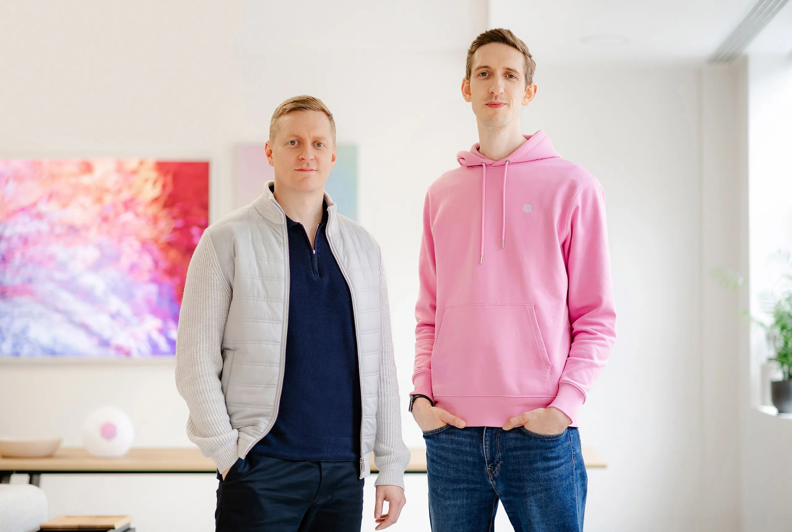

# Celebrating milestones and looking forward

Last week was awesome for our team at SurrealDB! It feels like the perfect time to pause and reflect on the whirlwind of achievements, all of which signal exciting times ahead for our company. We are incredibly proud to share some major milestones we've hit, and we want to extend our deepest gratitude to everyone who has been part of this journey to date.

First and foremost, we’re thrilled to announce that we have successfully secured our [Series A funding](/blog/surrealdb-raises-20m-to-disrupt-database-tech-introduces-new-cloud-beta-access). This is a monumental step for us, providing the investment we need to accelerate our vision and disrupt the database tech market.  We wish to express our heartfelt thanks to [FirstMark](https://firstmark.com), [Georgian](https://georgian.io), [Crew Capital](https://crew.vc), and [Alumni Ventures](https://www.av.vc) for believing in our mission and seeing the potential in what we are building. Your support is a strong endorsement of our direction and strategy.

Adding to the excitement, SurrealDB was named in the [Redpoint InfraRed 100 list](https://www.redpoint.com/infrared/100). This recognition is a testament to the hard work and dedication of every team member at SurrealDB. It's a clear indicator that our efforts are resonating within the industry and that we are on the right path. To our incredible team, this accolade belongs to you. Your commitment, creativity, and perseverance make achievements like this possible.

Last week also marked the launch of the [Surreal Cloud beta signup programme](/cloud), a significant milestone in our product development journey. The beta launch is a critical phase where we get to see our product in action, gather invaluable feedback, and refine our offering to ensure it truly meets the needs of our users. To all our beta testers, thank you for your willingness to engage with our product and provide your insights. Your feedback will be instrumental in shaping the future of our cloud offering.

And finally, a huge shout out to our [GitHub](https://github.com) community! We’re delighted by the incredible [SurrealDB repo](https://github.com/surrealdb/surrealdb), which has helped us surpass 26,000 GitHub Stars.

As we reflect on these achievements, we’re filled with a profound sense of gratitude and optimism. The journey so far has been incredibly rewarding, and these milestones are just the beginning. The infusion of new funding will allow us to scale our operations, enhance our product, and expand our reach. Being recognised in the Redpoint InfraRed 100 list motivates us to continue pushing the boundaries of innovation.

Looking ahead, the opportunities are endless. Our focus will remain on delivering exceptional value to developers, fostering a vibrant and supportive community, and driving meaningful impact within our industry.

To our investors, employees, beta testers, and the broader developer community, thank you for your unwavering support and belief in SurrealDB. Together, we are building something truly special.

Here’s to the journey ahead and to many more weeks like this one!

With gratitude

Tobie Morgan Hitchcock   Jaime Morgan Hitchcock CEO and Co-founder         COO and Co-founder SurrealDB                            SurrealDB
