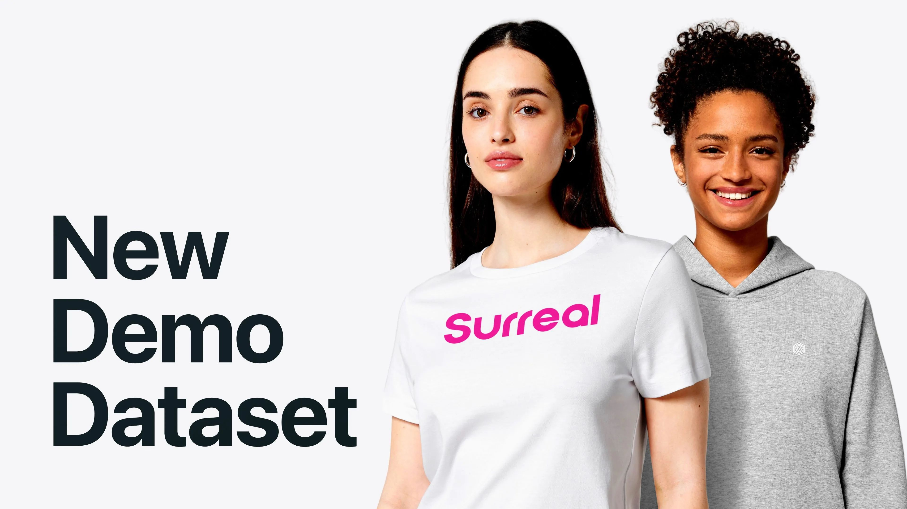
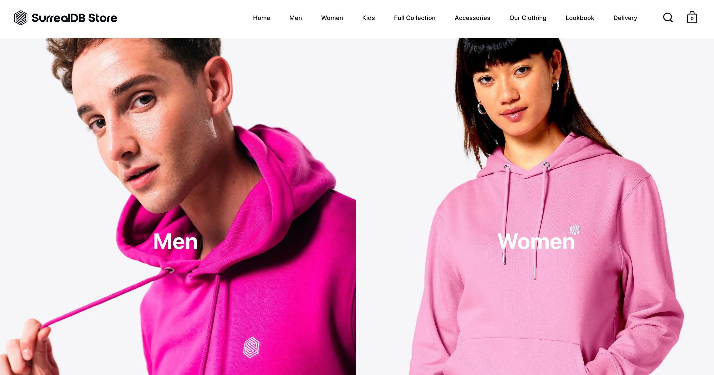
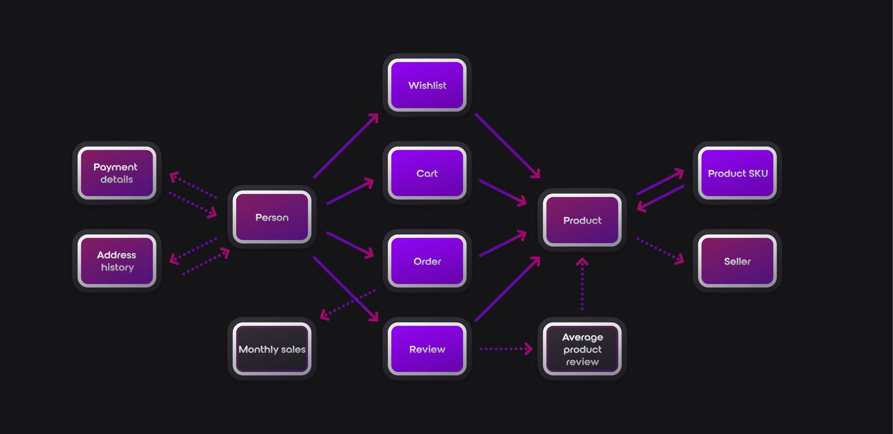
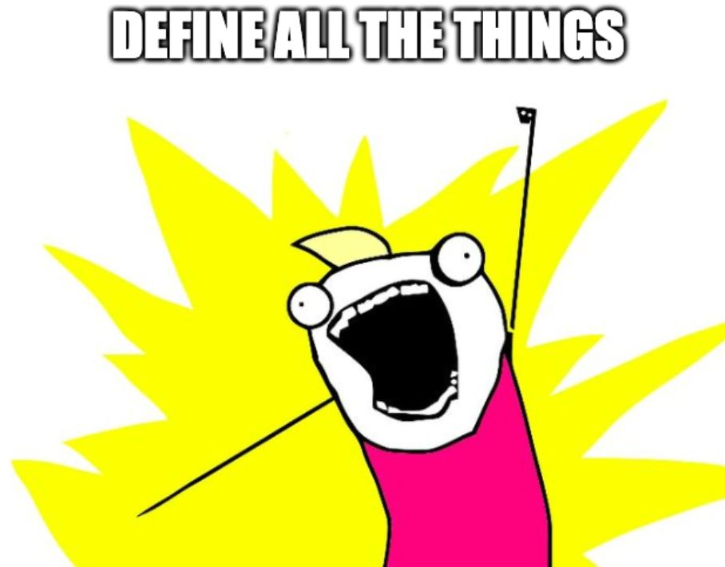

# Our new demo dataset has a lot in store for you!



With our [2.0-alpha release](/releases), you'll find a lot of exciting updates, one of which is a new and improved [demo dataset](/docs/surrealql/demo#surreal-deal-store---there-is-a-lot-in-store-for-you-recommended)!

If you've been using our [Surreal Deal dataset](/docs/surrealql/demo#surreal-deal---deals-so-good-its-surreal), you'll see some familiar tables and fields as this dataset is also based around an e-commerce store. However, unlike the previous Surreal Deal, this dataset is based on an actual e-commerce store!

That store is none other than our very own swag store - [SurrealDB.store!](https://surrealdb.store)



## The real and the surreal

Before we dive into some exciting examples, it's important to clarify what it means to be based on a real e-commerce store.

It means that

- The products are real, and you can buy them on the [SurrealDB.store!](https://surrealdb.store)
- Everything else is fake dummy data that has been generated from scratch with no connection to the actual real store.
- There is nothing in this demo data that was not publicly available on [SurrealDB.store](https://surrealdb.store) at the time of this dataset's creation.

Now that we have that out of the way, let's explore the new dataset.

## What's in store



### Define all the things!

There have been massive improvements and a lot of new features added since the dataset was first generated for `1.0-beta.9` last year.

The dataset has been completely overhauled to showcase many new features and more examples of data modelling patterns.

You'll now find the schema definitions for all the tables and fields, including more advanced definitions like assertions and default values.

```surrealql
-- Define a field with the object data type
DEFINE FIELD images
    ON TABLE product
    TYPE array<object>;

-- Define the subfields of the string data type Assert that the URL is a valid URL
DEFINE FIELD images.*.url
    ON TABLE product
    TYPE string
    ASSERT string::is_url($value);

-- Define the subfields of type number
DEFINE FIELD images.*.position
    ON TABLE product
    TYPE number;

-- Define time field on product table type object with subfields: created_at and updated_at with the datetime data type
DEFINE FIELD time
    ON TABLE product
    TYPE object;

DEFINE FIELD time.created_at
    ON TABLE product
    TYPE datetime
    VALUE $before OR time::now()
    DEFAULT time::now();

DEFINE FIELD time.updated_at
    ON TABLE product
    TYPE datetime
    VALUE time::now()
    DEFAULT time::now();
```

You'll find tables with record links in both directions.

```surrealql
-- from person to address_history
DEFINE FIELD person
    ON TABLE address_history
    TYPE record<person>;

-- from address_history to person
DEFINE FIELD address_history
    ON TABLE person
    TYPE record<address_history>;
```


As well as a graph relation example with just 2 tables instead of 3.

```surrealql
DEFINE TABLE product_sku TYPE RELATION FROM product TO product
```


You might notice it's using the new [`TYPE RELATION`](/docs/surrealql/statements/define/table#table-with-specialized-type-clause-since-140) instead of defining the `in` and `out` fields.

There are also various indexes defined.

```surrealql
-- Unique indexes
DEFINE INDEX unique_wishlist_relationships
    ON TABLE wishlist
    COLUMNS in, out UNIQUE;

-- Index on nested fields or record links
DEFINE INDEX person_country
    ON TABLE person
    COLUMNS address.country;

-- Analyzer and index for full-text search
DEFINE ANALYZER blank_snowball
    TOKENIZERS blank
    FILTERS lowercase, snowball(english);

DEFINE INDEX review_content
    ON TABLE review
    COLUMNS review_text
    SEARCH ANALYZER blank_snowball BM25 HIGHLIGHTS;
```

As well as functions

```surrealql
-- A function can encapsulate any valid SurrealQL logic
DEFINE FUNCTION fn::pound_to_usd($price: number) {
    RETURN $price * 1.26f;
};

-- Which means it can also be used like stored procedure
DEFINE FUNCTION fn::number_of_unfulfilled_orders() {
    RETURN (
        SELECT count()
        FROM order
        WHERE order_status NOTINSIDE ['processed', 'shipped']
        GROUP ALL
 );
};
```



### Time sortable random ids, using ULIDs

While our random ids are a great default option, they aren't the only option.

For an e-commerce application where things are often based on time, it can make sense to have a time sortable id, as was the case for [Shopify switching from UUID v4 to ULID](https://www.youtube.com/watch?v=f53-Iw_5ucA).

SurrealDB also supports [`UUID v7`](/docs/surrealql/datamodel/ids#generating-record-ids), which does pretty much the same thing. The honest reason `ULID` was chosen here is just because it's shorter and looks better.

Anyway, these identifiers naturally sort your data based on creation time, which enables you to better use our range query pattern for highly efficient operations regardless of table size.

```surrealql
-- Select the sum of sales for each product in the order table
SELECT
 product_name,
    math::sum(price * quantity) as sum_sales
FROM order:01FS426M489J4RVK2AGSN9HVP0..01FTQB6ZMG9RMB9300Z6GBDXNR
GROUP BY product_name;
```

### Realistic product reviews generated with llama3

It has been a fun experiment seeing what it takes to use a local LLM for fake data generation.

Now our fake reviews are no longer just a collection of words chosen at random.

```surrealql
review_text: "agriculture artwork feed name along xhtml putting photos much meal costs spring"
```

They are a collection of semi-random words chosen with statistics!

```surrealql
review_text: "The Voyager Wool-Like Jacket has become my new go-to for cold winter days. It's that good!",
```

As expected, it was relatively quick and easy to write prompts and get some outputs, you've been doing this with ChatGPT and friends for a while now.

The hard part was actually integrating it into a system and building the guardrails around it which makes it safe, useful, predictable and repeatable.

That is why we're [building out various AI/ML workflows](/features) here at SurrealDB which make it easier for you to [build intelligent applications.](/features)

What this means for this dataset however is that it allows us to have better examples such as this full-text search example looking for the products which people mention they are wearing nonstop.

```surrealql
-- Select product name and review text where the review text contains the phrase "wearing nonstop"
SELECT ->product.name, review_text
FROM review
WHERE review_text @@ 'wearing nonstop';
```

## What's next?

A lot of thought has been put into to making the dataset more realistic and useful for learning the various features and patterns everyone should be aware of. This is however just the beginning.

As we get closer to the finalised 2.0 release, the dataset will be updated with more features and improvements. As well as more examples of how to use it.

What you can do now is:

- [Go check out the new demo data in the documentation](/docs/surrealql/demo)
- [Load "Surreal Deal Store" from the Surrealist sandbox](https://app.surrealdb.com)

If you think something is missing or could be done better, [let us know!](mailto:community@surrealdb.com) We would love to hear from you.
