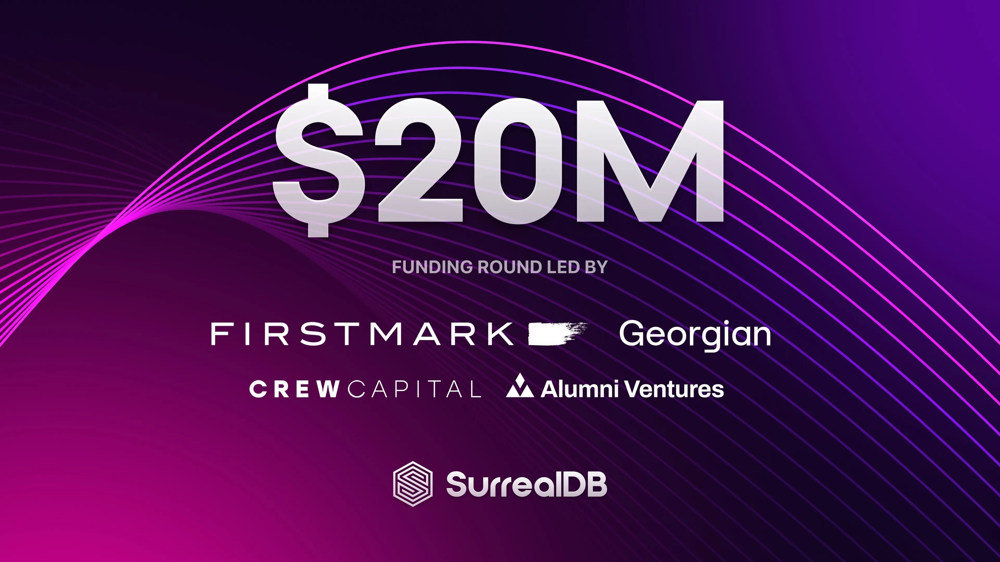

# SurrealDB Raises $20M to Disrupt Database Tech; Introduces New Cloud Beta Access

Led by FirstMark and Georgian, the Multi-Model Database has emerged as the Developer’s choice for Database Consolidation

London, United Kingdom June 18, 2024, SurrealDB, the ultimate multi-model database, today announced a $20 million investment round led by FirstMark and Georgian with participation from Crew Capital and Alumni Ventures. This latest round of funding brings SurrealDB’s total to $26 million.

In addition, the company has announced the beta launch of Surreal Cloud. Interested parties can sign up now to gain access: /signup

A rapidly growing number of enterprises use SurrealDB to consolidate their databases into one multi-model platform. Due to its flexibility and simplifying approach, software developers are adopting multi-model databases to quickly adapt to different data requirements and reduce the need for multiple database systems.

With over 25,000 GitHub stars, SurrealDB is one of the fastest-growing open-source database projects in the industry.

With SurrealDB, developers can build modern, real-time apps faster and more affordably. It minimises the need for backend infrastructure management and complex API creation while offering flexibility across data models and cloud platforms.

SurrealDB has emerged as the choice for organisations burdened by the cost of managing multiple databases. On average, many organisations manage 3-4 databases, adding cost and complexity and significantly impacting developer productivity. Developers spend excessive time on infrastructure management and learning new programming languages, leaving less time for application development.

In addition, SurrealDB handles advanced security and access permissions and includes indexing for AI workflows, machine learning inference and model processing.

The database is built entirely on Rust, a renowned general-purpose programming language recognised for its exceptional performance in critical applications due to its strong emphasis on safety, speed, and concurrency.

"Each industry goes through phases of bundling and unbundling. The database market has seen an explosion of many different types of specialised databases in the 2010s, resulting in ever-growing complexity for developers. The pendulum has now swung back to rebundling and simplification", said Matt Turck, Partner at FirstMark. "SurrealDB is rapidly emerging as the leader in that trend, offering tremendous versatility and performance to developers, whether they want to build simple applications or engage in advanced AI work. I’m thrilled to double down in the Series A after leading the seed round."

“SurrealDB’s novel multi-model database simplifies backend architecture and provides a powerful but user-friendly developer experience. Through our due diligence, including usage by Georgian's internal AI Lab, we have observed SurrealDB’s ability to consolidate multiple databases, which can reduce cost and complexity while also providing simple and intuitive querying. The pace of development by the SurrealDB team has resulted in one of the fastest growing open source projects that we have seen and we're very excited to partner with the company as it launches to an even broader audience”, said Emily Walsh, Lead investor at Georgian.

"As a developer myself, I passionately believe in creating software that enables all developers to focus on building the most innovative applications. With SurrealDB we're not just enhancing productivity; we're disrupting the database market. The support and enthusiasm from our community have been instrumental to our growth and success. We are committed to open-source development, and will continue to innovate and provide powerful, accessible tools that empower developers worldwide," said SurrealDB CEO and co-founder Tobie Morgan Hitchcock. "We are honoured to have FirstMark, Georgian, Crew Capital and Alumni Ventures support our vision. Their investment and support will help us scale faster and meet growing demand”.

## About SurrealDB

SurrealDB is an innovative, multi-model, cloud-ready database, suitable for modern and traditional applications. Its versatility, and focus on developer experience, along with the ability for deployment on cloud, on-premise, embedded, and in edge computing environments, allows developers and organisations to meet the needs of their applications, without needing to worry about scalability or keeping data consistent across multiple different database platforms.

To learn more and get started with SurrealDB in just one-click visit surrealdb.com
