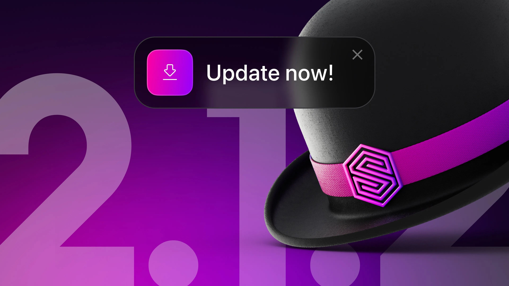

# Surrealist just got better - Update now!

> [!WARNING]
> Notice: You will need to manually install Surrealist 2.1.2 if you are currently using 2.1 or 2.1.1

Following the exciting release of Surrealist 2.0, which we launched back in April, we have been hard at work making constant improvements to the interface, adopting community feedback, and enhancing the user experience. While most of these changes can be noticed directly from the interface, we are also constantly improving the technical foundation of Surrealist to improve its stability and prepare it for future growth.

Within the Surrealist 2.1 release, we made some significant technical changes, such as introducing file associations and deep linking within the desktop app. While most of the changes in 2.1 have improved the usability of Surrealist, we have noticed that we mistakenly deactivated the automatic updater, meaning you will not have been prompted for any patch releases since then (oops!)

## It’s time to update!

In order to remedy this mistake we have released Surrealist 2.1.2, which besides containing further welcome improvements to the interface, also contains a brand new overhauled update experience for the desktop app. This means Surrealist will once again alert you of new updates and does so using a new redesigned update notification. We highly recommend you update to the 2.1.2 release to stay up-to-date with future releases.

## New Windows installer

Related to this new update experience is the new installer for Windows, which is now published as an `exe` file opposed to an `msi` file. This installer includes some minor improvements and solves some issues users may have faced in the past.

## Official RPM Support

Another improvement on the installer front is official support for `rpm` packages. This introduces a new way to install Surrealist on RedHat and Fedora based systems.

## Download dialog

With all these different distributions, finding the right binary to download from our GitHub can get overwhelming. For this reason, we have introduced a new Surrealist download wizard [on our website](/surrealist). Simply press “Download desktop app” and you’ll be able to choose which platform to download for.

## Surrealist 2.1.2

In addition to the overhauled updating experience, Surrealist 2.1.2 features more exciting improvements, such as experimental support for the first [SurrealDB 2.0 alpha release](/releases#v2-0-0-alpha-1).

Even if you already have Surrealist installed, you will have to [manually download and install Surrealist](/surrealist?download) 2.1.2 from our website.
