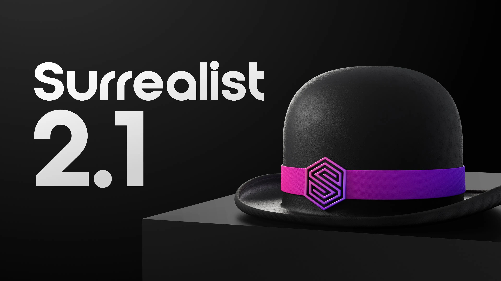
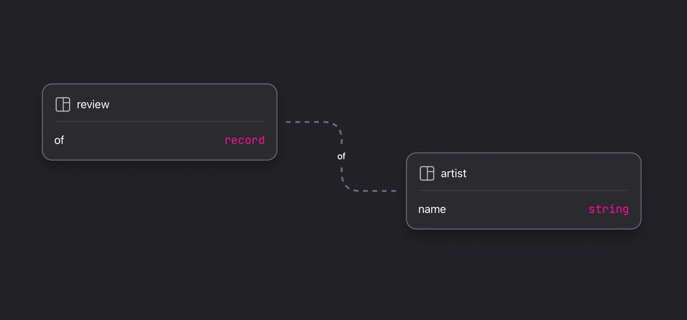
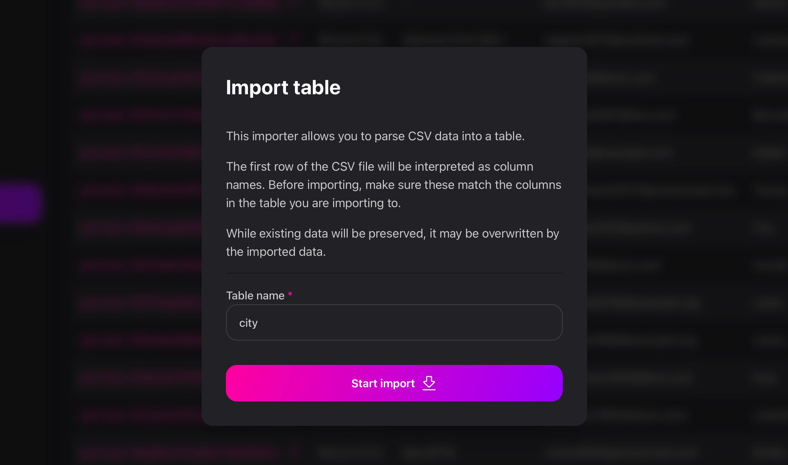

# What's new in Surrealist 2.1

I’m excited to announce the release of Surrealist 2.1, the latest update of our official SurrealDB graphical management interface. Expanding on the already powerful Surrealist 2.0 that we released back in April, this latest update brings an array of exciting new features and improvements to the interface. In this blog post we will dive into some of the more notable additions.

## Highlights

### Desktop file association

Users of the Surrealist Desktop app will notice that `.surql` and `.surrealql` files can now be opened directly with Surrealist. Doing so will automatically start Surrealist, navigate to the Query view, and open the query in a new tab. This makes it even easier to store queries in external files and further improves the workflow when working with many queries.

### Designer record link visualisation

In addition to visualising relations between tables, the Surrealist Designer view can now also draw relations based on simple record link fields. This highly suggested feature allows you to visualise your schema in even further detail. While disabled by default, this functionality can be easily enabled from the Table Graph options by pressing the gear icon in the designer view.

### CSV Table importing

Migrating from other databases and data sources can be a pain, which is why Surrealist now offers a convenient CSV table importer. Simply select a `.csv` file from the data importer (Explorer view > Import data), enter a desired table name, and Surrealist will automatically convert your rows to records. In addition, the importer will automatically parse SurrealQL compatible data such as objects, arrays, and dates.

We intend to further expand on the importing and exporting of schemas and records in future updates, including the support of JSON formats and exporting to CSV.

## Changelog

- Added designer view record link visualisation
- Draws lines for all `record<>` fields defined on tables
- Can be enabled in the designer view options
- Multiple links are collapsed into a single line for readability
- Added support for `.surql` file opening with Surrealist Desktop
- Queries are opened as a new tab in the query view
- Currently limited to files of at most 5 MB in size
- Added custom connection groups
- Redesigned the connection list to support creating groups
- Connections can be assigned to a group from the connection editor
- Group names can be customised
- Added support for importing tables from CSV files
- Accessible by selecting a `.csv` file from the "Import data" button in the Explorer view
- Automatically parses SurrealQL values such as objects, arrays, and dates
- Added support for deeplinking to the desktop app
- Allows integrating Surrealist deeper into custom tooling and workflows
- Added a loading indicator for long running queries
- Added schema function autocompletions in queries
- Added an appearance setting to permanently expand the sidebar
- Added `cmd+L`/`ctrl+L` shortcut to open the connections list
- Added Surrealist Mini window messaging protocol
- Added PHP examples to the API Docs view
- Added new convenient query context menu items
- Added the ability to resize the record creator, inspector, and designer drawers
- Added a log file for debugging purposes
- Added a confirmation when removing a connection
- Improved .NET examples in the API Docs view
- Improved Surrealist Mini startup performance for datasets
- Improved explorer logic and performance
- Improved the explorer record creation drawer
- Improved serving console performance
- Improved database version detection logic
- Improved SurrealQL syntax highlighting across the app
- Improved desktop config file readability
- Fixed authentication view incorrectly clearing passwords
- Fixed newsfeed indicator not always disappearing
- Fixed certain endpoints getting blocked on MacOS
- Fixed explorer filter parsing and error checking
- Fixed unintended overscroll behaviour on MacOS
- Fixed certain hover cards not having the correct background
- Fixed large numbers causing the explorer to crash
- Fixed command palette not saving history correctly

## Getting started

If you already have Surrealist installed, you will be prompted with an update notification the next time you launch Surrealist.

For new users, the easiest way to get started with Surrealist is using the web app available at [https://app.surrealdb.com](https://app.surrealdb.com). While the web app offers most of the functionality found within the Surrealist desktop app, for the complete Surrealist experience you can download the desktop app [here](https://github.com/surrealdb/surrealist/releases).
