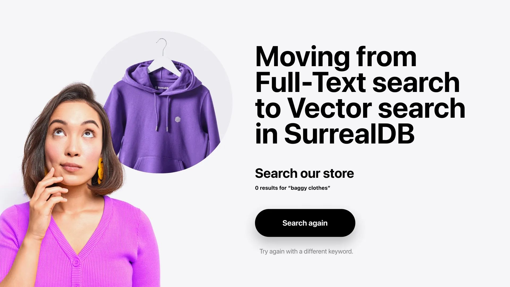
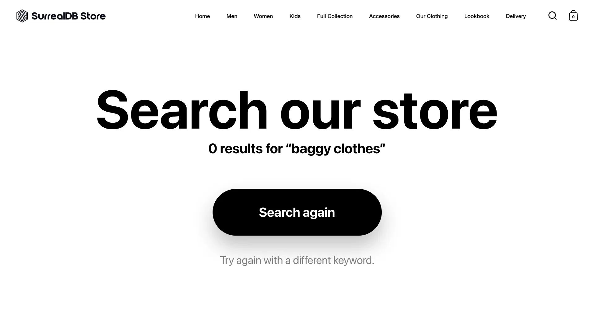

# Moving from Full-Text search to Vector search in SurrealDB



Recently, I realised I was out of Surreal clothing and wanted something comfy to wear at home. So I went ahead and searched for some "baggy clothes" on the [SurrealDB store](https://surrealdb.store/). However, the search results showed that no clothing of that description was available.



That was not what I expected. I knew we had a lot of baggy and comfy clothing that would suit my style. Clearly, the search wasn’t picking up items based on my preferences and choices.

But why was that?

## Why did the Full-Text search not work here?

For the search bar, the website uses Full-text search on the backend. [Full-text search](/docs/surrealdb/models/full-text-search) (FTS) uses [scoring functions](/docs/surrealql/functions/database/search#searchscore) and [analysers](/docs/surrealql/statements/define/analyzer) to process and index the content, preparing it for fast retrieval of any search terms that might come in. If the search query contains words and characters that don't exist in the indexed documents, the [Full-Text search index](/docs/surrealql/statements/define/indexes#full-text-search-index) won't return them. FTS is primarily concerned with the presence or frequency of words rather than their meaning or context. This means that a search on the SurrealDB store did not turn up any product details that match the search term “baggy clothes”.

Let’s confirm this by doing a FTS query on the Surreal Deal Store, which is based on our [SurrealDB Store](https://surrealdb.store/).

__Note:__ You can load the [demo dataset](/docs/surrealql/demo) in Surrealist and test the Full-Text search queries from the sandbox. To test the Vector search, follow the instructions given in the [examples repo](https://github.com/surrealdb/examples/blob/main/vector-search/README.md).

```surrealql
DEFINE INDEX product_details ON product COLUMNS details SEARCH ANALYZER blank_snowball BM25;
-- Search for products with "baggy clothes" in the details field
SELECT
  id,
  name,
  details
FROM product
WHERE details @@ 'baggy clothes'
LIMIT 10;
```

Running the above query will get an empty result.

However if you search for `Medium fit sleeve` (a type of sleeve fit) in product details, you’ll find a couple of products in the search result. This is because the words “Medium fit” and “sleeve” are present in the `details` array.

```surrealql
-- Search for products with "Medium fit sleeve" in the details field
SELECT
  id,
  name,
  details
FROM product
WHERE details @@ 'Medium fit sleeve'
LIMIT 3;
```

```surrealql
[
  {
    details: [
      'Medium fit',
      'Set-in sleeve',
      .
      .
    ],
    id: product:01FSXKCPVR8G1TVYFT4JFJS5WB,
    name: "Women's Surreal T-Shirt"
  },
  {
    details: [
      'Medium fit',
      'Set-in sleeve',
      .
      .
    ],
    id: product:01GRNCF5X88S29K4QQYNTYWDJF,
    name: "Men's Surreal T-Shirt"
  },
  {
    details: [
      'Medium fit',
      'Set-in sleeve',
      .
      .
    ],
    id: product:01HJN9QPNG9JAAAV19FT3GKZP0,
    name: "Kid's Mini Cruiser Hoodie"
  }
]
```

## How can your search understand the meaning of words?

If you want your search functionality to understand the meaning of your words, the appropriate choice would be to go with Semantic Search. [Vector Search](/docs/surrealdb/models/vector), which also means semantic search, performs computations on vector embeddings to grasp the context of words.

Vector embeddings are numerical representations of words, phrases, or entire documents. These embeddings can be created using any embedding model. These models are typically trained on a vast corpora to create multidimensional representations of language. And the embeddings encode complex linguistic relationships and world knowledge, which allows vector search to understand words in context, recognise synonyms and related concepts. When you perform a vector search, you're essentially looking for items in your database whose vector representations are most similar to the vector of your search query.

By using mathematical techniques like [cosine similarity](/docs/surrealql/functions/database/vector#vectorsimilaritycosine) to compare these embeddings, vector search can figure out conceptually similar items even when different words are used. And that's how it mimics the human understanding of language and meaning in the best possible way.

## Convert textual data into embeddings

Let’s try searching for “baggy clothes” using the Vector Search approach.

But first, we need to convert our search term into a vector embedding, i.e. we convert textual data into numerical vectors.

You can choose from a variety of text embedding models available publicly to do this. I am using [Nomic Embed](https://ollama.com/library/nomic-embed-text), which is open-source. You can also check out the embedding models like `text-embedding-3-small` and `text-embedding-3-large` from OpenAI, which are closed source.

Typically, this conversion is done using your language of choice in the application logic. For example, using Python.

But in SurrealDB, you have the option to embed this logic in the database query using SurrealQL.

As SurrealQL allows you to directly make an [HTTP request](/docs/surrealql/functions/database/http) from within the query, you can generate embeddings for your search phrase on the fly.

Here’s how the query will look:

```surrealql
LET $query_text = "baggy clothes"; 
LET $query_embeddings = return http::post('http://localhost:11434/api/embeddings', {
        "model": "nomic-embed-text",
        "prompt": $query_text
    }).embedding;
```

## Setup for testing Vector Search

To test vector search on the Surreal deal dataset, you'll need to import the dataset and Ollama. For a complete step-by-step guide on setting up vector search using the Surreal Deal dataset, please refer to our [GitHub example](https://github.com/surrealdb/examples/tree/main/vector-search). This guide includes instructions for installing SurrealDB, Ollama with the `nomic-embed-text` model, and importing the Surreal Deal dataset.

Once you've completed the setup, you'll have a product table with a `details_embedding` field and an [MTree vector index](/docs/surrealql/statements/define/indexes#m-tree-index-since-130) ready for searching.

## Performing Vector Search

Now that we have our embeddings in place, let's see how it can help us find those baggy clothes we're looking for.

For this we will use the vector function [`vector::similarity::cosine(array, array)`](/docs/surrealql/functions/database/vector#vectorsimilaritycosine).

Our final select statement will return the id, name and other details of the similar products will look like this:

```surrealql
SELECT id,
name,
category,
sub_category,
price, vector::similarity::cosine(details_embedding,$query_embeddings) AS similarity
FROM product WHERE details_embedding <|3|> $query_embeddings;
```

Let's look at the results:

```surrealql
[
  {
    category: 'Men',
    id: product:01GBDKYEAG93XBKM07CFH1S9S6,
    name: "Men's Slammer Heavy Hoodie",
    price: 65,
    similarity: 0.5410314334339930741185414464dec,
    sub_category: 'Shirts & Tops'
  },
  {
    category: 'Men',
    id: product:01GADYP46G8GN8YBPYTWGKYVB9,
    name: "Men's Locker Heavy Zip-Through Hoodie",
    price: 70,
    similarity: 0.5395832679844545049637110314dec,
    sub_category: 'Shirts & Tops'
  },
  {
    category: 'Women',
    id: product:01H36XDJRG95NB89AQKSV1NRGA,
    name: "Women's Locker Heavy Zip-Through Hoodie",
    price: 65,
    similarity: 0.5395832679844545049637110314dec,
    sub_category: 'Shirts & Tops'
  }
]
```

As we can see, the vector search has successfully identified hoodies as similar matches for "baggy clothes", even though the term "baggy" doesn't appear in the product names or categories. The similarity scores (around 0.54) signal that there is a moderate level of semantic similarity between our query and these products.

Aren’t hoodies baggy and comfortable? They absolutely are. I finally have some options to choose from.

## The right search leads to a better experience

If you know exactly what you're searching for and its semantic meaning does not matter to your search - such as searching for the meaning of a word in a dictionary or looking for syntax in the documentation - Full-Text Search would be the way to go. But in times when your priority is looking for the semantic meaning or searching beyond text, Vector Search will be more useful. Vector Search is heavily used in e-commerce applications because there will always be individuals like me who search for their favourite products using terms which aren’t exactly part of the description included with the items.

If you’re wondering what would happen if you combine the results of full-text search and vector search together, keep an eye on our upcoming [blogs](/blog) to know more!
