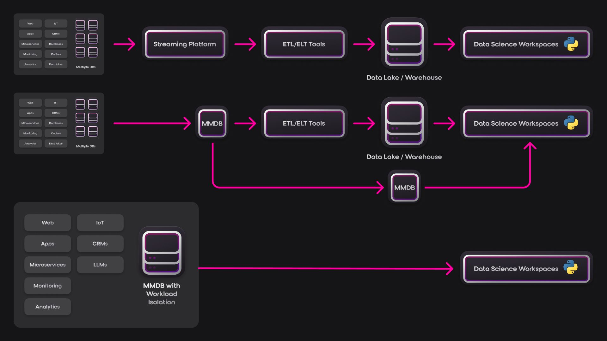

# Real-Time Data Science: Orchestrating Insights with the Right Ensemble

Picture this: It's Monday morning, and your CEO urgently needs an update on the company's website traffic.

You know the data exists, but it's stuck in the slow-moving stream of your standard Extract-Transform-Load (ETL) pipeline. In a moment of desperation, you dump the raw data into a separate database for a quick analysis. The numbers look great! You share them with leadership, only to have the head of marketing question the results a few hours later when the data finally makes its way into the warehouse... and it doesn't match.

Sound familiar? We've all been there. And like a band performing live, everyone knows when it just doesn’t sound right.

In the fast-paced world of real-time data, your team needs to behave like a band performing live - responsive to the audience, ready to improvise with the latest information at a moment's notice. However, inconsistencies between data sources can lead to discordant notes, with different team members playing from different music sheets.

The struggle for real-time, unaggregated data is a common pain point in data science. Keeping separate data sources consistent is a headache, and discrepancies often lead to finger-pointing and confusion. But when the pressure is on to deliver answers *now*, you need a reliable way to access and analyse the freshest data.

## The Power of Real-Time Analysis

Real-time capabilities are incredibly useful for:

- Monitoring System Health: Track website traffic, server loads, or application performance in real time to identify issues quickly.
- Detecting Fraud: analyse financial transactions as they happen to flag suspicious activity.
- Personalised Marketing: Deliver targeted offers based on a customer's current browsing behaviour.

Time-series data, in particular, often demands real-time analysis. Consider these examples:

- Stock Market Trading: Decisions need to be made based on the latest price fluctuations.
- IoT Sensor Data: Monitoring temperature, pressure, or other variables in real time can trigger immediate actions.
- Social Media Analytics: Understanding trending topics as they emerge can inform marketing or crisis management strategies.

## Orchestrating Your Real-Time Data Ensemble

Let's explore three approaches to real-time data integration, each with its own strengths and weaknesses:

### Approach 1: The Orchestrated Ensemble (Real-Time Streaming + ETL)

The Breakdown:

- Components: Separate data lake or warehouse, real-time streaming platform (e.g., Kafka, Pulsar), message queue, ETL/ELT tools, Online Analytical Processing (OLAP) product.
- Data Flow: Transactional data is ingested by the streaming platform, queued, transformed with ETL/ELT, then lands in the data lake/warehouse for OLAP analysis and finally, your data science workspaces.

Pros:

- Robust: Handles large-scale, intricate data pipelines with ease.
- Flexible: Multiple specialised tools for both streaming and ETL, catering to your specific needs.

Cons:

- Complex: More moving parts mean a more intricate architecture to manage.
- Overhead: Increased operational effort is required to keep everything running smoothly.
- Latency: Multiple processing steps can delay getting data to your team.
- Raw Information loss: After multiple transformations the source raw data is [lost](https://stackoverflow.blog/2022/03/03/stop-aggregating-away-the-signal-in-your-data/) due to the upstream choices you make in your ETL logic.

### Approach 2: The Agile Jazz Band (Multi-Model Database with OLAP)

What is a Multi-Model Database (MMDB)?

A [multi-model database](/blog/what-are-multi-model-databases) is not your average data repository. It's designed to handle diverse data types - structured, unstructured, semi-structured, time-series, geospatial, you name it - under one roof. Unlike traditional databases that specialise in a single data model (e.g., relational, graph, vector, time-series, or document), MMDBs offer a unified platform for storing, querying, and analysing different kinds of data.

MMDBs for Real-Time Analytics: A Paradigm Shift

MMDBs can massively accelerate real-time analytics by tackling the challenges that plague traditional data pipelines:

- Reduced Latency: MMDBs bypass the lengthy ETL processes that introduce delays. Data is ingested and made available for analysis almost instantaneously.
- Data Fidelity: By eliminating the need for multiple data sources, MMDBs ensure that your insights are always based on the most up-to-date and accurate information.
- Flexibility: MMDBs empower data scientists to work with diverse data types without the hassle of managing separate databases. This means faster iterations, more experimentation, and ultimately, more valuable insights.

The Breakdown:

- Components: A single, powerful multi-model database, paired with an OLAP product and replica MMDBs for data-marts.
- Data Flow: Transactional is captured directly into a master transactional MMDB, which is then used by the OLAP product for long running analysis after ETL/ELT and replicated to MMDB marts for real-time analysis for recent data.

Pros:

- Speedy: Real-time data access with minimal latency for faster insights.
- Consistent: A single data source ensures accuracy across your analyses.
- Adaptable: Multi-model support in the database handles various data types.
- Better data troubleshooting: Having access to the raw real-time data along side the warehoused data will make it easier to mitigate data loss issues.

Cons:

- Complex: Replication of the MMDBs may be simpler than an ETL but it comes with additional maintenance overhead.
- Database Choice: You'll need an MMDB with the functionality and performance characteristics to deliver on the transformations needed at scale.
- Production performance: Any complex ELT steps can hamper the performance of production systems without workload isolation.

### Approach 3: The Unified Symphony (MMDB with Workload Isolation)

Workload Isolation: The Key to Performance

One of the most critical features that has emerged since the adoption of cloud-native applications is the ability to [isolate computational workflows](/blog/why-surrealdb-is-the-future-of-database-technology-an-in-depth-look#storage-layer-innovation) from high-concurrency capable storage platforms. This capability ensures that the complex queries and analyses run by data scientists don't impact the performance of transactional workloads essential for business operations. Workload isolation acts as a safeguard, allowing both worlds to coexist harmoniously within the same database.

The Breakdown:

- Components: A high-performance multi-model transactional database (MMDB) with built-in workload isolation.
- Data Flow: Transactional data is written directly to the MMDB. Data scientists connect *directly* to the MMDB for queries and analysis, bypassing the need for a separate OLAP product.

Why Choose This Approach?

This approach is ideal when:

- Simplicity is Paramount: You want the absolute simplest architecture possible.
- Speed Matters: You need lightning-fast analysis on real-time data.
- MMDB Expertise: Your engineering team is comfortable managing a large scale MMDB deployment.
- Specific Use Case: The analytical needs align well with the capabilities of the MMDB.

Pros:

- Ultra-Simple: The most streamlined solution, reducing complexity and operational overhead.
- High-Performance: The MMDB is optimised for both transactional and analytical workloads, potentially delivering even faster results.

Cons:

- Database Choice: You'll need an MMDB with robust workload isolation capabilities, strong scalability, *and* strong support for the type of analysis you want to perform.
- Security: Direct access to the MMDB requires stringent access controls to protect sensitive transactional data.

### Making the Decision

The ideal architecture depends on YOUR unique needs. Consider the following:

- Data Volume and Velocity: High volumes and complex transformations? Approach 1 might be your best bet.
- Simplicity vs. Flexibility: Prioritise ease of use and faster insights? Approach 2 or 3 could be winners.
- Existing Infrastructure: Already invested in streaming and ETL? Approach 1 might be a natural fit.
- Cost: Factor in licensing costs for different tools and databases.

## The Data Paradigm Shift

It's important to recognise that different data tasks call for different tools. While OLAP warehousing is invaluable for analysing large historical datasets, it's not always necessary (or efficient) when dealing with current, often smaller-scale data. Waiting for data to trickle through a lengthy processing pipeline simply isn't an option when you need real-time insights.

Traditional architectures for real-time data can be likened to musical ensembles. The Real-Time Streaming Platform + ETL Tools approach, with its separate components for streaming, ETL, and storage, resembles a chamber ensemble. Each instrument plays a distinct role, offering flexibility but requiring careful coordination. The Multi-Model Transactional Database approach is akin to a jazz band: it's agile and responsive, improvising on real-time data, but may lack the structure of a larger ensemble. In contrast, the Single Platform with Workload Isolation approach is like a symphony orchestra: diverse capabilities within a unified system work harmoniously under a skilled conductor, delivering power, precision, and a seamless experience. While each approach has its strengths, the symphony orchestra's unified power may be the key to unlocking new levels of real-time data performance.

No matter your choice, remember, real-time data is the fuel for today's data-driven decision-making. Choose the architecture that empowers your data science team to deliver maximum value to your organisation.
