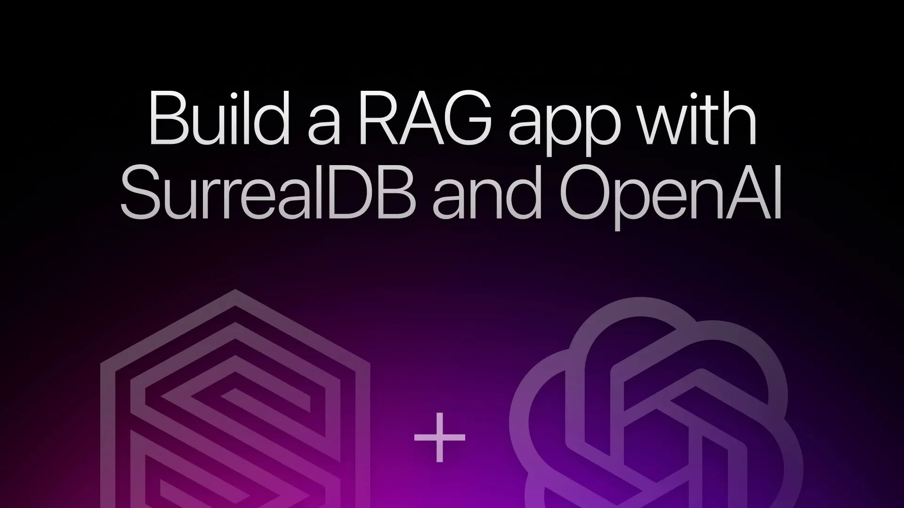
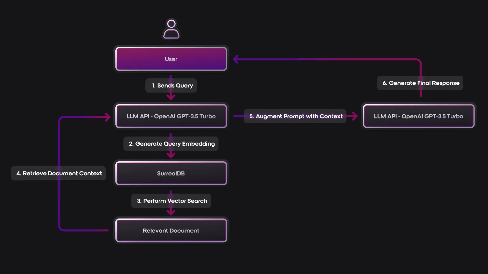
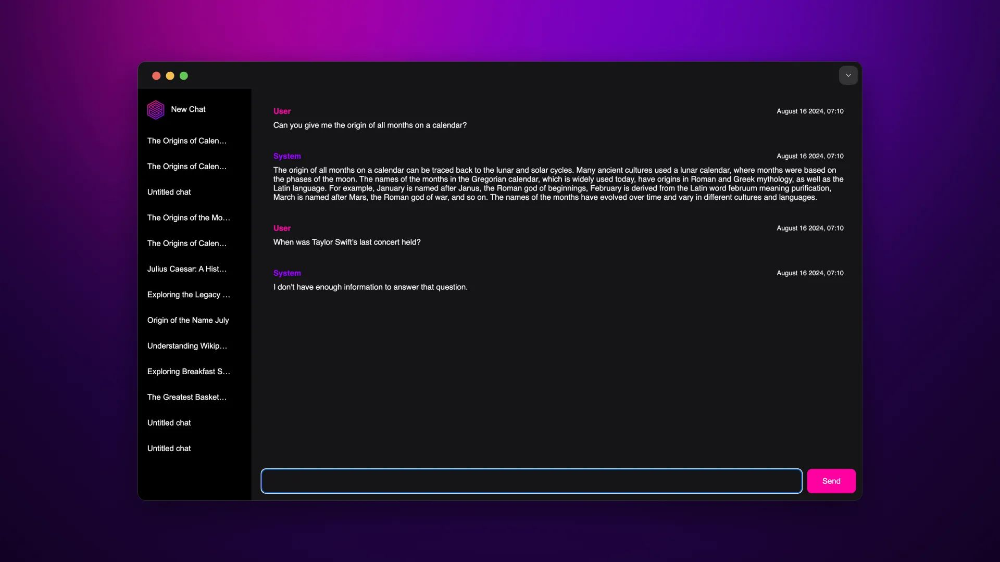

# Building a Retrieval-Augmented Generation (RAG) App with OpenAI and SurrealDB



## Introduction: LLMs and the Need for RAG

We are seeing [Large language models](https://www.youtube.com/watch?v=zjkBMFhNj_g)(LLMs) being used in all sort of areas such as information retrieval, data conversion, code generation, and even conversational interfaces.

LLMs often struggle with accuracy and hallucinate information. Based on when and what dataset they were trained on they can also become outdated if they lack access to the most current data.

While [LLMs hallucinate due to their statistical nature](https://arxiv.org/pdf/2403.10446v1), limited training data, and lack of real-world grounding, adding an external source of up-to-date domain-specific information can help LLMs provide more contextually relevant and factually grounded answers.

This method of adding an external structured source of data for LLMs to reason with is called [Retrieval-Augmented Generation (RAG)](https://arxiv.org/pdf/2005.11401). RAG combines the generative capabilities of language models with information retrieval from external knowledge sources and helps anchor the LLM's responses to relevant, factual information.

## Implementing RAG with SurrealDB

A RAG application typically converts both the user's query and the documents in the external knowledge base into vector embeddings and stores them in a database. There are databases that only cater to vector operations, but in most cases they can be an overkill if your existing database can support vectors, its functions, and semantic search.

SurrealDB is a multi-model database. It supports [relational](/blog/beyond-sql-joins-exploring-surrealdbs-multi-model-relationships), document, graph, and [time series](/blog/its-about-time-time-series-in-surrealdb) data models within a single system. It can also store vector data.

This means you don’t need separate systems for structured/unstructured data and vector operations - it's all in one place. You also don’t need adjacent libraries to score and rank your vector search since SurrealDB supports vector operations natively. Your application ends up with fewer moving parts which reduces the overall complexity.

As we move ahead, we will see a big chunk of information being stored as numerical embeddings. But you shouldn’t have to use different data query languages to interact with your hybrid data. In SurrealQL, you can include your vector functions and algorithms in the same query. This will give you more defined control of your data.

## Let’s Build: A RAG assistant with OpenAI and SurrealDB

This tutorial is based on the talk [Unlocking the Future of AI: Secure and Intelligent Retrieval with OpenAI and SurrealDB Vector Search](https://www.youtube.com/watch?v=eBE-o2OMF-E) given by Machine learning engineer [Cellan Hall](https://github.com/Ce11an) at SurrealDB's [Futures Forum event](https://www.meetup.com/futures-forum-ai-llm-meetup/).

We'll build an assistant that answers questions based on Wikipedia information, using the GPT-3.5 Turbo model from OpenAI. Our goal is to create an assistant that generates answers to questions it's aware of and explicitly states when it doesn't have enough information, avoiding hallucination.

We use SurrealDB to handle the retrieval process and storing the embeddings.

## Prerequisites

- **System Requirements**: MacOS Sonoma 14.4, SurrealDB, Python env > 3.11
- **Software Installation**: [SurrealDB](/releases#v1-5-4), Rust compiler.
- **OpenAI API Key**: Obtain from [OpenAI Developer Quickstart](https://platform.openai.com/docs/quickstart)
- **GitHub Repo:** [Clone](https://github.com/surrealdb/examples/tree/main/surrealdb-openai) the application and switch to the surrealdb-openai folder to follow along.

## Step 1: Understanding the Application Architecture



- **User Query**: The user sends a query to the application.
- **LLM API (OpenAI GPT-3.5 Turbo)**: The query is processed by the OpenAI API, which generates a vector embedding representing the query’s semantic meaning.
- **SurrealDB Vector Search**: The query embedding is sent to SurrealDB, where a vector search is performed to identify the most relevant document stored in the database.
- **Document Retrieval**: We return the most relevant document based on a similarity score containing the context necessary to enhance the LLM's response.
- **Prompt Augmentation**: The retrieved document augments the original query and is sent back to the LLM API.
- **Response Generation**: The LLM finally processes the augmented prompt, generating an accurate response grounded in up-to-date information based on the external dataset added.

## Step 2: Running and Testing the App

Before we get into the details of this application, let's run it to see if our RAG app works as expected.

Follow the [README](https://github.com/surrealdb/examples/blob/main/surrealdb-openai/README.md) step-by-step to run SurrealDB and test the application.

Here’s what the app will look like after successfully running it in your Python environment.



## Step 3: Key Components of the Application

Now that our RAG app is running smoothly, let's take a tour through the key components of the application.

### Schema Overview

We start our schema definition by defining [namespaces](/docs/surrealql/statements/define/namespace) and [databases](/docs/surrealql/statements/define/database), which in SurrealDB help you scope and limit access to your data. You can find the definition in the [define_ns_db.surql](https://github.com/Ce11an/surrealdb-openai/blob/main/schema/define_ns_db.surql) file.

The main tables in our SurrealDB schema are:

1. `wiki_embedding`: Stores the wikipedia article URLs, titles, content, and their vector embeddings.
1. `chat`: Manages chat sessions with timestamps and titles.
1. `message`: Stores individual messages within chats.
1. `sent`: Handles the relationship between chats and messages.

```surrealql
DEFINE INDEX IF NOT EXISTS wiki_embedding_content_vector_index ON wiki_embedding 
FIELDS content_vector MTREE DIMENSION 1536 DIST COSINE;
```

### Core SurrealQL Functions

Once all tables and indexes are defined we can move towards some key functions that power our RAG application:

**Generating embeddings:** OpenAI offers multiple [LLM models](https://platform.openai.com/docs/models). They cover a wide range of use cases and price points. Once you have the model fixed and your input, you can pass it to the `embeddings_complete` surrealql function where we use a [`http::post`](/docs/surrealql/functions/database/http#httppost) function to interact with the OpenAI API and return the embeddings.

```surrealql
DEFINE FUNCTION IF NOT EXISTS fn::embeddings_complete($embedding_model: string, $input: string) {
    RETURN http::post(
        "https://api.openai.com/v1/embeddings",
        { "model": $embedding_model, "input": $input },
        { "Authorization": fn::get_openai_token() }
    )["data"][0]["embedding"];
};
```

```surrealql
DEFINE FUNCTION IF NOT EXISTS fn::get_openai_token {
    RETURN "Bearer " + $openai_token;
};
```

Here, `$openai_token` is a variable that will be populated with the value from the `.env` file when the SurrealDB instance is started.

**Note:** Remember to not push your .env file to version control

**Searching for relevant documents:** For every prompt we find the most relevant document using the vector index and the cosine similarity between each document's `content_vector` and the input vector.

```surrealql
DEFINE FUNCTION IF NOT EXISTS fn::search_for_documents($input_vector: array<float>, $threshold: float) {
    LET $results = (
        SELECT
            url,
            title,
            text,
            vector::similarity::cosine(content_vector, $input_vector) AS similarity
        FROM wiki_embedding
        WHERE content_vector <|1 | > $input_vector
        ORDER BY similarity DESC
        LIMIT 5
    );
    RETURN {
        results: $results,
        count: array::len($results),
        threshold: $threshold,
    };
};
```

The RAG function: This function ties everything together - embedding generation, document retrieval, prompt creation, and AI response generation - making it the core of our RAG application.

```surrealql
DEFINE FUNCTION IF NOT EXISTS fn::surreal_rag(
    $llm: string,
    $input: string,
    $threshold: float,
    $temperature: float,
) {
    LET $input_vector = fn::embeddings_complete("text-embedding-ada-002", $input);
    LET $search_results = fn::search_for_documents($input_vector, $threshold);
    LET $context = array::join($search_results.results[  * [].text, "\n\n");
    LET $prompt = "Use the following information to answer the question. If the answer cannot be found in the given information, say 'I don't have enough information to answer that question.'\n\nInformation:\n" + $context + "\n\nQuestion: " + $input + "\n\nAnswer:";

    LET $answer = fn::chat_complete($llm, $prompt, "", $temperature);

    RETURN {
        answer: $answer,
        search_results: $search_results,
        input: $input,
    };
};
```

Our assistant has a chat interface similar to ChatGPT. Where every chat includes its messages and we can also retrieve the conversation history and context.

Let's see how to build it.

### Chat and Message Management

In a traditional relational database setup, we would link the `chat` and `message` table using foreign keys. With the growing chat history, the JOINS can get overwhelming.

You could use a separate Graph database to connect the two nodes with an edge, but why would you when you can reduce complexity by using [graph relations](/docs/surrealql/statements/relate) from SurrealDB.

```surql
chat->sent->message
```

```surql
SELECT out.content, out.role
FROM $chat_id->sent
ORDER BY timestamp
FETCH out;
```

Functions `fn::create_message()`, `fn::create_system_message()`, `fn::generate_chat_title()`, and others help with creating and managing messages, generating AI responses, and organising chats, along with retrieving conversation history and generating chat titles.

## Step 4: Hooking it up to Python

Now, let's bring in [FastAPI](https://fastapi.tiangolo.com/) to get our backend rolling:

```python
app = fastapi.FastAPI(lifespan=lifespan)
app.mount("/static", staticfiles.StaticFiles(directory="static"), name="static")
templates = templating.Jinja2Templates(directory="templates")
```

We'll need a few key endpoints:

```python
@app.post("/create-chat", response_class=responses.HTMLResponse)     async def create_chat(request: fastapi.Request) -> responses.HTMLResponse:         chat_record = await life_span["surrealdb"].query(             """RETURN fn::create_chat();"""         )         return templates.TemplateResponse(             "create_chat.html",             {                 "request": request,                 "chat_id": chat_record[0]['result']['id'],                 "chat_title": chat_record[0]['result']['title'],             },         )
```

```python
@app.post("/send-user-message", response_class=responses.HTMLResponse)     async def send_user_message(         request: fastapi.Request,         chat_id: str = fastapi.Form(...),         content: str = fastapi.Form(...),     ) -> responses.HTMLResponse:         """Send user message."""         message = await life_span["surrealdb"].query(            """RETURN fn::create_user_message($chat_id, $content);""",             {"chat_id": chat_id, "content": content}         )         return templates.TemplateResponse(             "send_user_message.html",             {                 "request": request,                 "chat_id": chat_id,                 "content": message[0]['result']['content'],                 "timestamp": message[0]['result']['timestamp'],             },         )
```

```python
python     @app.get("/send-system-message/{chat_id}", response_class=responses.HTMLResponse)     async def send_system_message(         request: fastapi.Request, chat_id: str     ) -> responses.HTMLResponse:         message = await life_span["surrealdb"].query(             """RETURN fn::create_system_message($chat_id);""",             {"chat_id": chat_id}         )
title = await life_span["surrealdb"].query(             """RETURN fn::generate_chat_title($chat_id);""",             {"chat_id": chat_id}         )
 return templates.TemplateResponse(             "send_system_message.html",             {                 "request": request,                 "content": message[0]['result']['content'],                 "timestamp": message[0]['result']['timestamp'],                 "create_title": title == "Untitled chat",                 "chat_id": chat_id,             },         )
```

As mentioned before you can refer the repo for the other api endpoints.

These endpoints are our bridge between the front end and our RAG-powered back end.

## Step 5: Frontend Overview

For the frontend, we're keeping it simple with a few [HTMX templates](https://github.com/surrealdb/examples/tree/main/surrealdb-openai/templates):

- `index.html`: The main chat interface
- `chats.html`: Shows all existing chats
- `create_chat.html`: For starting a new chat
- `load_chat.html`: Displays messages in a chat
- `send_user_message.html`: Renders user messages
- `send_system_message.html`: Displays AI responses

This setup gives us a smooth, responsive interface that plays nicely with our RAG backend.

## Wrapping it up

And there you have it! We've built a RAG application from the ground up with SurrealDB and OpenAI's GPT-3.5 Turbo. Here’s what Cellan had to say on why he chose SurrealDB to build his RAG application.

> Using SurrealDB with OpenAI has been an exciting and rewarding experience. SurrealDB’s multi-model nature allowed me to rapidly iterate on my data schema, starting with schema-less tables and transitioning to schema-full tables as my ideas took shape. The extensive feature set of SurrealDB enabled me to write the majority of the application in SurrealQL, which meant I could avoid relying on additional services or packages for vector search and document retrieval. Of course, SurrealDB is flexible enough to integrate seamlessly with other popular LLM frameworks like LangChain, offering developers the freedom to choose how they want to build their applications. This project is just the beginning of what’s possible with SurrealDB and large language models, and I’m eager to explore further enhancements using SurrealML in the future.

The combination of SurrealDB's vector search and OpenAI's language model gives us a powerful tool for smart, context-aware information retrieval and generation. Whether you're building a Q&A system or generating personalised content, you should check out [SurrealDB’s vector functions](/docs/surrealql/functions/database/vector).

So go ahead, give it a spin, and see what you can create!
