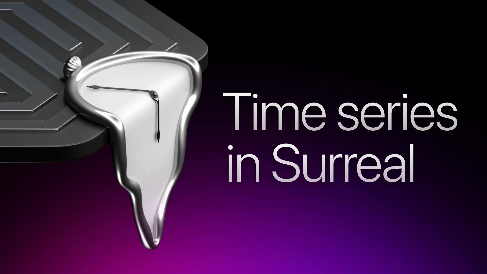

# It’s about time: time series in SurrealDB



## What is time?

The philosopher Heidegger described Hegel's "vulgar understanding" of time as [simply a sequence of “nows”.](https://www.cambridge.org/core/journals/hegel-bulletin/article/abs/time-for-hegel/B24C8A2DB22D2BE9B25A93CD3C4DB91F)

This "vulgar understanding" also happens to be a great way to understand time series data. We are simply capturing this sequence of "nows" such that we can analyse it later.

## How now is now?

```surrealql
RETURN time::now();
```

Dealing with time series data forces you to think of these rather philosophical questions because, for most things in life, now usually means right this second.

However, for high-frequency time series data, it's all about milliseconds, microseconds and nanoseconds.

In SurrealDB, when we ask for the current time using the `time::now` function, we get back an ISO8601 timestamp with nanosecond precision in the UTC timezone.

```surrealql
"2024-08-09T22:02:19.544Z"
```

Fun fact, UTC is not Universal Time Coordinated, but rather Coordinated Universal Time (CUT), but since the French acronym is TUC (Temps Universel Coordonné), a compromise was made to have UTC as the international acronym.

## The two types of time series data

As we've seen, a single now is called a timestamp and a sequence of "nows" is called a time series. However, not every time series is the same.

There are fundamentally two types of time series data: events (discrete data) and metrics (continuous data).

### Events

Events are timestamped records collected whenever they happen. An example of this is when starting a new SurrealDB server using `surreal start`, after which you’ll be greeted with log messages like these.

```cli
2024-08-08T09:33:21.883060Z  INFO surreal::env: Running 2.0.0 for macos on aarch64
2024-08-08T09:33:21.883154Z  INFO surrealdb::core::kvs::tr: Starting kvs store in memory
2024-08-08T09:33:21.883573Z  INFO surrealdb::net: Started web server on 127.0.0.1:8000
```

Events are both:

- Discrete: meaning each of the log messages above is a separate part of the whole `surreal start` event.
- Irregular: meaning that when we trigger the `surreal start` event, we get the series of log messages above. If we do nothing after that we won’t get any more logs until we send a stop event using the keyboard shortcut ctrl-c.

```cli
2024-08-12T15:51:10.024760Z  INFO surrealdb::net: Web server stopped. Bye!
```

However, if we have our logging set to debug `surreal start --log debug` and then run a query, that will trigger an event and we’ll get more timestamped records.

```cli
2024-08-08T09:49:44.129228Z DEBUG rpc/call: surreal::rpc::response: Process RPC response otel.kind="server" ws.id=22a1c9f6-f762-4282-8fdd-c9179f5b7e90 rpc.service="surrealdb" rpc.method="query" otel.name="surrealdb.rpc/query" rpc.request_id="34"
```

Since there can be millions of queries per second and each query can generate multiple log messages, you quickly start to see how large the scale of time series data can be.

### Metrics

Metrics are timestamped records collected over regular intervals of time. If you use any kind of fitness tracker, such as the Apple Watch, you’ll have seen metrics in action.

Metrics are both:

- Continuous: meaning each heart rate measurement is part of tracking the same heart.
- Regular: meaning you collect and summarise measurements at regular intervals instead of all the time, such that your fitness tracker’s battery and storage lasts longer. Our example summarises our heart rate to beats per minute (bpm).

To keep the series continuous without tracking every heartbeat, the fitness tracker uses fancy math to infer your past heart rate to fill in the gaps. If your current heart rate is 71 bpm and your heart rate was 72 bpm 2m ago then your heart rate 1m ago would be between 71 and 72 bpm. We can use a bit of fancy math like linear interpolation to find out the answer is most likely 71.5 bpm.

```surrealql
-- linear interpolation
RETURN math::lerp(71, 72, 0.5) -- = 71.5
```

Its also possible to turn discrete events into continuous metrics, usually through counting the events over a regular interval. We can for example turn discrete query logs into a useful metric such as queries per second (qps) to keep track of the database performance.

Three key reasons for turning events into metrics are:

- Turning data into insight. A series of query logs is data, queries per second offers insight.
- Downsampling to save on storage space and computation cost, only keeping the summarised metrics (beats per minute or queries per second) if the lowest granularity of the data is not needed.
- Enabling forecasting, since most forecasting models only work with continuous and regular data.

## Modelling time series data in SurrealDB

Now that we’ve established a common understanding of time series data, let’s explore a practical example using IoT sensor data.

## Modelling events

The normal way of modelling data in SurrealDB would be as fields in a record.

```surrealql
CREATE sensor_readings CONTENT {
    timestamp: time::now(),
    location: location:Longleat_House,
    sensor: sensor:ARF8394AAA,
    temperture_celsius: 28.4,
    humidity_percent: 55
};
```

### Complex record IDs

A more optimised way of working with it in a time series context would however be using array-based record IDs, otherwise known as complex record IDs.

```surrealql
CREATE sensor_readings:[
  time::now(),
  location:Longleat_House,
  sensor:ARF8394AAA,
  28.4,
  55
];
```

### Selecting from array-based record IDs

The example of storing it as a record or as part of the ID might look similar at first glance, but under the hood, it's optimised for efficient range selection, through the [magic of record IDs](/blog/the-life-changing-magic-of-surrealdb-record-ids).

This effectively means fewer worries about selecting the right indexes or partitions since the ID field already does that naturally in your data as you scale with the performance of a key-value lookup regardless of size!

```surrealql
-- Select all the temperature readings from the start until now 
-- from a specific sensor
SELECT id[2] AS temperture_celsius FROM sensor_readings:[
  NONE,
  sensor:ARF8394AAA
]..=[
  time::now(),
  sensor:ARF8394AAA
];
```

This is however not the only way of doing it, you can have the metadata in the ID and sensor data in the record itself, like in the example below.

```surrealql
CREATE sensor_readings:[time::now(), location:Longleat_House,sensor:ARF8394AAA] 
CONTENT {
    temperture_celsius: 28.4,
    humidity_percent: 55
};
```

```surrealql
-- Select all the temperature readings from the start until now 
-- from a specific sensor
SELECT temperture_celsius FROM sensor_readings:[
  NONE,
  sensor:ARF8394AAA,
]..=[
  time::now(),
  sensor:ARF8394AAA,
];
```

### IDs inside IDs

The last thing to note here is that we’ve actually been using record IDs inside our complex record IDs! This is to reduce the fields in our main time series table to only the necessary ones by offloading most of the metadata to connected tables.

In our case we have

- `location:Longleat_House` , which refers to the `Longleat_House` ID in the `location` table. There we put all the metadata about the location itself such as geo coordinates.
- `sensor:ARF8394AAA` , which refers to the `ARF8394AAA` ID on the `sensor` table. There we could put all the metadata about the sensor such as location, firmware, when it was bought and when it needs maintenance.

It's very easy and performant to get the connected data, since you don’t have to do any table scans for that either since it links directly to a specific record on a specific table!

```surrealql
-- Select all fields in the ID and the coordinates field from the sensor table
SELECT id, id[2].coordinates AS sensor_coordinates
FROM sensor_readings:[
  '2024-08-13T03:32:19.109Z',
  location:Longleat_House,
  sensor:ARF8394AAA,
  28.4,
  55
];
```

Now that we’ve explored a bit how to store and query event data, let’s turn our events into metrics.

## Modelling metrics

For doing metrics in SurrealDB you can choose one or combine

- Pre-computed table views and Live Queries
- Drop tables
- Custom events

### Pre-computed table views

Our [pre-computed table views](/docs/surrealql/statements/define/table#pre-computed-table-views) are most similar to event-based, incrementally updating, materialised views. Practically, this means our downsampled metrics will always be up to date as it incrementally updates in near real-time when we add more records to the `sensor_readings` table.

```surrealql
-- Define a table view which aggregates data from the sensor_readings table
DEFINE TABLE daily_measurements_by_location AS
  SELECT
    id[1] AS location,
    time::day(id[0]) AS day,
    math::mean(id[3]) AS avg_temperture_celsius,
    math::mean(id[4]) AS avg_humidity_percent
  FROM sensor_readings
  GROUP BY id[1];
```

For real-time visualisation of our metrics we can then use [Live Queries](/docs/surrealql/statements/live) to stream real-time updates to our client, such as a BI dashboard or embedded analytics code.

```surrealql
LIVE SELECT * FROM daily_measurements_by_location;
```

### Drop tables

Drop tables are pretty unique tables that drop all writes once they have been written.

```surrealql
-- Drop all writes to the sensor_readings table. We don't need every reading.
DEFINE TABLE sensor_readings DROP;
```

These tables can be very useful in a time series context if you want to capture very high-frequency data but only care about storing the aggregated downsampled metrics. They are typically used in combination with either the table views or custom events, such that the metrics are calculated then the underlying data is automatically dropped.

When combining drop tables, table views and live queries, you have a very easy-to-set up, event-based and real-time solution from capturing events, creating metrics, dropping stale data and live selects for visualisation.

### Custom events

If you have something even more bespoke in mind, you can even create your own event triggers based on when a record is created, updated or deleted. You can include any valid SurrealQL inside the event.

For example, we can create a simple real-time anomaly detection and notification solution using just SurrealQL events and functions in 5 steps.

1. Define a event to trigger when a record is added to the `sensor_readings` table.
1. Get the desired time range you want to track.
1. Calculate both the upper and lower threshold for an outlier, using the standard `Q1 - 1.5 * IQR` formula for the low outliers and `Q3 + 1.5 * IQR` formula for the high outliers.
1. Check if the current temperature is a low or high outlier.
1. Send a `http::post` request with the outlier details.

```surrealql
-- Trigger the event on when a record is created
DEFINE EVENT sensor_anomaly_notification ON sensor_readings WHEN $event = 'CREATE'
THEN {
    -- Get the desired time range you want to track
    -- here we're grabing just the past hour
    LET $temp_past_hour = (
            SELECT VALUE id[3] FROM sensor_readings:[
                time::now() - 1h,
                ]..=[
                time::now()
            ]);
    -- Calculate both the upper and lower threshold for an outlier
    -- using the standard Q1 - 1.5 * IQR formula for the low outliers
    LET $low_outliers = (
        RETURN math::percentile($temp_past_hour, 25) - 1.5 * math::interquartile($temp_past_hour)
    );
    -- Q3 + 1.5 * IQR formula for the high outliers
    LET $high_outliers = (
        RETURN math::percentile($temp_past_hour, 75) + 1.5 * math::interquartile($temp_past_hour)
    );
    
    -- If a low outlier is found send a http post request
    -- with the outlier details
    IF $after.id[3] < $low_outliers {
        http::post('https://dummyjson.com/comments/1', {
            id: rand::ulid(),
            outlier: $after.id,
            message: 'Outlier Detected: low temperature'
        });
    };

    -- If a high outlier is found send a http post request
    -- with the outlier details
    IF $after.id[3] > $high_outliers {
        http::post('https://dummyjson.com/comments/1', {
            id: rand::ulid(),
            outlier: $after.id,
            message: 'Outlier Detected: high temperature'
        });
    };
};
```

## SurrealDB vs specialised time series databases

There are many specialised time series databases out there, so where does SurrealDB fit in?

The advantages SurrealDB has over specialised time series databases are:

- That you can combine our time series functionality with the rest of our [multi-model database features](/features). For example, doing [full-text search](/features) and [vector search](/features) on your log data.
- No need to learn another query language just for time series. SurrealDB has a unified query language for all its features.
- Connect and enrich your metrics easily, instead of having them being siloed in a separate system. You can have all your data in one place with zero ETL for your various use cases. Whether you’re doing transactional, analytical, [ML and AI applications](/features), SurrealDB covers a lot of the use cases a modern application needs.
- SurrealDB will soon also become a native bi-temporal database, with the introduction of [new data structure](/blog/vart-a-persistent-data-structure-for-snapshot-isolation) for our new [SurrealKV storage engine](https://github.com/surrealdb/surrealkv).

The advantages specialised time series databases have over SurrealDB currently are:

- More advanced time series features such as custom data retention policies and better data compression.

Whether you pick SurrealDB for your time series use cases depends mostly on whether you are looking to lower your total system complexity or if you are looking for another specialised solution.

If you want to reduce your total system complexity, [check out Surreal Cloud](/cloud) for the power and flexibility of SurrealDB without the pain of managing infrastructure.
