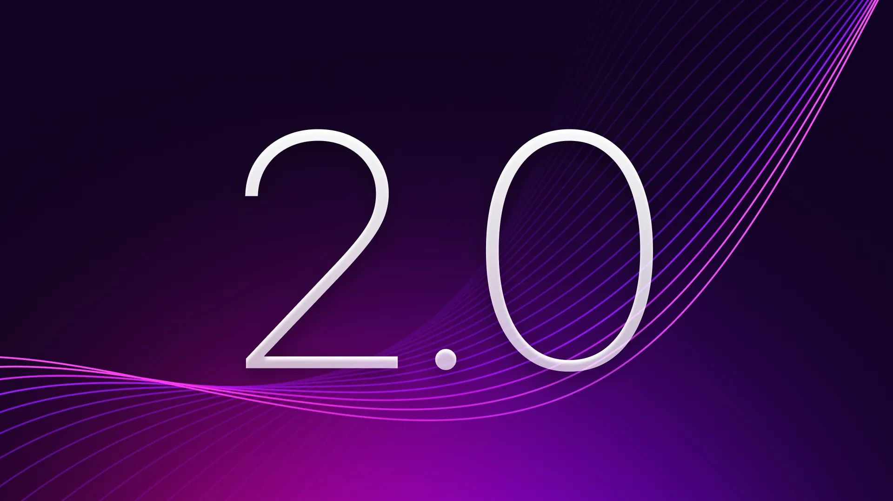

# SurrealDB Delivers Future-Ready Database Technology for Developers and Enterprises with Release of SurrealDB 2.0

*Powerful new features introduce advanced stability, performance, security and data management capabilities to build enterprise-ready applications*

**LONDON - September 17, 2024** - [SurrealDB](/), the ultimate multi-model database, today announced the release of SurrealDB 2.0, with new advancements in stability, performance, security and data management capabilities to build powerful, efficient and secure applications. This latest release represents a major leap forward in database technology, with SurrealDB 2.0 specifically engineered to empower developers to build complex real-time applications faster, more cost-effectively, and at scale - across teams, data volumes, and diverse use cases.

“As enterprises continue to adopt cloud-native architectures, manage increasingly large and complex datasets, and navigate the challenges of intricate back-end systems, distributed databases are critical for managing data effectively,” said CEO and co-founder, Tobie Morgan Hitchcock. “With SurrealDB 2.0, we provide developers with a future-ready tool needed to build powerful, efficient and secure applications at scale while significantly reducing infrastructure complexity.”

With SurrealDB 2.0, organisations now have access to a database platform built to support modern enterprises with consistent performance across all database operations, ensuring stability and reliability for enterprise-level applications. SurrealDB has rebuilt its SurrealQL parser to be faster, lightweight, and more resilient, significantly enhancing memory handling while supporting deep recursive queries and providing a more robust transaction layer with advanced caching.

Additionally, a new comprehensive and adaptable security framework introduces greater control of user authentication, session management and use of third-party authentication providers, to ensure secure databases by default without sacrificing customisation for specific security needs. This, paired with new features such as JWT and token-based authentication along with new sanitation functions, helps to safeguard data against common vulnerabilities and ensures data is protected in all scenarios within a more interconnected infrastructure.

SurrealDB 2.0 also introduces several new features, including:

- **Querying improvements and integration:** new statements like UPSERT, ALTER, REBUILD, and DEFINE ACCESS are available in SurrealQL, in addition to now supporting GraphQL to allow querying with any preferred method.
- **Optimised index performance:** improvements to hashing mechanisms, the addition of the HNSW algorithm for AI-driven searches, and the option for asynchronous indexing now ensures fast and reliable data access at scale.
- **Advanced storage capabilities:** 2.0 debuts SurrealKV, its native key-value storage engine built entirely in Rust, bringing ACID compliance, built-in versioning, and historical querying capabilities, to empower enterprises with immutable data querying and audit trails for historical data analysis.
- **Direct Machine Learning integration:** offering the power to harness ML with data operations to drive smarter decisions and insights via SurrealML. This integrates ML directly into the database to store, load and execute ML models alongside data, streamlining workflows by enabling real-time processing and analysis.
- **Enhanced SDK Support:** significant improvements focused on performance, flexibility, data integrity and type safety now offer better data handling, reduced bundle sizes and new embedding capabilities so enterprise developers can more easily integrate SurrealDB into applications.

For more information about SurrealDB 2.0 and its new features, visit [www.surrealdb.com](/).

Learn more about SurrealDB 2.0 and discover how enterprises can elevate business operations and reduce infrastructure complexity with SurrealDB during SurrealDB NYC Developer Meetup, taking place in New York City on September 26. Register now for free: [https://bit.ly/SurrealDBNYC](https://bit.ly/SurrealDBNYC)

###### About SurrealDB SurrealDB is an innovative, multi-model, cloud-ready database built for both modern and traditional applications. Its versatility, emphasis on developer experience, and SQL-like query language make it accessible and approachable for developers transitioning from other databases. This flexibility combined with the ability for deployment on cloud, on-premise, embedded, and in edge computing environments, allows developers and organisations to meet the needs of their applications, without needing to worry about scalability or keeping data consistent across multiple different database platforms.

###### Press Contact Gabrielle Redwine PAN Communications for SurrealDB surrealdb@pancomm.com
