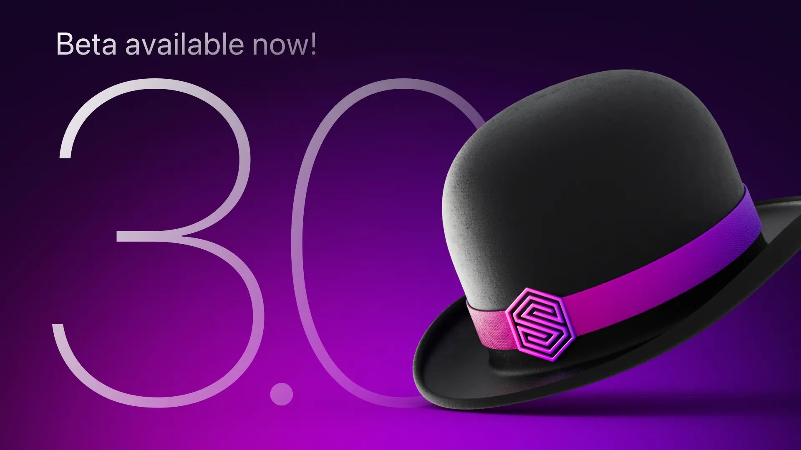

# Surrealist 3.0 beta

Following in the footsteps of the recent SurrealDB 2.0 beta release, we are thrilled to announce that the first beta release for Surrealist 3.0 is now available.

This release contains exciting new features, user experience improvements, and most importantly, it fully supports the SurrealDB 2.0 beta.

## Notable changes

- Support for the SurrealDB 2.0 beta
- Partial support for SurrealDB 1.x is included
- Updated and improved editor syntax highlighting
- Support for all new SurrealQL queries and features
- Revised connection system and handling of namespaces & databases
- Connections are now decoupled from the active namespace and database
- The namespace and database can now be selected visually from the toolbar
- First class support for creating and managing namespaces / databases
- New GraphQL view
- Supports GraphQL syntax highlighting and variable declarations
- Additional features such as documentation and completion coming soon
- Light interface theme
- Accessible from the “Appearance” tab in the Settings dialog.

## Feedback

Since we launched Surrealist 2.0 in April as the official management interface for interacting with your SurrealDB database, your continuous feedback has been invaluable to our team.

With the Surrealist 3.0 beta release, please continue to provide feedback, including submitting issues and requests via [our GitHub repo](https://github.com/surrealdb/surrealist/issues). Your feedback means everything to us, and shapes the future of Surrealist.

Surrealist will use a different config location for the beta, meaning any connections will be stored separately from those configured in stable Surrealist. Changes you make in the Surrealist beta will not transfer over to the stable Surrealist 3.0 release.

## Getting started

The easiest way to get started using the Surrealist 3.0 beta is through the web app available at [https://beta.app.surrealdb.com/.](https://beta.app.surrealdb.com/.)

Alternatively you can download and install the beta version of Surrealist Desktop from [our GitHub release page](https://github.com/surrealdb/surrealist/releases/tag/surrealist-v3.0.0-beta.1).
