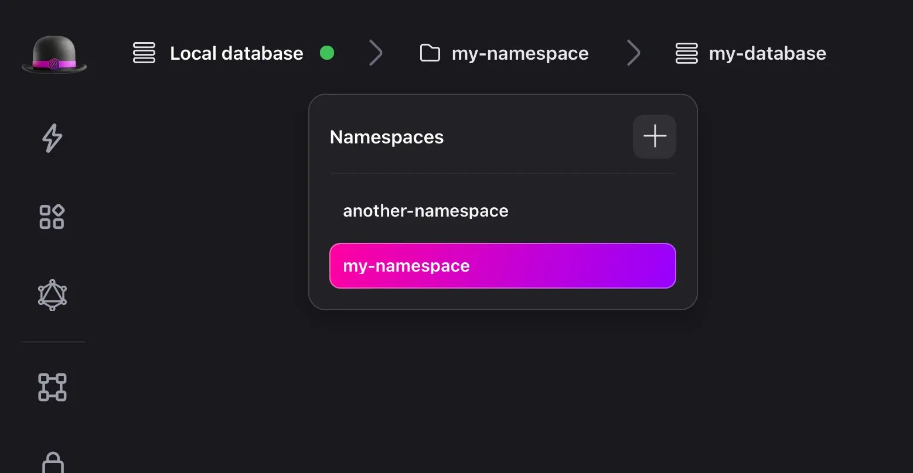
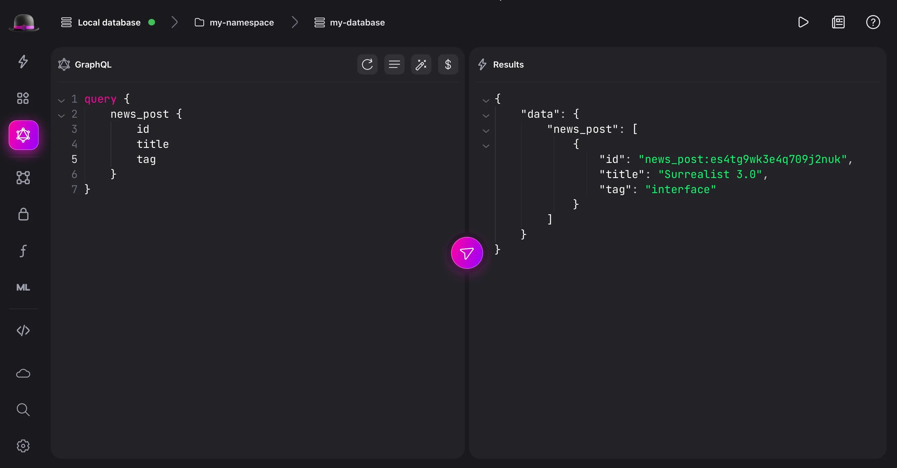
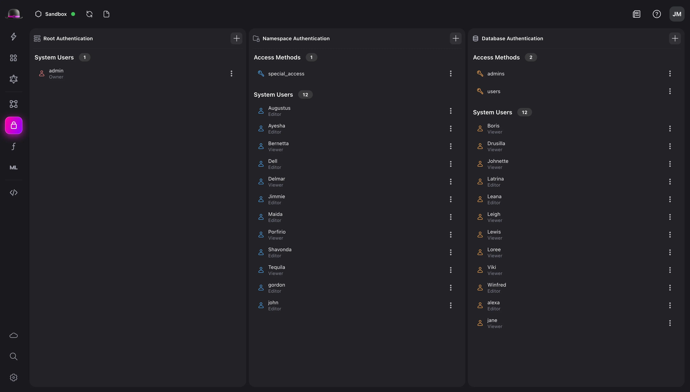
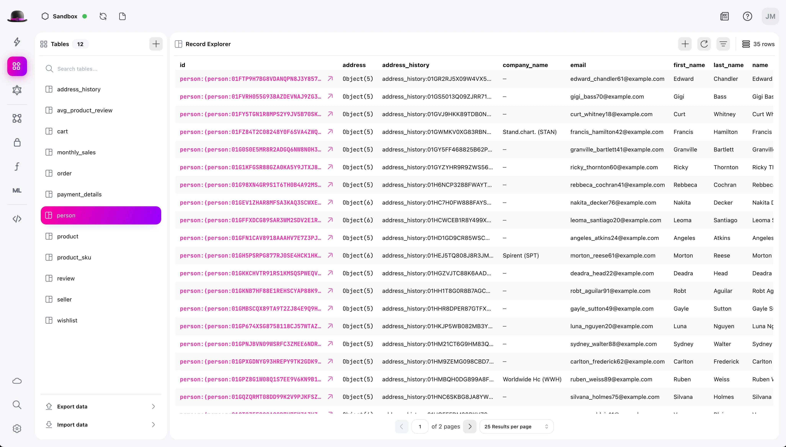
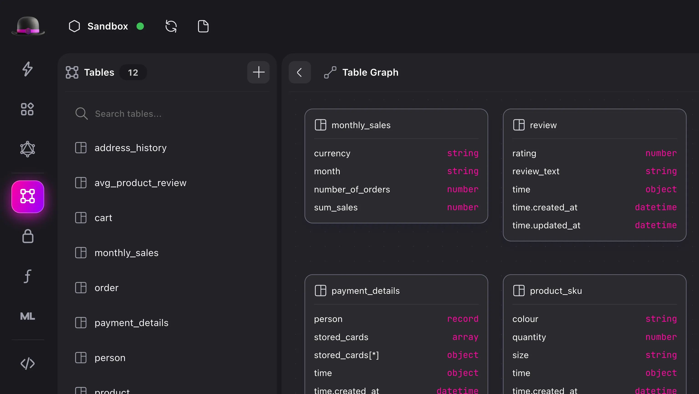

# Surrealist 3.0 is now available!

In addition to our spectacular [SurrealDB 2.0 release](/blog/challenge-accepted-announcing-surrealdb-2-0/), we are also excited to announce that the next major iteration of Surrealist has arrived! Besides providing full support for SurrealDB 2.0, this release is packed full of useful new features, community requested quality of life improvements, and bug fixes for reported issues. Let’s explore the highlights of this release and discover what you can expect from Surrealist 3.0.

## Getting started

### Existing user of Surrealist

If you already have Surrealist installed, you will be prompted to update the next time you start the application. Surrealist will automatically create a configuration backup for you when updating through this channel. Alternatively, you can [create a backup](/docs/surrealist/troubleshooting#resetting-the-config) of your config file manually.

### New to Surrealist

The easiest way to get started with Surrealist is using the web app available at [https://app.surrealdb.com](https://app.surrealdb.com/). While the web app offers a convenient and portable way to interact with SurrealDB, for the complete Surrealist experience we recommend downloading and installing the [Surrealist Desktop](https://github.com/surrealdb/surrealist/releases) app.

## Highlights

### Improved namespace and database selection

Previously you were required to provide a namespace and database in each connection, and while this worked well for simple use-cases, we believe a more scalable approach is required.

In Surrealist 3.0 you will no longer be required to pass namespace and database in the connection editors. Instead, you will be able to select, create, and remove namespaces and databases directly from the toolbar. This means you can now connect to your database without selecting any namespace or database, and switch them on-the-fly without creating a new connection.

### New GraphQL view

Alongside the new experimental GraphQL query functionality included in SurrealDB 2.0, this new release of Surrealist also includes a brand new GraphQL view. This view provides an optimised zero-configuration interface for executing queries against your database.

In addition, this new view provides full GraphQL syntax highlighting, live error checking, and full support for query variables. Much like the regular Query view you can even infer your variables directly from your query.

Note that since GraphQL support is still experimental, this view can only be used when GraphQL functionality is enabled on the remote database.

### Overhauled Authentication view

SurrealDB 2.0 includes a significant improvement to authentication, hence the Surrealist Authentication view has been updated to reflect these improvements.

Within this view you will now be able to manage both system users and access methods, each on a root, namespace, and database level. You can fully configure these through the redesigned editor dialogs, allowing you to effortlessly setup and manage authentication within your database.

### Light interface theme

After being absent for a few months, we can finally say the Light interface theme has made a spectacular comeback! The new Light theme is supported across the entire interface and features a stunning new design. Additionally, when set to “Automatic”, Surrealist will synchronise its theme to your operating system’s preference.

### Designer view improvements

The Surrealist Designer view remains an excellent choice for designing, building, and managing your database schemas. To facilitate this further the Designer view has been improved with some useful quality of life improvements. This includes a new expandable table list, persistent expanded table designer sections, and a new system warning you of potential schema issues.

## Other changes

- Redesigned start screen with a new appearance, useful resources, and latest news
- Query formatting support for the functions view
- The sidebar is now organised more logically
- Maximum size of resizable drawers has been increased
- Customise the history size and log level of the database serving console
- Query view variable panel expansion state is now saved persistently
- Functions editor now auto completes arguments, tables, and other functions
- Updated SurrealQL highlighting to support new SurrealDB 2.0 features
- Highlighting for regular expressions in query editors
- New collapsible table list in the Designer view
- Improved appearance of edge tables in the Designer view
- Designer view will now report on schema configuration warnings
- Added the option to initialise any empty database with a demo dataset
- Decreased the minimum window size for Surrealist Desktop
- Initial work on making the interface mobile compatible
- Improved listing of fields and indexes in the Table Designer
- Remember expanded Table Designer panels persistently
- Improved search behaviour in the tables panel
- Slightly changed the appearance of drawers

## Bug fixes

- Performance improvements for large schemas
- Performance improvements for Designer view record link visualisation
- Performance improvements when navigating the explorer view
- Fixed designer field and table permissions initialising incorrectly
- Fixed explorer object tooltip indenting
- Fixed incorrect editor highlighting keywords
- Fixed Designer view performance issues when visualising record links
- Fixed backspace deleting nodes in the Designer view
- Fixed designer permission fields incorrectly including WHERE keyword
- Fixed indenting in data table tooltips
- Fixed unintended scrollbars rendering on Windows
- Fixed null geo coordinates crashing Surrealist
- Fixed the geography explorer not always updating
- Fixed live messages displaying incorrect timestamps
- Fixed record ids within live message previews not being clickable
- Fixed the designer view not changing incoming/outgoing tables on relation tables
- Fixed incorrect Surrealist Mini embed URL generation
