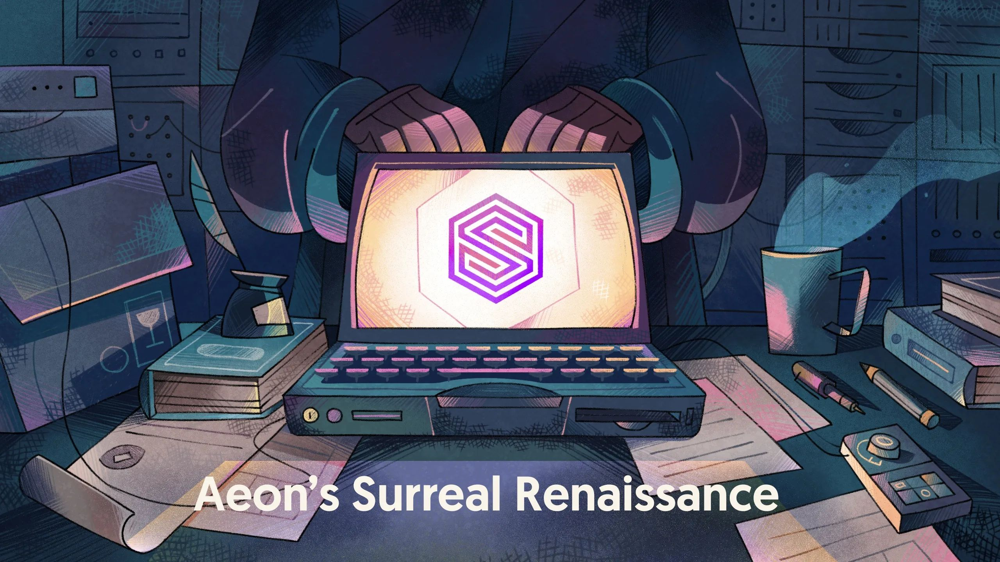
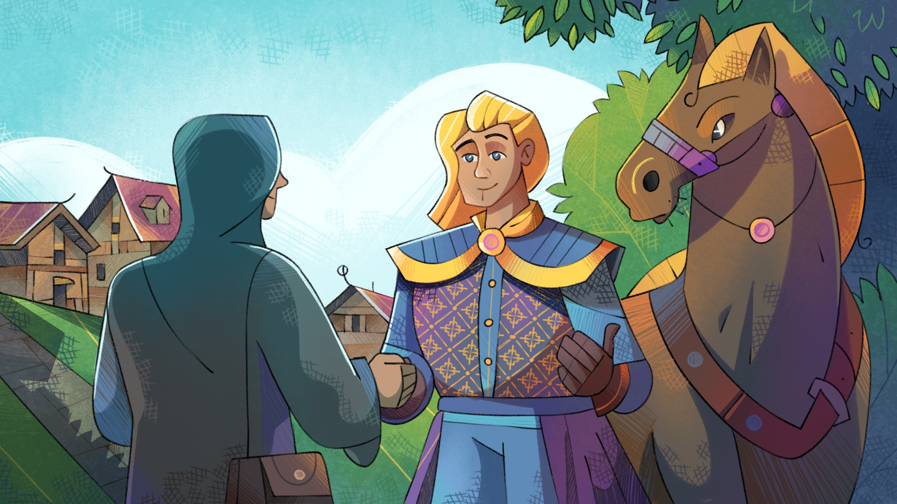
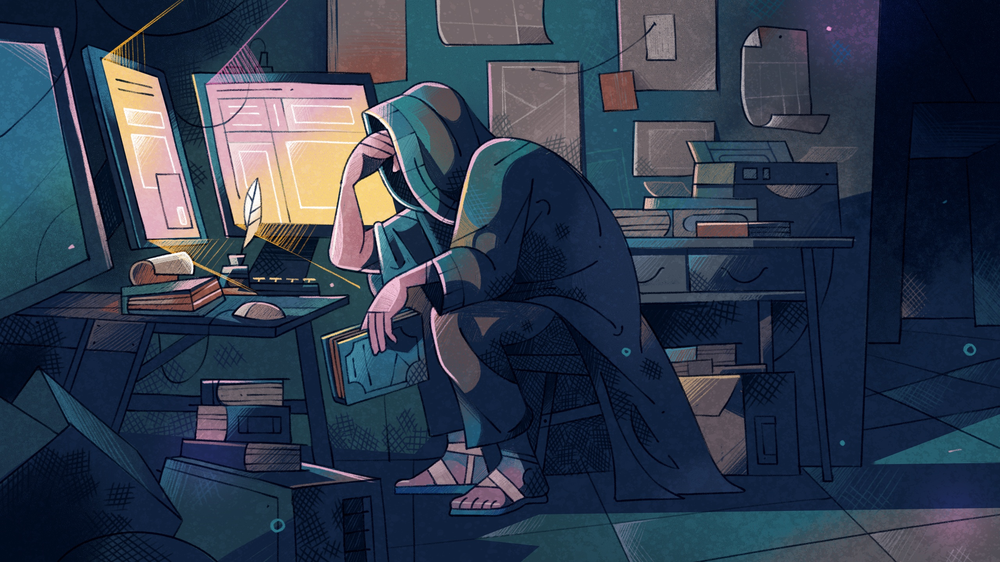

# Aeon's Surreal Renaissance: Learn SurrealDB Through a Story



I am thrilled to announce the publication of SurrealDB's first book: Aeon's Surreal Renaissance. It's an immersive book that will teach you everything you need to know about SurrealDB in a story where you are the main character. My goal is to make learning SurrealDB fun and intuitive.

Imagine yourself taking a leisurely walk along your favourite route, enjoying the familiar sights. But today, something feels different. Instead of turning right, as you always do, you choose to turn left, drawn by a sense of adventure. With each step, you make a series of small decisions that lead you somewhere entirely new - a place you've never seen before: a tunnel. Tunnels can be eerie, dark, and full of unknowns, yet your curiosity overpowers the fear, and you find yourself stepping boldly inside.

In the tunnel you find technology rivalling what you see in Star Trek and Star Wars. You realise that it was an advanced civilisation of the past that made it.

Their medical technology is so advanced that it can cure the deadliest of diseases. But their weaponry is just as advanced, and even thinking about it makes you shudder. Should you run away and pretend that you never saw the tunnel in the first place?

This book tells the story of a person much like that, set in our world in the future.

For some reason, humanity in the future is back to riding horses and swinging swords, and they have forgotten about the past. But one day, a person just like you comes across a tunnel with books and computers from our time that somebody set up for some reason. This person is your alter ego in the future, who we are going to call Aeon.

Aeon has an idea: why not put the knowledge from the books into the database? This would make it easy to access, and maybe even help to rebuild all the great inventions of the past.

That is where the book begins, as you follow your alter ego who begins to learn SurrealDB. In each chapter you follow along with Aeon who is on a long and exciting quest to master the database and restore civilisation.

Just like everyone else, Aeon has good days,



and bad days.



Sometimes working with the new technology is exciting. Sometimes it feels like an impossible task to master. And other times it's downright scary, like the time Aeon woke up to see all the data in the database deleted (because SurrealDB runs by default in memory unless you choose to save to disk!). That can be intimidating when you grew up in a world where the only way to record data was by writing every word by hand.

But Aeon persists, and so do you, as you go through the book chapter by chapter on a shared journey together. It's almost like you have your laptop open as you look over Aeon's shoulders centuries in the future. And as you do so, you get closer and closer to the secret of why humanity lost all of its technology in the 21st century.

That's the sort of immersion that this book brings, an experience that almost makes you forget that you're learning.

My hope for this book is that you will say the following two things after it is over:

- "Wow, what a great story!"
- "Huh! Everything in SurrealDB makes perfect sense to me now."

The book is beautifully designed, and thanks to the embeddable nature of SurrealDB’s [Surrealist](/surrealist) app, the majority of the examples are runnable right inside the book! A single click shows you the results inside an interactive frame in which you can experiment with the data on your own. Give it a try!

```surql runnable=""
CREATE person:the_nobleman SET 
    name = "The Nobleman", 
    class = "Count", 
    money = 100000;
UPDATE person:the_nobleman SET money = 50;
```

And if you prefer a traditional book feel, no problem - each example is readable on its own and is followed by the expected output. It’s all up to you and how you prefer to interact with the book.

I hope you enjoy reading this book as much as I did writing it. I’d love to hear about your experiences with the book, so please drop by Discord - where we have a dedicated #university channel for the book and our other education materials - or [any of the other places that make up the growing SurrealDB community](https://github.com/surrealdb/surrealdb) and say hi!
