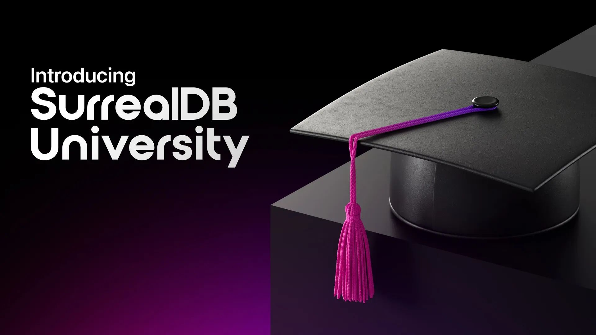

# SurrealDB Empowers Developers to Build Applications with the Launch of SurrealDB University

_Access to this comprehensive course provides any developer with the education and documentation needed to quickly and successfully build applications on SurrealDB in as little as three hours_

**LONDON - October 15, 2024** - SurrealDB, the ultimate multi-model database, today announced the launch of SurrealDB University, offering the first point of contact for anyone who wants to learn about SurrealDB and begin building their first applications on the leading multi-model database. Consisting of three components, SurrealDB University provides developers the opportunity to learn the inner workings of the multi-model database to quickly begin building applications in a matter of hours.

“Developers are at the center of everything we do, and this extends to ensuring our developer community has access to the best documentation and education to be successful with SurrealDB,” said CEO and co-founder, Tobie Morgan Hitchcock. “The goal of SurrealDB University is to help developers bring their ideas to life fast and in a way that prioritises practical hands-on learning with concepts explained in context instead of the typical boring slides and quizzes.”

Central to the learning platform is SurrealDB’s Fundamentals course which provides an interactive curriculum that delves into all essential topics from the basic to complex, ensuring a practical and interactive learning experience. Through expert-led learning, developers will gain insights firsthand from the SurrealDB team who work on the core of the products in a flexible learning environment that is 100% online. What’s more, all queries explored are runnable and will be right next to the text or video in the company’s embedded Surrealist query interface, meaning developers do not need to install anything to follow along.

In addition to the Fundamentals course, SurrealDB is offering Aeon’s Surreal Renaissance, the company’s new e-book that takes everyone from hobbyists to enterprise developers from “zero to SurrealQL expert” over the course of 20 chapters with illustrations. The e-book is also online and includes various code examples which can serve as inspiration for an application being built.

For more information about SurrealDB University and SurrealDB, visit www.surrealdb.com.

### About SurrealDB

SurrealDB is an innovative, multi-model, cloud-ready database built for both modern and traditional applications. Its versatility, emphasis on developer experience, and SQL-like query language make it accessible and approachable for developers transitioning from other databases. This flexibility combined with the ability for deployment on cloud, on-premise, embedded, and in edge computing environments, allows developers and organisations to meet the needs of their applications, without needing to worry about scalability or keeping data consistent across multiple different database platforms.

### Press Contact

Gabrielle Redwine PAN Communications for SurrealDB surrealDB@pancomm.com
