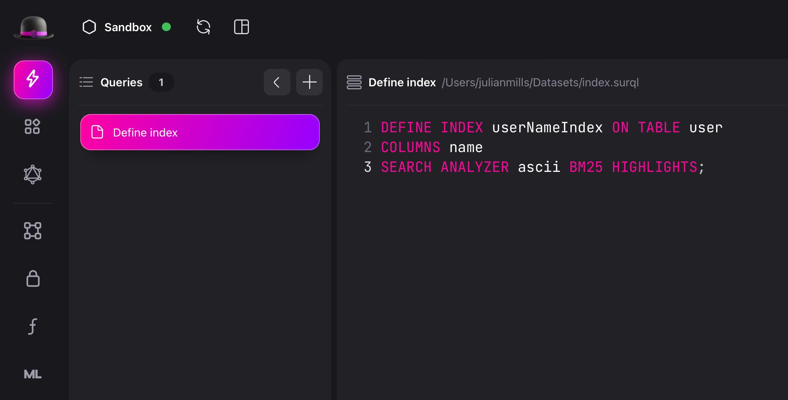
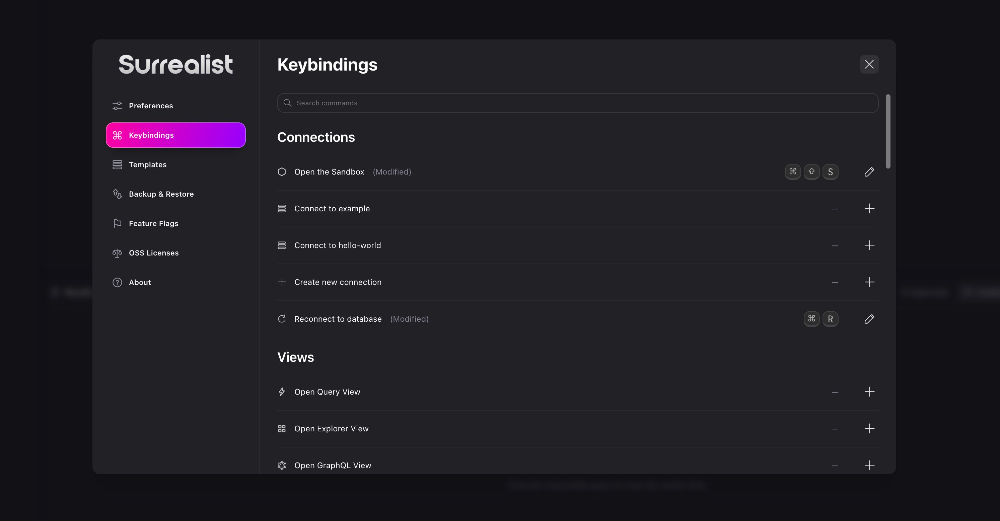
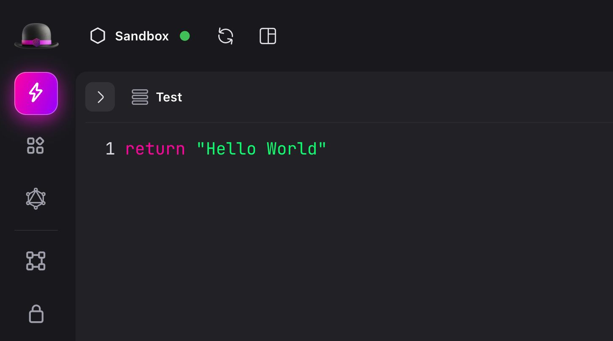
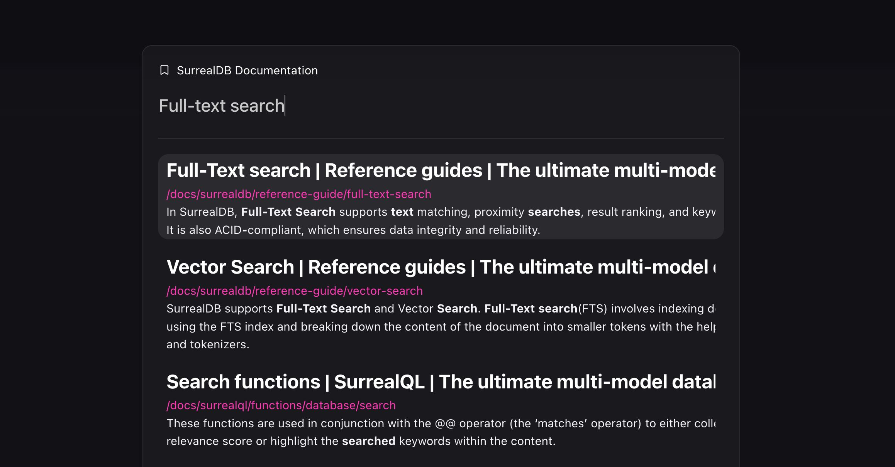
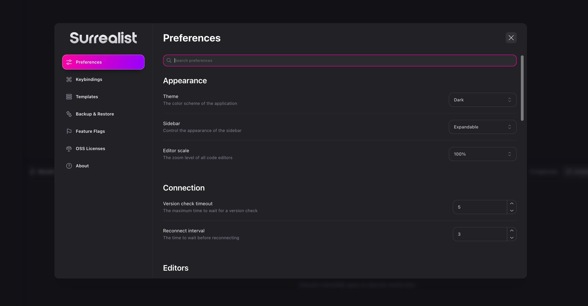
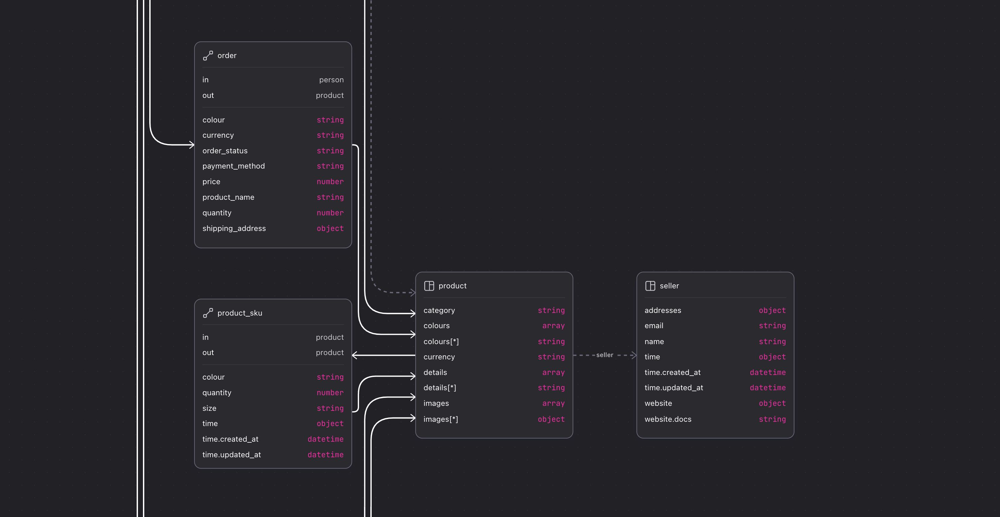
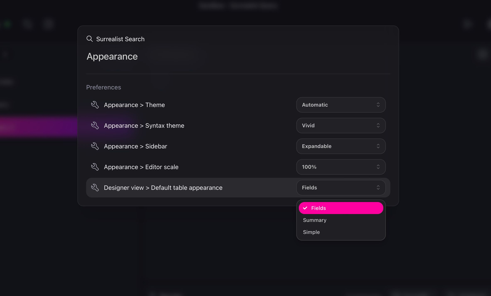

# What's new in Surrealist 3.1

Today marks the release of Surrealist 3.1, the latest feature-packed update for our graphical management interface Surrealist. Since the previous 3.0 release we have been hard at work on all aspects of the app to further streamline the experience of interacting with your SurrealDB database.

In this blog post I will guide you through the highlights of this release and showcase the most exciting new features. Strap in tight as this is our largest release to date!

## Highlights

### Open file system query files

While it was previously possible to open queries stored on your file system, it was not trivial to save modifications back to disk. In this release we have completely overhauled this behaviour to allow for loading, editing, and saving query files much like the text editors you are familiar with.

Queries opened this way are identified by a file icon, and display their file system path after their name. Changes you make to the query are automatically saved back to disk, making them as seamless to edit as any other query. In addition to opening files from your file explorer, we introduced a new `Open query file` command (Ctrl/Cmd + o) to further ease the process of opening query files. Last but not least, the context menu for file system queries contains the option to reveal a file in your file explorer, making it easy to locate opened queries on your file system.

File system queries provide an exciting range of new possibilities when it comes to storing, organising, and sharing queries, and we can’t wait hear how you use them to enhance your workflow.

### Customisable keybindings

One of the most requested features to date has been the ability to customise keybindings, and I’m delighted to announce this functionality is now available in Surrealist 3.1.

Located in the settings screen, the new Keybindings page allows you to register keybindings to commands, includes changing and unregistering any default keybindings. You can even register keybindings to dynamic commands, such as for opening specific connections.

At the moment keybindings can only be attached to commands, however in the future this will also allow customising editor shortcuts.

### Collapsible panels

In order to further streamline the user interface, we added the ability to collapse the query list and table list in the Query and Explorer views, similar to what was already possible in the Designer view. This allows you to hide distractions and reserve more space for the content that matters the most.

### Integrated documentation searching

Using the new `Search SurrealDB Documentation` command (Ctrl/Cmd + J) you can now search through the SurrealDB documentation without leaving Surrealist. This new convenient way to interact with the docs allows you to find answers faster and effortlessly expand your SurrealDB knowledge.

### Redesigned settings screen

The settings screen has received a much needed upgrade, reorganising existing pages and introducing new ones. The most noticeable change is that the “Behaviour” and “Appearance” pages have been merged into a single searchable preferences page. In addition to the aforementioned “Keybindings” page, we also introduced a new “Backup & Restore” page where you can create backups of your Surrealist configuration file, or import previously created backups. Finally, we introduced a new “About” page containing version and debug information.

### Designer view improvements

In Surrealist 3.1 we also gave some love to the powerful Designer view. This release significantly improves the visualisation capabilities of the table graph, including new algorithms for laying out tables, improved relation rendering, performance enhancements for large schemas, and an overhauled settings dropdown.

All table graph settings can now also be controlled from the preferences page, and overridden individually per connection. This allows you to tailor the table graph to each individual database schema.

Additionally, the editing of fields, indexes, and events has been improved within the table designer drawer, making it easier than ever to compose your schemas visually.

### Inline preference editing

For our final highlight of this release, we must mention the new inline preference editing capabilities. You can now use the search dialog to find and modify preferences without opening the settings dialog. This makes it easier than ever to customise your Surrealist experience.

We made sure to make this experience fully accessible and keyboard navigable, providing a frictionless way to update your preferences while you are writing your queries.

## Other changes

- Added configuration backups & restoring
- Allows saving your Surrealist configuration and restoring at a later date
- Provides the option to strip sensitive information
- Allows exporting only specific connections
- Improved and optimised the query history
- Large queries will no longer be saved to the query history
- When a query is too large to be saved, an indicator will show up notifying you of this
- Entries within the query history will be truncated when too long
- It is now easier to delete and run query history entries
- Improved the result formatting setting
- Configurable per connection directly from the query result panel
- Allows representing query results as SurrealQL or JSON
- Improved config serialisation in the web app
- The config will now be stored in the browser using IndexedDB
- This should result in improved performance due to faster serialisation and deserialisation
- Improved namespace and database creation
- The namespace and database selection dropdowns will automatically open the creator dialog when no existing entries are found
- Added a setting to toggle line numbers in different editors
- Currently available for the query editor, record inspector, and functions editor
- Also configurable for [Surrealist Mini](https://app.surrealdb.com/mini/new)
- Accessibility improvements
- Made various dialogs easier to use when navigating with a keyboard
- Improved query result rendering
- Queries are now selected from a dropdown
- Table rendering now supports full pagination
- Improved Designer table graph settings
- Globally configurable default values in the settings menu
- Added the option to use a more spaced out layout algorithm
- Added per-connection line style customisation
- Enabled record link rendering by default
- Added new default keybindings
- `Ctrl/Cmd + T` to open a new query tab (Desktop only)
- `Ctrl/Cmd + W` to close the current query tab (Desktop only)
- `Ctrl/Cmd + N` to create a new table (Desktop only)
- Added a new editor shortcut to select the entire query your cursor is inside of
- Activated using `Ctrl/Cmd + E`
- Added a new table context menu option to display the full table definition
- The record inspector will now display errors encountered while saving
- Updated SurrealQL highlighting to support new SurrealDB 2.1 features
- Added a Sync schema button to the connection dropdown
- Added a “Focus table” context menu option to focus tables in the table graph from the table list
- Added a “Rename” option to query tab context menus
- Added the option to view the status of nodes in the cluster
- Added back database export customisation options
- Improved table designer field, event, and index editing
- Added a confirmation before deleting a record from the Explorer
- Added a new setting to disable quick query closing
- Added editor warnings when trying to use unsupported SurrealQL features
- Improved the editing of connections in the connections list
- Surrealist is now available as a [Docker image](https://hub.docker.com/r/surrealdb/surrealist)

## Bug fixes

- Fixed explorer pagination not adjusting when changing max results per page
- Fixed the designer help button not working
- Fixed situations where Surrealist could crash with “Session unavailable”
- Fixed query tabs not being editable on Firefox
- Fixed query tabs allowing empty names
- Fixed Surrealist rendering blank on Linux systems using Nvidia graphics
- Fixed record access sign up modal inputs not working correctly
- Fixed connection templates not saving
