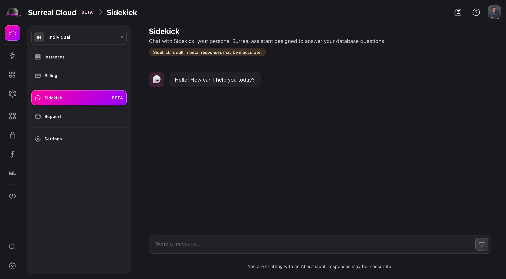
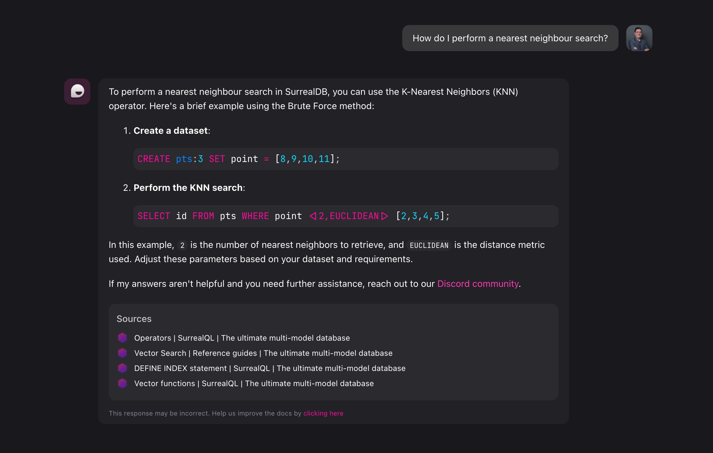
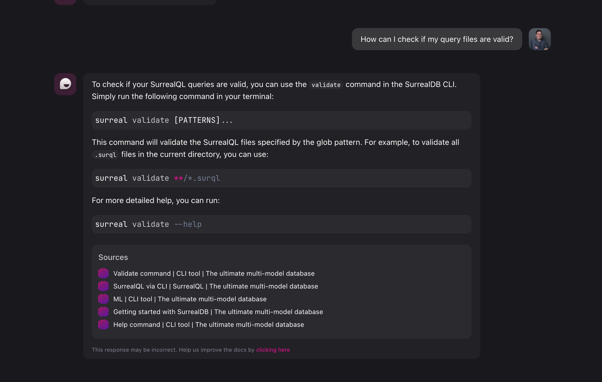
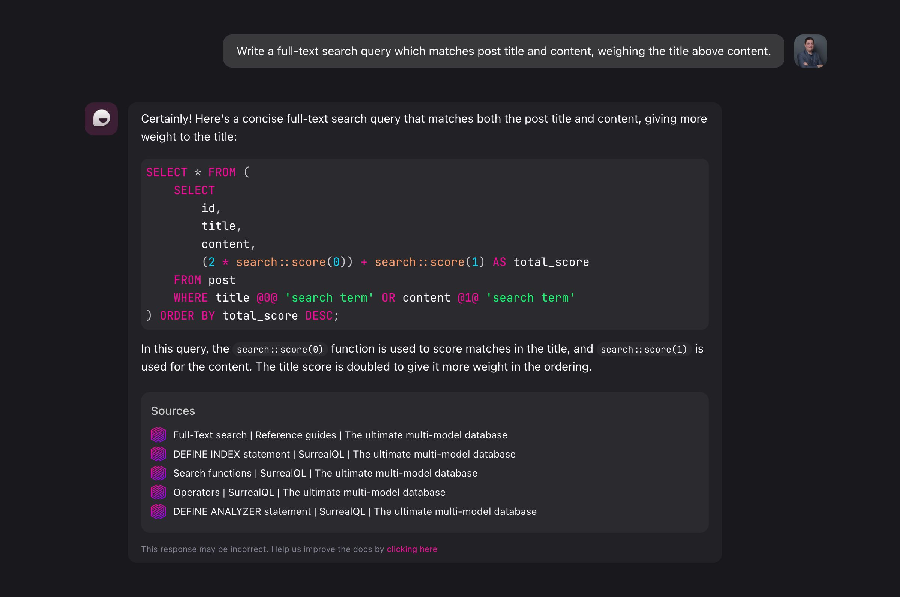
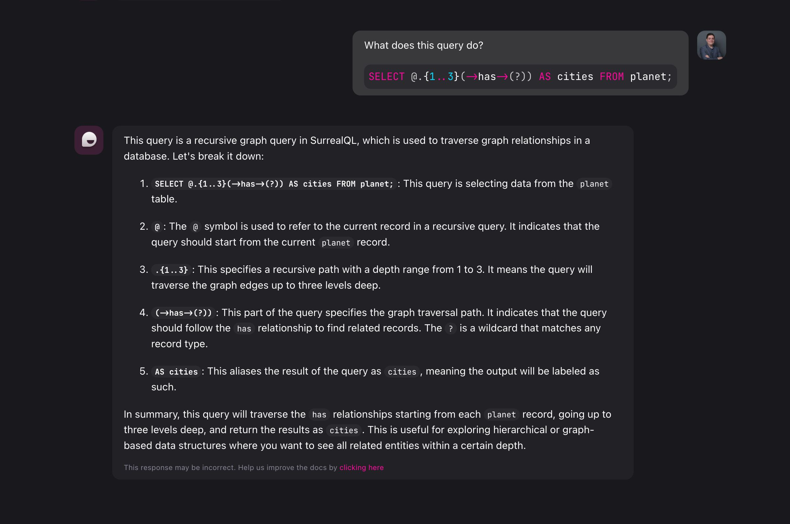
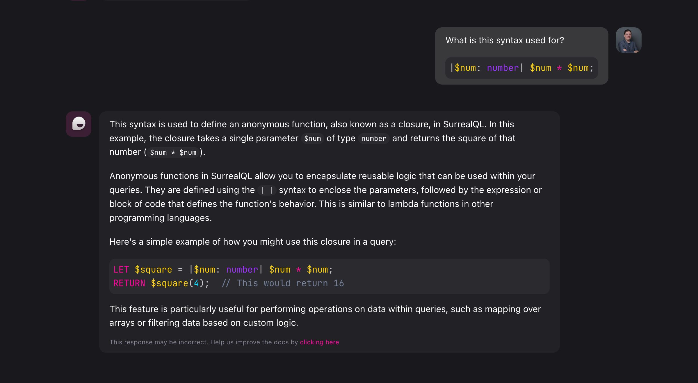
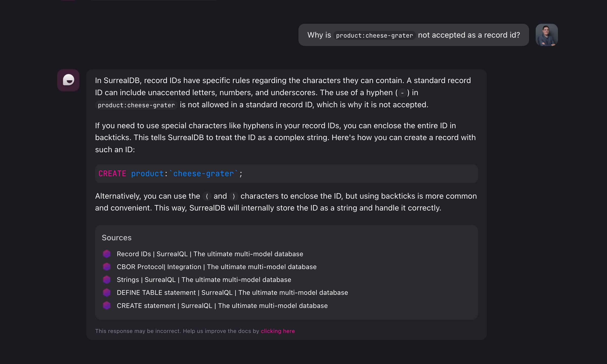

# Your personal Surreal Sidekick


With the recent release of [Surreal Cloud (beta)](/cloud) and the introduction of the Surreal Cloud panel in Surrealist, we introduced a brand new tool to help you increase your SurrealDB productivity. Surreal Sidekick is our fully fledged AI assistant who can help you debug your queries, answer questions based on the latest available documentation, and optimise your use of SurrealDB.

In this blog post we will explore the advantages of using Surreal Sidekick, how it can supercharge your SurrealDB workflow, and how you can take full advantage of this powerful tool.

# Hello! I'm Sidekick

Sidekick is housed within the Surreal Cloud panel in Surrealist, our graphical database management interface, available as both a web and desktop app. The first step to start using Sidekick is to open the [Surrealist web app](https://app.surrealdb.com/) or install [Surrealist Desktop](/surrealist?download) on your system.

Once this is done, navigate to the Cloud panel and sign in. If you have not previously created an account, [sign up to Surreal Cloud](https://app.surrealdb.com/signin/deploy) for free. In addition to Sidekick, you will gain access to all other features Surreal Cloud has to offer, including the ability to run your own managed instance of SurrealDB in the cloud.



Once you have entered the Surreal Cloud panel, you can simply navigate to the Sidekick page in the left sidebar to start your very first conversation.

# Your personal assistant

Sidekick is continuously learning from all available SurrealDB resources, allowing it to respond to your questions with accurate and up-to-date information. This enabled you to effortlessly learn about any topic in SurrealDB, including the query language, storage drivers, SDKs, and more. You can even communicate with Sidekick in your preferred language, making it easier to get the information you need.

Now, enough about what Sidekick can do, let's actually explore it hands on and see it in action. In this example, I will ask Sidekick how I would perform a nearest neighbour vector search in SurrealDB.



As you can see, Sidekick has provided us with a quick run down of the vector search capabilities of SurrealDB, including explaining the presence of the KNN operator, as well as query snippets demonstrating it in action. After each response, Sidekick will compile the list of resources it used to answer your question, and lists them at the bottom of its response. This allows you to further research the documentation on relevant functionality.

Sidekick is not limited to answering questions about queries and code, it can also help you find solutions using the CLI tool. In this second example, let's ask Sidekick how we can validate SurrealQL files, which we may want to do as part of an automated system.



This time, Sidekick responded with shell commands allowing us to validate surql files using the CLI. Just like in the previous example, this answer also lists out its sources, allowing us to learn more about the CLI tool on the documentation website.

While asking Sidekick broad database questions is extremely useful, we can actually ask Sidekick to perform more specific tasks, for example on the topic of queries.

# Your personal writer

Sometimes, you're just not in the mood to write complex queries, it happens to all of us! You can always ask Sidekick to generate queries for you instead. This is one of my personal favourite use-cases of Sidekick, and is a great example of how it can help boost your productivity. While Sidekick will always attempt to respond with a useful query, some generated queries may not always be what you were looking for. In these situations you can simply ask Sidekick to revise a previous response, or generate a completely different query.

In this next scenario, we want to perform a full-text search on a hypothetical post table, while weighing the title above the content. While this is useful for when you want to rank title matches higher, it involves writing some math in our query to compute a combined score. Let's ask Sidekick to generate this query for us.



And just like that, Sidekick gives us a `SELECT` query that we might only have to touch up slightly before we can use it, how convenient! While this was just one specific example, there are many more different questions we could ask, such as "How can I select all but a specific field from a record", or "How do I select multiple fields from a graph edge?". I won't bother you with more examples, instead, feel free to try it out yourself!

While on the topic of queries, Sidekick can do much more than just create queries. You might come across a query written by your co-worker and just can't wrap your head around it. For these situations, Sidekick can also be your lifesaver.

# Your personal teacher

Instead of telling Sidekick to generate a query, we can also flip things around. What if we give Sidekick a query, and tell it to explain it step-by-step?

As an example, let's take this query containing the [graph recursion](/docs/surrealql/datamodel/idioms#recursive-paths) syntax. There is a lot going on, so perhaps Sidekick can help us break it down into individual steps and explain each part.



Nice! We can now learn about each individual segment and start to understand how this query is put together. If something is still not entirely clear to you, feel free to respond back with follow-up questions, which Sidekick will try to answer.

Instead of providing queries for Sidekick to explain, you might also just come across a specific keyword or syntax you haven't seen before. In these situations you can also ask Sidekick to explain them to you. In this example we can take the [closure](/docs/surrealql/datamodel/closures) syntax present in SurrealQL, used to create anonymous functions on the fly. Let's see if Sidekick can tell us how it works.



We have now learnt how we can use Sidekick to create queries, and explain them to us, however there is one last use-case which may be even more useful.

# Your personal detective

Writing queries can be difficult, but debugging them can be even harder. While SurrealQL is one of the easiest query languages to use, there are still many intricacies behind writing valid, performant, and maintainable queries. You might run into difficulties writing complex queries, or struggle with an error you can't solve. In this situations you can also ask Sidekick to help you out.

For example, in our table of products we want to add a cheese grater, so we run a `CREATE` statement to create a new record with the id `product:cheese-grater`, however upon executing this query, we receive the following error

> ``` Parse error: Unexpected token `-``, expected Eof ```

That's a bummer, let's see if Sidekick can help us solve this one by asking it why our record id is being rejected.



Sidekick correctly helped us identity the cause of our error being that the record id must be escaped, as hyphen characters are not allowed by default.

Just like all examples we've discussed in this blog post, this too is just a single use-case out of a sea of possibilities. The next time you run into difficulty debugging a query, I highly recommend you give Sidekick a try yourself, as it might save you valuable time.

# The future

While Sidekick is an extremely powerful tool and can help you in many ways, it is currently still in beta. This means responses may not always be entirely accurate. As Sidekick continues to answer questions and help write queries, it will learn and grow from its conversations. We intend to keep improving Sidekick going forward, and keep it up-to-date with knowledge over the latest SurrealDB features.

In addition, we have many further improvements planned to make Sidekick an even bigger asset to your SurrealDB experience. While you should stay tuned for further updates, you can already start incorporating Surreal Sidekick into your personal workflow today.
