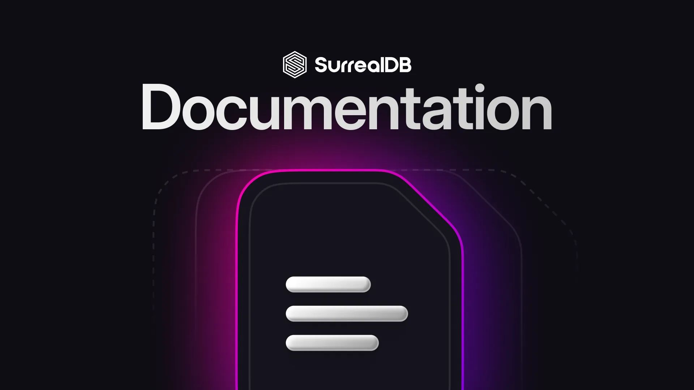
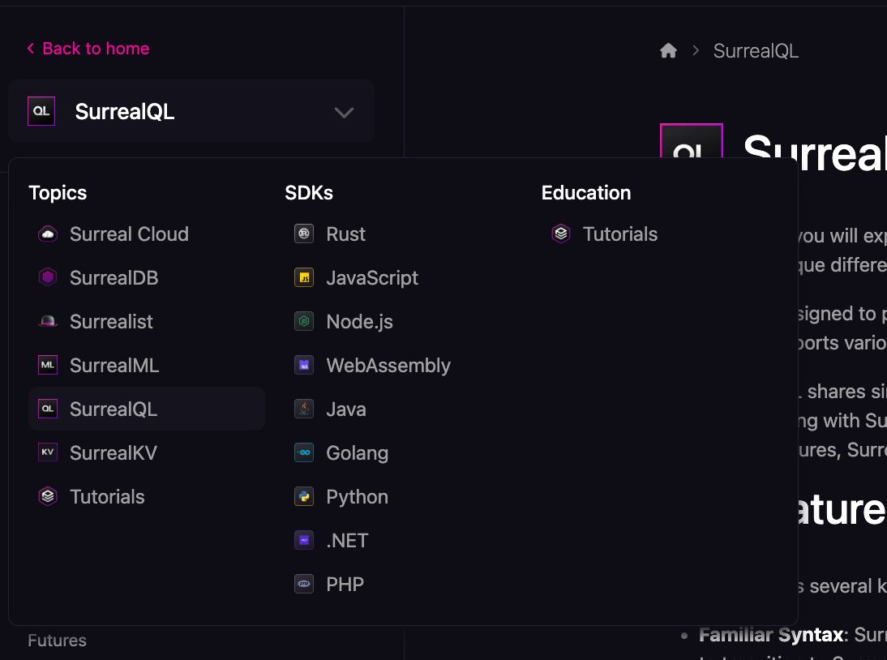
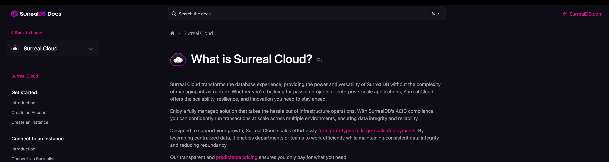
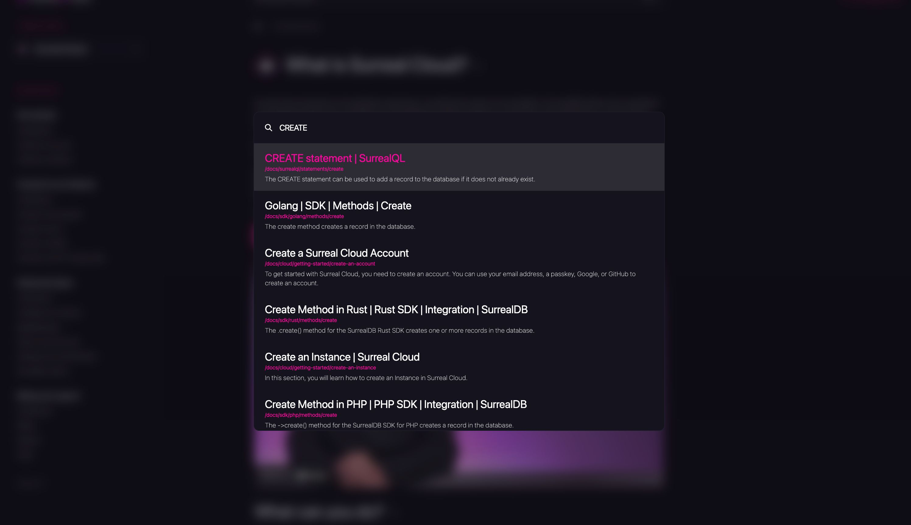
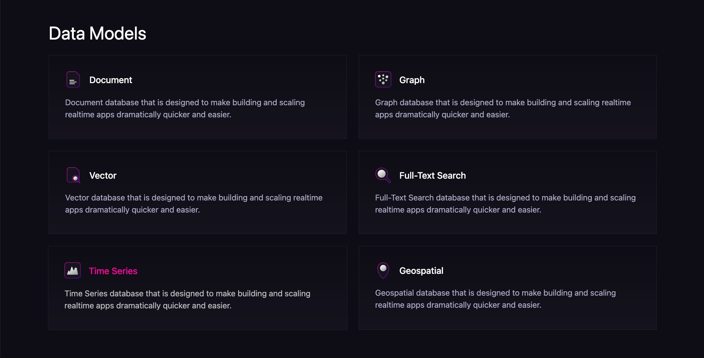

# Improving the documentation user experience

At SurrealDB, we’re constantly iterating to enhance our product and provide the best possible experience for our users. Recently, we've gathered feedback through our channels and made updates we believe will improve both our documentation and your understanding of [multi-model databases](/blog/what-are-multi-model-databases).

In this blog, we will be exploring these changes in more detail.

## Improved documentation layout

We have modelled SurrealDB documentation as a multi-doc, which means it includes several points of entry, either through: [SurrealDB](/docs/surrealdb), [Surreal Cloud](/docs/surrealdb), [Surrealist](/docs/surrealist), [SurrealML](/docs/surrealml), [SurrealQL](/docs/surrealql), [Tutorials](/docs/tutorials), [SDKs](/docs/surrealdb/integration/sdks)

The improved navigation is to ensure that you can always find information from wherever you are in the documents.

## Sidebar overhaul

We've introduced a new expanded sidebar, allowing you to reference more information at a glance. We believe this will improve your documentation experience, and can’t wait to hear your feedback. In addition to this we have also improved search so you can find information much more easily. With that in mind, we have made the search faster including;

- Added a new hotkey `cmd + /` or `ctrl + /` for windows to ensure that you can always search with ease.
- Improved search indexing and display, ensuring your queries are returned with the most relevant pages across the multi-doc.

## Data-model section

Whether you’re coming from a [Document](/docs/surrealdb/models/document), [Graph](/docs/surrealdb/models/graph), [Vector](/docs/surrealdb/models/vector), or [Time-series](/docs/surrealdb/models/time-series) type database we’d like to help you build a better understanding of the ‘models’ needed to utilise and understand the capabilities of SurrealDB better. We’ve added a section that covers examples with popular databases such as MongoDB, Neo4J and Postgres.

## Improved getting started guides

We understand that there is a lot of information and it can be overwhelming to get started with our offerings. We’re here to guide you along the way with our getting started guides.

- [Surreal Cloud](/docs/surrealdb/introduction/start#get-started-via-surreal-cloud)
- [Installing SurrealDB on your machine](/docs/surrealdb/introduction/start#get-started-in-memory-or-on-disk)
- [Using any of the SDKs](/docs/surrealdb/introduction/start#getting-started-via-an-sdk)

We look forward to your continued feedback that enables us to improve the user experience with our documentation.
