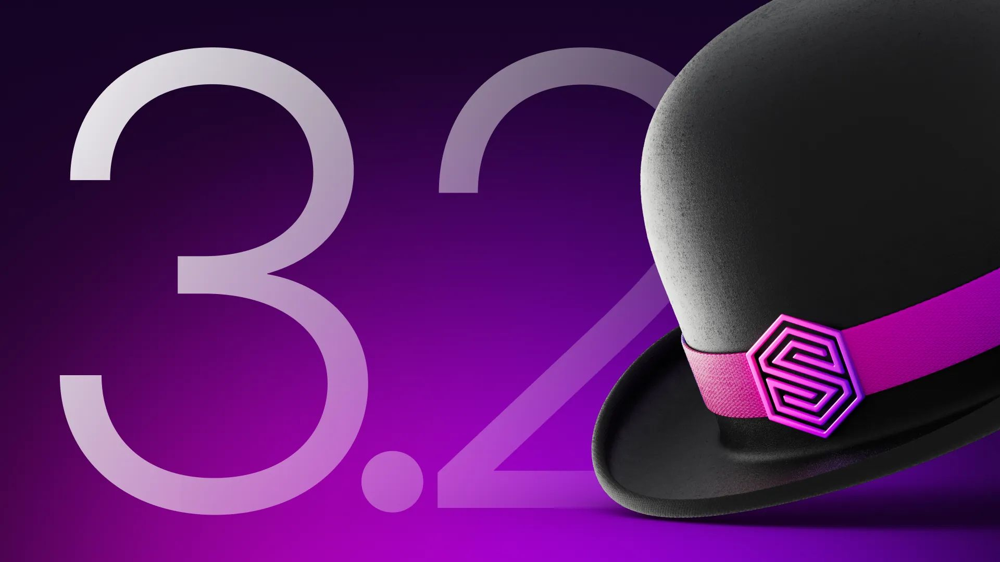
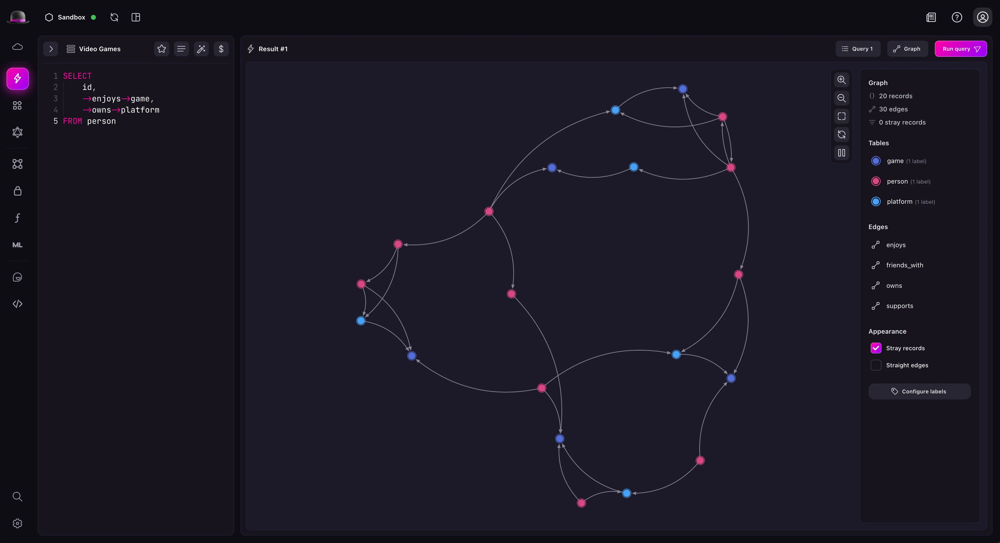
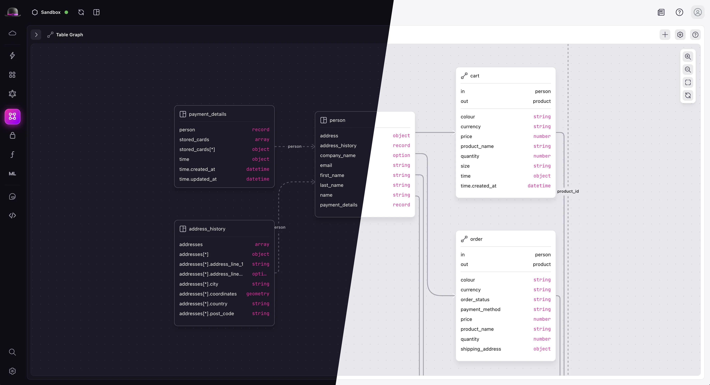
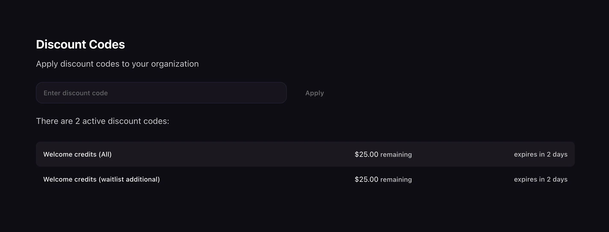

# What's new in Surrealist 3.2

Hello everyone! We’re excited to announce the release of Surrealist 3.2 - our first major update of the year. This version introduces the highly requested graph visualisation functionality, a fresh new interface design, extended Surreal Cloud features, and fixes for reported issues. Let’s dive into the highlights of this release.

## Highlights

### Graph visualisation

This is the largest addition in Surrealist 3.2 and the star of this release. Using the new Graph result mode in the Query View, you can plot the result of any query into a visual graph, complete with force-based physics, full control over the appearance, and the ability to expand the graph in place.

The new Graph result mode automatically analyses query results for record IDs and maps relationships between them. This gives you complete flexibility in writing queries, allowing you to filter and limit records as needed. There are no strict query requirements - just ensure the response includes all record IDs you want to visualise. Once the graph is rendered, you can customise its appearance using the sidebar and access additional actions by right-clicking nodes.

Stay on the lookout as we will be dropping an additional blog post later this week diving into the details of the new Graph result mode, and how to use it to your benefit.

### Interface redesign

The Surrealist interface has received a new look! This new appearance more closely reflects the SurrealDB brand, while simultaneously improving contrast throughout the interface.

Additionally, various improvements have been made to improve interface consistency, such as the addition of an introduction box in the Designer view.

### Surreal Cloud panel improvements

This release introduces some highly requested features to the Surreal Cloud panel, including the ability to view active discount codes, the current monthly usage charges, and referral progression. Additionally, instances will now clearly indicate when they are using resources.

With these changes we hope to provide a clearer view of your resource usage and offer greater transparency on billing.

## Other changes

- Added a button to copy the table name in the table designer
- Added an additional deletion confirmation when deleting Cloud instances

## Bug fixes

- Fixed table creator validation issues
- Fixed missing Explorer view table panel reveal button
- Fixed explorer not resetting to page 1 when changing tables
- Fixed the namespace and database selector incorrectly rendering
