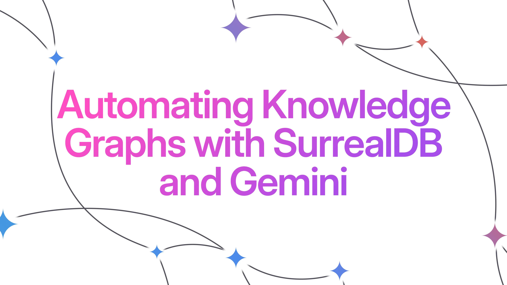
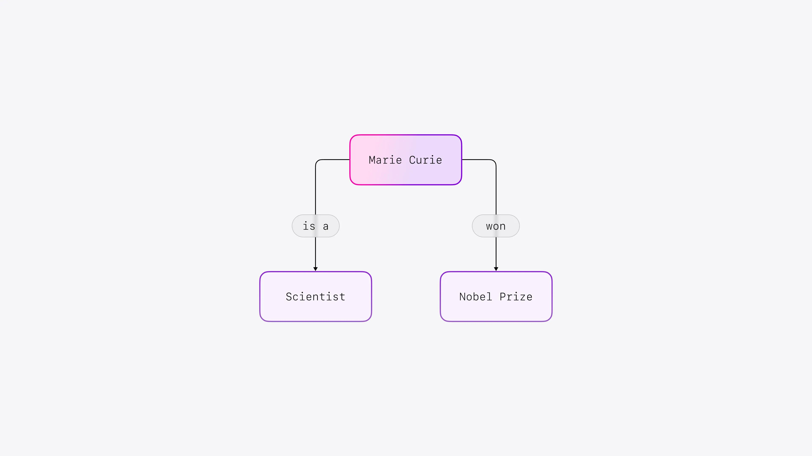
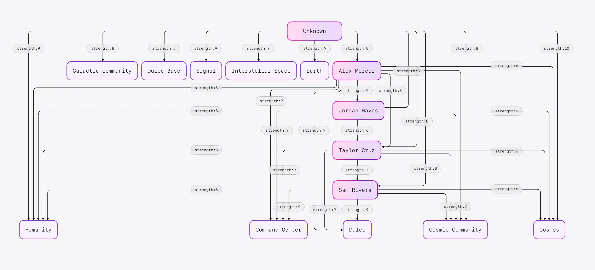

# Automating Knowledge Graphs with SurrealDB and Gemini



The data landscape is evolving rapidly. We are moving beyond simple storage and retrieval and into an era where understanding the relationships within data is paramount. This is where knowledge graphs come in. Knowledge graphs provide a powerful way to represent and query complex interconnected data. Traditionally, the process of building knowledge graphs has been labour intensive and technically complex. Large language models (LLMs) have been empowering firms to unlock the power of their data by automating the traditional process of insight generation. Gemini is one such LLM that has proven to be especially potent at processing and interpreting large corpuses of data. In this blog post, we'll explore how to automate knowledge graph construction using SurrealDB and Gemini. This code and assets for this article and the follow up on leveraging the graph for a RAG (Retrieval Augmented Generation) can be found on [GitHub](https://github.com/apireno/graph_rag).

## Knowledge Graphs: A Network of Understanding

Knowledge graphs represent information as interconnected networks.

- **Nodes:** The key players in your data (people, places, concepts) are represented as nodes.
- **Edges:** The connections between these nodes, capturing how they relate to each other, are represented as edges (generally known as "relations" in SurrealDB).



This structure allows machines to understand data, not just store it. Think of it like this: a traditional database might store the facts that 'Marie Curie was a scientist' and 'Marie Curie won a Nobel Prize'.

A knowledge graph goes further by explicitly linking these facts, creating the relationships (e.g. 'Marie Curie' -> *won* -> 'Nobel Prize'). This interconnectedness allows machines to grasp the significance of Marie Curie's achievements, understand her impact on science, and even potentially discover connections to other Nobel laureates or scientific breakthroughs. It's the difference between memorizing facts and comprehending their greater context. Knowledge graphs enable sophisticated analysis, reasoning, and insights that are simply not possible with traditional data models.

## SurrealDB: The Multi-Model Powerhouse

SurrealDB is a multi-model database that seamlessly handles various data structures, including:

- **Graph Structures:** Graph structures are inherently suited for representing knowledge graphs. Unlike traditional data models that struggle with complex relationships, graph structures excel at capturing and navigating interconnected data. Think of it like having a map for exploring a complex network of roads: the graph provides the "roads" (relationships) to efficiently traverse and understand the connections within your knowledge. This enables you to answer complex questions, uncover hidden patterns, and derive meaningful insights that would be difficult to achieve with other approaches. By providing a natural and efficient way to work with interconnected data, graph structures unlock the full potential of knowledge graphs, enabling more sophisticated analysis and discovery.
- **Vector Embeddings:** Vector embeddings are powerful tools for capturing the essence of data. They transform information like text, images, or sounds into numerical representations that encode their meaning and relationships. This allows you to compare items based on their underlying concepts, not just their literal form. Unlike keyword or full-text search which relies on matching specific words, vector embeddings can identify similarities based on semantic meaning. For example, a search for "climate change solutions" could return results about renewable energy, even if the exact phrase isn't present because “climate change solutions” and “renewable energy” sit numerically, and thus semantically, close to each other. You could also compare a news article about a political debate with a podcast discussing the same topic, or find products similar to a customer's previous purchases based on their descriptions. By representing data in this way, vector embeddings unlock new possibilities for semantic search, recommendation systems, and uncovering hidden connections within your data.

While some databases have third-party add-ons or extensions for users to enable vector or graph functionality, SurrealDB stands out by providing native support for both. This inherent duality makes SurrealDB uniquely powerful for knowledge graph applications. Imagine a database that not only understands the relationships between entities but also grasps the nuanced meaning within those entities through vector embeddings. This synergy unlocks a new level of knowledge graph capability, allowing for deeper analysis, more accurate semantic search, and richer insights. When combined with the reasoning abilities of LLMs, SurrealDB becomes an ideal platform for building truly intelligent knowledge-driven applications.

## AI-Powered Knowledge Graph Creation

LLMs excel at extracting entities and relationships from text. Let's see how Gemini can help us generate SurrealDB queries to build a knowledge graph from [Operation Dulce](https://microsoft.github.io/graphrag/data/operation_dulce/ABOUT/), an AI-generated science fiction novella often used for integration testing.

Asking Gemini a general question about the document might look like this.

```syntax
Identify all the people and places. For each identified person and place,
list who or where they are and how they are related to one another.
```

This will prompt Gemini to provide a helpful summary, but not one structured for database insertion. However, we can refine our prompt as follows to get much more useful output that can be copied and pasted as is.

```syntax
Identify all entities. For each identified entity, extract the following information:

* entity_name: Name of the entity, capitalized
* entity_type: One of the following types: [PERSON, PLACE]
* entity_description: Comprehensive description of the entity's attributes and activities

Format each entity as CREATE <entity_type>:<entity_name> SET description="<entity_description>"

From the entities identified in step 1, identify all pairs of (source_entity, target_entity)
that are clearly related to each other.

For each pair of related entities, extract the following information:

* source_entity: Name of the source entity, as identified in step 1
* target_entity: Name of the target entity, as identified in step 1
* relationship_description: Explanation as to why you think the source entity and the
target entity are related to each other
* relationship_strength: A numeric score indicating the strength of the relationship
between the source entity and the target entity (e.g., on a scale of 1 to 10)

Format each relationship as

RELATE <source_entity_type>:<source_entity>->RELATED_TO-><target_entity_type>:<target_entity>
    SET description="<relationship_description>",
    strength=<relationship_strength>`
```

With this prompt, Gemini might return SurrealQL code like this:

```surrealql
CREATE PERSON:SAM_RIVERA SET 
    description="Sam Rivera is a cybersecurity expert on the Paranormal Military Squad,
    adept at interpreting complex data and signals. They are youthful and enthusiastic,
    often expressing optimism and a desire to connect with the alien intelligence.";

CREATE PLACE:DULCE_BASE SET
    description="Dulce Base is an underground military facility located in New Mexico.
    It is known for its clandestine operations and its connection to paranormal activities.";

RELATE PERSON:ALEX_MERCER->RELATED_TO->PERSON:JORDAN_HAYES SET
    description="Alex Mercer and Jordan Hayes work together to decipher alien signals.
    Their partnership demonstrates a balance between Alex's military experience and
    Jordan's scientific expertise.",
    strength=8;

RELATE PERSON:ALEX_MERCER->RELATED_TO->PERSON:TAYLOR_CRUZ SET
    description="Alex Mercer and Taylor Cruz are colleagues on the Paranormal Military
    Squad, both leaders in their own right. They often clash over their different
    approaches to the alien contact. While Alex embraces curiosity and diplomacy,
    Taylor prioritizes caution and control.",
    strength=5;
```

This code can be executed directly in SurrealDB to populate our knowledge graph!



## Adding Embeddings for Semantic Search

To make our knowledge graph even more powerful, we can add embeddings to the `description` fields. This allows us to perform semantic searches that go beyond keyword matching and get to the meaning of a future query.

We can leverage SurrealDB's support for functions to automatically generate embeddings during data insertion. Here's an example:

```surrealql
DEFINE TABLE PERSON SCHEMAFULL;

DEFINE FIELD description
    ON TABLE PERSON
    TYPE string;

DEFINE FIELD embedding
    ON TABLE PERSON
    TYPE option<array<float>>
    VALUE fn::sentence_to_vector(description);
```

Now, every time we insert data into the `PERSON` table, the `embedding` field will be populated with a vector embedding generated by a custom `fn::sentence_to_vector` function. In this example, we use the GloVe model ([https://nlp.stanford.edu/projects/glove/](https://nlp.stanford.edu/projects/glove/)) which can be installed into your SurrealDB instance using this Python script found on [GitHub](https://github.com/apireno/surrealDB_embedding_model). One could leverage any number of embedding models based on your corpus of data and requirements. You may consider training a custom embedding model as in this [example](https://github.com/apireno/generate_fasttext_model_from_recipe_data).

A portion of the knowledge graph and a simple prompt is even enough to generate images like the following showing Alex and Taylor clashing with Jordan in the middle.


## What's Next?

Knowledge graphs are powerful tools when paired with LLMs. One of the more powerful use cases is combining RAG (Retrieval Augmented Generation) techniques with a knowledge graphs to build a GraphRAG (a technique that combines text extraction, network analysis to improve RAG results). Approaches like these combine the power of LLMs with the flexible data model and querying capabilities of SurrealDB, which in turn makes them more accessible and useful than ever before. Read about the impact of knowledge graphs with RAG implementations using Gemini and Deepseek for comparison [here](/blog/enhancing-retrieval-augmented-generation-with-surrealdb).

## Where do I get started?

Feel free to play with this repository which has a notebook for both parts of these blog posts. There is also a rudimentary API for hosting an embedding model of your choice. Find all the code and further info in [GitHub](https://github.com/apireno/graph_rag/).
