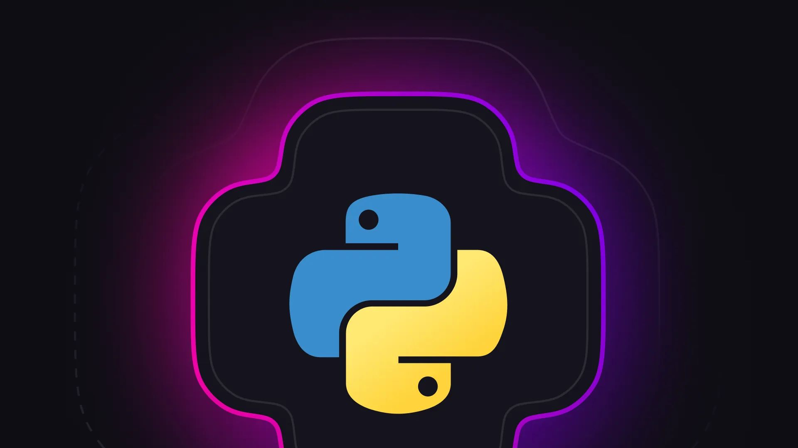

# How we improved the Python SDK for our 1.0 stable version

## Stable interface

In this new release of the Python SDK, we have ensured that the interface for WebSockets and HTTP requests is consistent with other SurrealDB SDKs such as the JavaScript SDK. Due to the versatility of Python, this SDK supports blocking and async implementations for both WebSocket and HTTP requests.

## Easy async and framework support

For our async implementation, we give the user 100% control over how the async request is implemented. There are no hidden threads of async handling under the hood so there are no surprises for the user. This also means that the SDK will easily integrate with async web frameworks like FastAPI, Flask, and even Jupyter notebooks.

## From JSON to CBOR

For the transmission of data, our new Python SDK no longer uses JSON but CBOR serialisation. This binary protocol gives us the flexibility to have unstructured data but has the performance benefits of a binary protocol. Inside the data sent and received, certain data types are tagged and processed. This means we have native data types that have their own functionality and comparison logic.

### Native datetime support

We even support native datetime objects meaning that you can pass a Python native datetime object into your query params and SurrealDB will be able to process the binary representation of that datetime. What’s more, datetimes returned from the database are automatically converted to Python native datetimes via our CBOR deserialisation process.

## Performance and stablity

CBOR isn’t the only performance improvement. For our WebSockets, we have increased the sizes of packets for better performance.

In terms of stability, we have implemented 100% test coverage. Each request method (async WebSocket, async HTTP, blocking WebSocket, blocking HTTP) has their own isolated class. These classes have atomic end to end tests for every operation that we offer resulting in 227 tests in total.

### Broad version support

These tests are then run for Python versions from 3.9 to 3.13, and each one of these Python versions are tested against different SurrealDB versions from 2.0 onwards, including nightly, resulting in a total of 5,675 tests run before merging.

### Making contributing easy

What’s more, every atomic to end-to-end test is isolated, meaning that a user can download the source code and run through any request method of their choice for any method in a debugger. This enables the user to see in real-time how the data changes through the lifecycle of a request.

## Get started

[Check out our quickstart docs](/docs/surrealdb/introduction/start) to get started with this new release!
