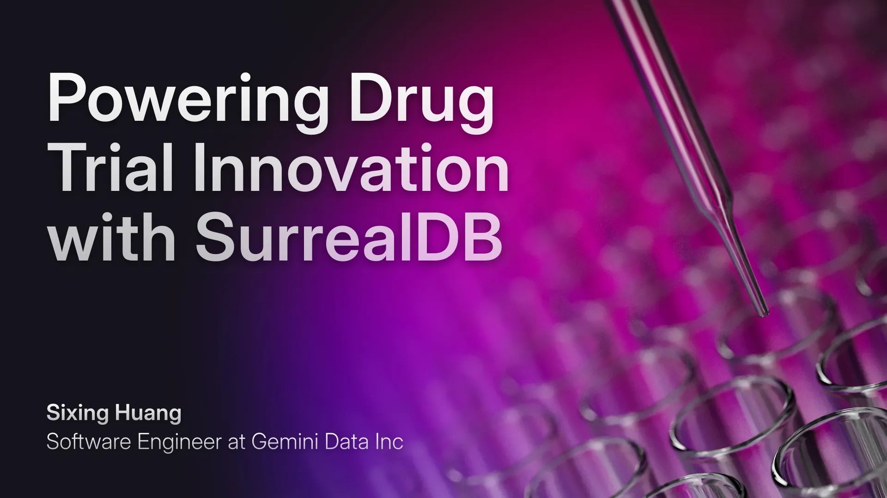

# Powering Drug Trial Innovation with SurrealDB

By Sixing Huang, Software Engineer at Gemini Data Inc

## Overview

Clinical trials are the backbone of medical innovation, yet they face a massive hurdle - patient recruitment. The process is expensive, time-consuming, and often inefficient. What if there was a way to build a smarter, more connected drug trial search engine? That’s exactly what we set out to do using SurrealDB.

## The Challenge

Drug trials are essential for evaluating the safety and efficacy of new treatments. However, the high costs associated with these trials, particularly in recruiting volunteers, pose significant challenges. According to information on the [U.S. Department of Health and Human Services](https://www.nih.gov/health-information/nih-clinical-research-trials-you/need-awareness-clinical-research) site on clinical research trials, they cite research 1 that shows that:

- 85% of patients were either unaware or unsure that participation in a clinical trial was an option at the time of diagnosis.
- 75% of these patients said they would have been willing to enroll had they known it was possible.

Developing a user-friendly drug trial search engine can enhance patient awareness and participation, potentially reducing recruitment costs and getting vital new drugs out to market faster.

Drug trials involve vast amounts of interconnected data - drugs, disorders, mechanisms of action (MOA) which is how a drug or substance provides an effect on the body, and trial results - all of which need to be efficiently stored, queried, and analysed. Traditional relational databases struggle with these complex relationships, while NoSQL solutions often sacrifice structure. The challenge? Build a high-performance, multi-model database that makes it easy to navigate the intricate web of clinical trial data.

## The Solution with SurrealDB

SurrealDB's multi-model architecture provided the perfect foundation for this challenge. By combining graph, document, table, and vector-based storage within a single system, we were able to model complex relationships effortlessly - without the need for multiple databases or data silos. The following features were utilised:

- **Graph Model:** Seamlessly connect drugs, disorders, and MOAs, enabling intuitive, relationship-driven searches.
- **Table Model:** Store structured data for fast and familiar querying.
- **Vector Model:** Enhance search capabilities with similarity-based retrieval for unstructured data.
- **Unified Query Language:** Run powerful, cross-model queries with SurrealQL - no need to learn multiple query languages or integrate external tools.

## The Impact

By leveraging SurrealDB, we built a system that simplifies the drug trial search process, making it easier for researchers and patients to find relevant clinical trials. The key benefits include:

- **Reduced Complexity:** No need for multiple databases or complicated ETL pipelines.
- **Blazing-Fast Queries:** Efficiently traverse complex relationships and retrieve relevant data in real-time.
- **Scalability:** SurrealDB’s architecture scales effortlessly as new trial data is added.
- **Unified Development:** One database, one query language, endless possibilities.

## Conclusion

SurrealDB made it possible to build a smarter, more efficient drug trial database - one that bridges the gap between complex data relationships and real-world usability.

For a more detailed walkthrough of the implementation and code snippets, check out the original blog post by Sixing Huang [here](https://dgg32.medium.com/build-a-drug-trial-database-with-the-multi-model-surrealdb-6a23c2b5faa3).

Interested in seeing what a multi-model database could do for you? [Get started with SurrealDB](/docs/surrealdb/introduction/start)

Reference from the NIH.gov website: 1 Harris Interactive. 2001. Misconceptions and lack of awareness greatly reduce recruitment for cancer clinical trials. Health Care News 1(3).
