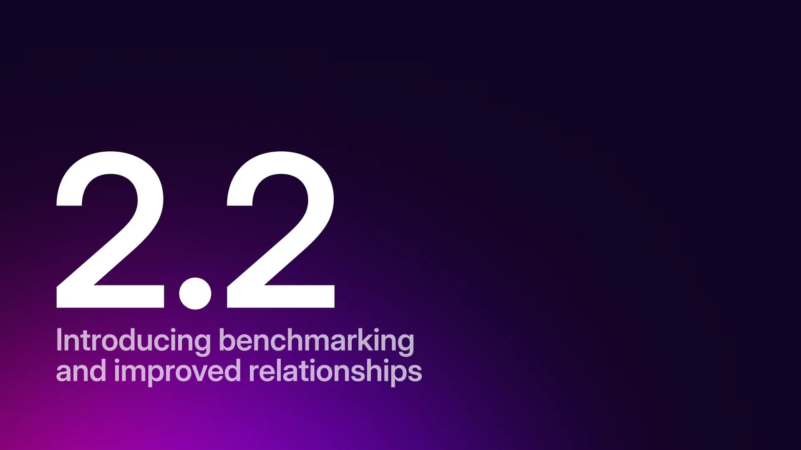

# SurrealDB 2.2: Benchmarking, graph path algorithms and foreign key constraints



2025 marks a major shift at SurrealDB. 2024 was all about building a strong foundation and shipping new things: Surrealist, SurrealDB 2.0, SurrealDB University, Surreal Cloud and Surreal Sidekick.

In 2025 the focus shifts from new to better!

- Better performance
- Better stability
- Better features

Our first release in 2025 comes with better performance and stability as well as better relationships for both graph and record links.

## Benchmarking

Benchmarking has been, without a doubt, the most requested item from our community for some time. And we hear you - it’s an essential part of evaluating any database. However, as a small team, building a multi-model database entirely from scratch, we’ve had to make some tough choices along the way. From the storage layer to the query layer (and everything in between), our focus has always been on prioritising the **developer experience** above all else. This philosophy guided us as we navigated the trade-offs between creating *new* capabilities and making existing ones better.

In 2024, much of our energy went toward building what we believed was necessary to set a strong foundation: rethinking old paradigms and embracing first-principles thinking to deliver something truly transformative in market filled with wrappers and clones.

Of course, this approach had its consequences. Benchmarking, a critical but time-intensive process, was postponed multiple times. We hope this has been worth the wait.

The tl;dr (too long; didn't read) summary is that SurrealDB performs well compared to a range of other databases on standard CRUD queries. For detailed results see our dedicated benchmarking blog post: [Beginning our benchmarking journey](/blog/beginning-our-benchmarking-journey)

## SurrealQL language test suite

Along with all the performance improvements we've made, there have also been significant stability improvements made possible by the complete overhaul of our testing strategy for SurrealQL.

Previously our tests have been implemented in Rust. While this is a completely fine approach it does have some downsides:

- Tests are slow to compile
- Test implementation is very verbose
- Implementing tests requires knowledge of Rust
- No highlighting for SurrealQL

To make this better, we've created a [language testing suite](https://github.com/surrealdb/surrealdb/tree/main/crates/language-tests) similar to the ECMAscript conformance testing suite [test262](https://github.com/tc39/test262).

This makes writing tests fast and easy, as it allows any normal SurrealQL file (`.surql`) to be a SurrealQL test. To turn a normal `.surql` file into a test file, all you need to do is include a test comment in the TOML format, which specifies how the test should be run and the expected results.

See the below example for a sample SurrealQL test file.

```surrealql
/**
# The env map configures the general environment of the test
[env]
namespace = false
database = false

[test]
# Sets the reason behind this test; what exactly this test is testing.
reason = "Ensure multi line comments are properly parsed as toml."
# Whether to actually run this file, some files might only be used as an import,
# setting this to false disables running that test.
run = true

# set the expected result for this test
# Can also be a plain array i.e. results = ["foo",{ error = true }]
[[test.results]]
# the first result should be foo
value = "'foo'"

[[test.results]]
# the second result should be an error.
# You can error to a string for an error test, then the test will ensure that
# the error has the same text. Otherwise it will just check for an error without
# checking it's value.
error = true
*/

// The actual queries tested in the test.
RETURN "foo";
1 + "1";
```

We have been adding a lot of tests to ensure SurrealQL always has the correct behaviour and we don't accidentally introduce breaking changes.

If you have previously wanted to help contribute to SurrealDB but felt that learning Rust was a barrier, then contributing to the SurrealQL tests could be a good way to start. Your help there would be appreciated!

[You can find the SurrealQL language tests here](https://github.com/surrealdb/surrealdb/tree/main/crates/language-tests), along with a detailed readme file which explains how it all works.

## Graph path algorithms

We have big plans for improving our graph features this year!

Starting with releasing a number of built-in algorithms that allow recursive queries to collect all paths, all unique nodes, and to find the shortest path to a record. These can be used by adding the following keywords to the part of the recursive syntax that specifies the depth to recurse:

- `{..+path}`: used to collect all walked paths.
- `{..+collect}`: used to collect all unique nodes walked.
- `{..+shortest=record:id}`: used to find the shortest path to a specified record id, such as `person:tobie` or `person:one`.

The originating (first) record is excluded from these paths by default. However, it can be included by adding `+inclusive` to the syntax above.

- `{..+path+inclusive}`
- `{..+collect+inclusive}`
- `{..+shortest=record:id+inclusive}`

You can learn more in our documentation here: [Graph path algorithms](/docs/surrealql/datamodel/idioms)

## Record references

This release also includes a very exciting experimental feature - bringing referential integrity to record links!

This will work in a similar way to foreign key constraints in SQL, where you can define references for fields, but with some additional Surreal magic.

To try it out, you need to start your SurrealDB instance with a special flag:

`surreal start --allow-experimental record_references`

Once you have allowed record references you’ll have access to two new things in SurrealQL:

- A `references` type that allows you to reference a field on another table
- A `REFERENCE` clause that enables you to specify deletion behaviour

In this one-to-many example, we are using the `references` type to create a reference from the `people` field on the `city` table to the `hometown` field on the `person` table.

```surrealql
DEFINE FIELD people ON city TYPE references<person, hometown>;
```

For the `hometown` field on the `person` table, we are then using the `REFERENCE` clause with the `ON DELETE CASCADE` option to delete the `person` record when the referenced `city` record is deleted.

```surrealql
DEFINE FIELD hometown ON person TYPE record<city>
    REFERENCE ON DELETE CASCADE;
```

Record references also work for many to many relationships. In the below example, you don't need to specify a specific `references` type. You only need to change the field definition from a single record `TYPE record<tag>` to an array of records `TYPE array<record<tag>>`. Here it might also make sense to use the `ON DELETE UNSET` which removes only the value which was the reference, effectively removing an item from the array.

```surrealql
DEFINE FIELD tags ON post TYPE array<record<tag>>
    REFERENCE ON DELETE UNSET;
```

There are more options and examples you can see in our documentation here: [Record references](/docs/surrealql/datamodel/references)

## Additional changes

Some additional note-worthy changes include:

- [HTTP function improvements](/docs/surrealql/functions/database/http): Improves HTTP error messages, giving the status code, and some additional information if available.
- [Two new environment variables for configuring Open Telemetry monitoring](/docs/surrealdb/cli/env): Allowing you to disable sending metrics or traces.
- [Optimising WebSocket implementation](https://github.com/surrealdb/surrealdb/pull/5293): Improving concurrent requests.
- [New `object::is_empty` function](/docs/surrealql/functions/database/object): Making it easier to check whether an object contains values.
- [Adding system information to `INFO FOR ROOT`](/docs/surrealql/statements/info): Starting with memory allocation and parallelism.

## Explore more and stay updated

These are only the highlights of this 2.2 release, [explore our release notes](/releases#v2-2-0) for a detailed overview of all the updates, including a comprehensive list of bug fixes.

As always, we really appreciate any feedback and contributions. SurrealDB wouldn’t be what it is today without you!

If you haven't tried SurrealDB yet, you can get started here: [Getting started](/docs/surrealdb/introduction/start)
