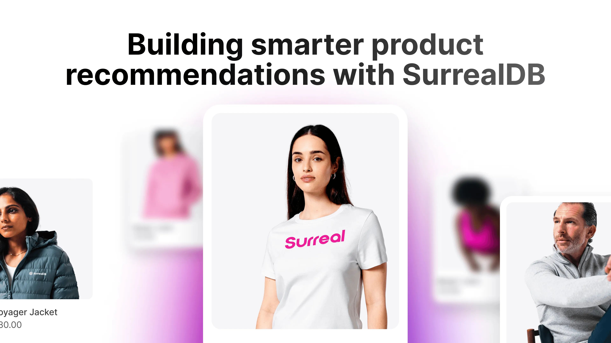
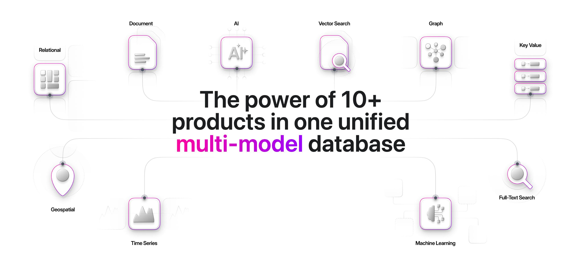
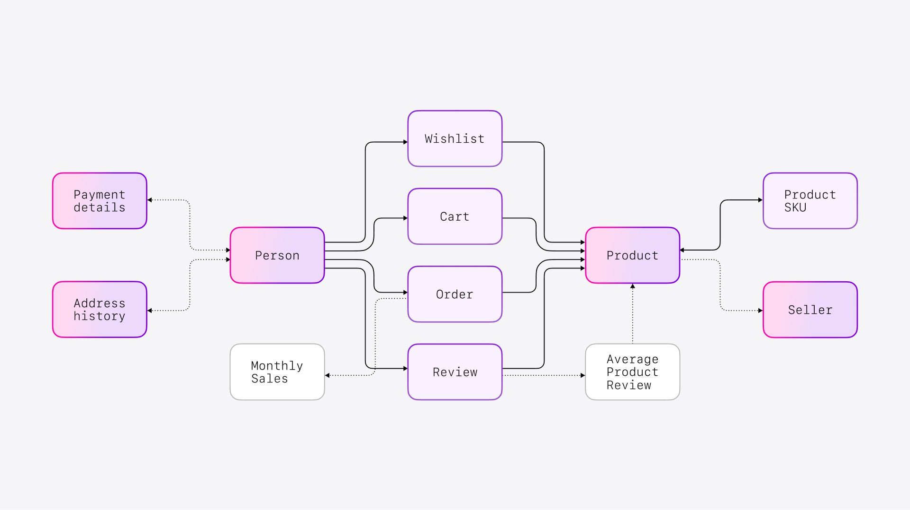

# Building Smarter Product Recommendations with SurrealDB

Personalised experiences can make or break the conversion of a visitor into a customer, which is why recommendation engines are no longer a luxury - they’re essential.

You’ve seen them everywhere:

> “*Gift ideas inspired by your shopping history.*”
> *“Customers who viewed this item also bought…”
> “Just arrived for you.”*

However, behind these helpful nudges are complex systems. Traditionally, building these systems meant building out a team of experts who build out stacks of disconnected tools, which then need to be glued together again. This might include relational, document and graph databases along with advanced machine learning and vector stores.

Systems like these trend toward ever increasing complexity, but is that really necessary?

What if complex systems don’t need to be complicated?

What if you could do it all in one stack?

## Unify disconnected tools with SurrealDB



SurrealDB gives you the power of 10+ products in one unified multi-model database.

It's natively real-time, relational, document, graph, vector and more. Built from the ground up using cutting-edge research and the Rust language to ensure runtime safety, combined with the performance and low-latency requirements you need from a high performance system.

For recommendation systems, this enables you to build simpler systems and achieve better personalisation. Instead of juggling multiple systems to stitch together context, relationships, and meaning, SurrealDB lets you keep everything in one tightly integrated platform, without the need to install or interact with multiple databases, libraries or frameworks.

## Why Recommendations Need to Be Smarter

Traditional recommendation systems rely on techniques like:

- **Collaborative Filtering (CF):** "People who bought this also bought…"
- **Content-Based Filtering:** "Products similar to the ones you like."
- **Hybrid Models:** Combining CF and content-based for more accuracy.

These work, but if you could increase conversion rates by a few percent, why wouldn’t you?

The current cutting-edge trends are moving towards real-time, more context-aware systems - making using of LLM driven recommendations powered by centralised knowledge graphs.

This is where SurrealDB shines. Let’s therefore explore a high-level recipe for how you can build such recommendation systems, simply using SurrealDB and a LLM provider. No need for Python glue code, frameworks, vector stores and more.

## How to Build a Smart Recommendation Engine with SurrealDB

### Build Out Your Knowledge Graph



This makes it easy to provide context that can be used to answer questions such as:

- Who bought what?
- Who’s similar to whom?
- What’s trending?

```surrealql
SELECT array::distinct(
  ->order->product
  <-order<-person
  ->order->product.{id, name}
) AS recommended_products
FROM person:01FVRH055G93BAZDEVNAJ9ZG3D;
```

### Turn Data Into Embeddings for Vector Search and LLMs

Create vector embeddings from product descriptions or user behaviour.

```surrealql
DEFINE FUNCTION fn::create_embeddings($input: string) {
  RETURN http::post("https://example.com/api/embeddings", {
    "model": "embedding model",
    "input": $input
  });
};
```

These embeddings unlock semantic search, so you can say:

> “Show me products similar to a ‘casual sweatshirt’”

And get results based on meaning, not just keywords.

```surrealql
SELECT id, name, vector::similarity::cosine(details_embedding, $prompt)
FROM product
ORDER BY similarity DESC;
```

### Mix Semantic Search with Full-Text Search

Combine keyword relevance and vector similarity for the best of both worlds.

```surrealql
DEFINE FUNCTION fn::hybrid_search($search_term: string) {
  LET $prompt = fn::create_embeddings($search_term);
  LET $semantic_search = (…);
  LET $full_text_search = (…);
  RETURN { semantic_results: $semantic_search, full_text_results: $full_text_search };
};
```

### Add Context from the Graph

Retrieve personalised context: purchase history, preferences, popular items, and more.

```surrealql
DEFINE FUNCTION fn::person_context($record_id: string) {
  LET $context = (SELECT id, name, address, ->order.* AS order_history FROM $record_id);
  RETURN $context;
};
```

### Send the context to an LLM

Send all this rich context into an LLM for hyper-personalised recommendations.

```surrealql
DEFINE FUNCTION fn::get_recs($template: any) {
  RETURN http::post('https://example.com/api/chat', {
    "model": 'reasoning model',
    "input": $template
  });
};
```

## A Real-World Example: Luxury Fashion Retail

A luxury fashion retailer was struggling with low website conversion rates. They had personal shoppers in-store, but scaling that experience online was a massive challenge.

Their solution? Build a virtual personal shopper!

### The Results:

- 4 million customers served monthly
- 1.5 million recommendations every week
- 3x increase in conversion rates

By creating a real-time recommendation pipeline powered end-to-end by SurrealDB. Want to see it in action? Check out the full case study on [YouTube](https://www.youtube.com/watch?v=yLw9MvNfuY8).

Want help making your recommendations smarter? [Reach out to us](/contact)
