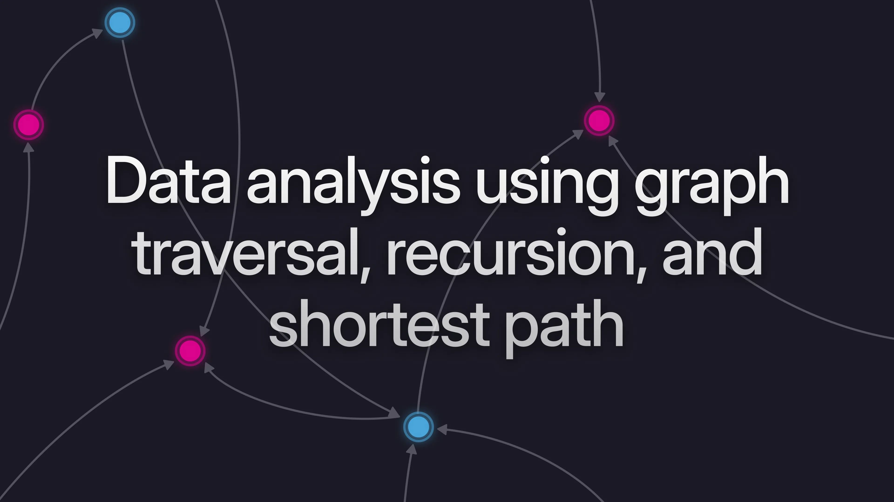

# Data analysis using graph traversal, recursion, and shortest path



In the latest [SurrealDB Stream](https://www.youtube.com/watch?v=n3SjFz6tFes), we dove deep into the world of graph data modelling, showcasing the power of graph traversal, recursive querying, and shortest path calculation. Whether you're building intelligent applications, modelling complex relationships, or looking to redo existing queries in a more expressive way, SurrealDB's graph capabilities open up exciting new possibilities.

Let’s explore some of the highlights from that stream.

### Why graphs are all the rage

While relational and document databases remain the norm, graph databases are gaining traction for a reason: they reflect how we naturally think. Our brains don’t model the world in rows and columns; we think in relationships. John `knows` Bob. A user `follows` another user. A dog `belongs_to` a person (or maybe the other way around?).

Here's what those paths look like when using SurrealQL, SurrealDB's query language.

```surrealql
person:john->knows->person:bob;

user:one->follows->user:two;

person:which_pretends_to_be_the_owner
  ->belongs_to
  ->dog:which_essentially_owns_the_house;
```

SurrealDB is a multi-model database, meaning that it allows you to use graph traversal in addition to structured records and relational schemas. From knowledge graphs in AI to fraud detection and logistics optimisation, modelling your data as a network brings both flexibility and insight.

> Want to learn more about graph modelling? Check out the [graph documentation](/docs/surrealdb/models/graph).

### Traversing your graph: from basic to recursive

Let’s say you are modelling some people and the products they purchase:

```surrealql
CREATE person:tobie, person:alex;
CREATE product:shirt, product:sticker;
RELATE person:tobie->bought->product:shirt;
RELATE person:alex->bought->product:shirt;
RELATE person:alex->bought->product:sticker;
```

You can write a query to traverse from one person to the product they bought...

```surrealql
person:tobie->bought->product;
```

```surrealql
[
  product:shirt
]
```

...to others who bought the same product, and so on.

```surrealql
person:tobie->bought->product<-bought<-person;
```

```surrealql
[
  person:tobie,
  person:alex
]
```

Following the same path down a depth of more than one is where recursion shines:

```surrealql
-- Create some people, use the latter portion of their record ID as their name
CREATE person:tobie, person:alex, person:jaime, person:paz SET name = id.id();

-- Send a few messages from one to the other...
RELATE person:tobie->messaged->person:alex  SET subject = "engineering";
RELATE person:tobie->messaged->person:jaime SET subject = "design";
RELATE person:jaime->messaged->person:tobie SET subject = "marketing";
RELATE person:alex-> messaged->person:jaime SET subject = "design";
RELATE person:paz->  messaged->person:tobie SET subject = "marketing";

-- Go three levels down the ->messaged->person path, then access the 'name' field
person:tobie.{3}(->messaged->person).name;
```

```surrealql
[
  'jaime',
  'alex',
  'tobie'
]
```

But what if you want to visualise the fields from connected records along the way, outputting a single tree? You can do this by combining the range operator (such as `1..2`) with a structure for your desired output, and the `@` operator to instruct the database which path to continue following at each depth.

```surrealql
-- All ->messaged->person paths and indicated fields
-- from person:paz down to the third depth
person:paz.{1..3}.{ 
    from: id,
    recipients: ->messaged.out,
    subjects: ->messaged.subject,
    then: ->messaged->person.@
};
```

```surrealql
{
  from: person:paz,
  recipients: [
    person:tobie
  ],
  subjects: [
    'marketing'
  ],
  then: [
    {
      from: person:tobie,
      recipients: [
        person:jaime,
        person:alex
      ],
      subjects: [
        'design',
        'engineering'
      ],
      then: [
        {
          from: person:jaime,
          recipients: [
            person:tobie
          ],
          subjects: [
            'marketing'
          ],
          then: [
            person:tobie
          ]
        },
        {
          from: person:alex,
          recipients: [
            person:jaime
          ],
          subjects: [
            'design'
          ],
          then: [
            person:jaime
          ]
        }
      ]
    }
  ]
}
```

Yes, **recursive trees** are now native to SurrealQL!

### Going even deeper: hierarchies and shortest path

Let’s say you’re modelling a corporate hierarchy: CEO -> VP -> Manager -> Employee. A few nested `CREATE` statements will allow us to put some sample data together to experiment with.

```surrealql
LET $CEO = CREATE ONLY person:ceo SET title = "CEO";

FOR $vp IN CREATE |person:2| SET title = "VP" {
    RELATE $CEO->manages->$vp;
    FOR $manager IN CREATE |person:2| SET title = "Manager" {
        RELATE $vp->manages->$manager;
        FOR $employee IN CREATE |person:2| SET title = "Employee" {
            RELATE $manager->manages->$employee;
        };
    };
};
```

As above, instead of flattening this data or struggling with nested queries, you can use SurrealDB’s recursive syntax to walk the entire org tree in a single line.

```surrealql
person:ceo.{..}.{ id, title, manages: ->manages->person.@ };
```

```surrealql
{
  id: person:ceo,
  manages: [
    {
      id: person:wyt8roa15ule67z7rtda,
      manages: [
        {
          id: person:6oe44saitwg66vps4ect,
          manages: [
            {
              id: person:opp8n5uxos9wfs0o7khn,
              manages: [],
              title: 'Employee'
            },
            {
              id: person:3zy2dztr9vs2i1dtelgh,
              manages: [],
              title: 'Employee'
            }
          ],
          title: 'Manager'
        },
        {
          id: person:zrir2d2i5yyzez8cwd4z,
          manages: [
            {
              id: person:f92gror3ty46jtt1vm3z,
              manages: [],
              title: 'Employee'
            },
            {
              id: person:3knztiakxj0q1nnkfh3n,
              manages: [],
              title: 'Employee'
            }
          ],
          title: 'Manager'
        }
      ],
      title: 'VP'
    },
    {
      id: person:0qkas5lmuxgr9bbqc0e7,
      manages: [
        {
          id: person:8htxksimbjhizhknr8h9,
          manages: [
            {
              id: person:v1c48171dksnc8me2ge1,
              manages: [],
              title: 'Employee'
            },
            {
              id: person:dazx4f9ur8zlp5hv9uq8,
              manages: [],
              title: 'Employee'
            }
          ],
          title: 'Manager'
        },
        {
          id: person:wdssijioy9mcdfmxqt8d,
          manages: [
            {
              id: person:7p2gl4t943hsk1b5ef6d,
              manages: [],
              title: 'Employee'
            },
            {
              id: person:gkis2bwmwjlqa10twp7w,
              manages: [],
              title: 'Employee'
            }
          ],
          title: 'Manager'
        }
      ],
      title: 'VP'
    }
  ],
  title: 'CEO'
}
```

But you can also use SurrealDB's built-in algorithms too when making a recursive query.

Want to find the shortest path between two people in the org chart? You can add `+shortest` to the path to follow, in this case the `<-manages<-person` path.

```surrealql
SELECT 
  title, 
  @.{..+shortest=person:ceo}<-manages<-person AS path_to_ceo
FROM person
LIMIT 3;
```

You can see that employees have two people in between them and the CEO, managers have one, while VPs are directly connected.

```surrealql
[
  {
    path_to_ceo: [
      person:ceo
    ],
    title: 'VP'
  },
  {
    path_to_ceo: [
      person:zrir2d2i5yyzez8cwd4z,
      person:wyt8roa15ule67z7rtda,
      person:ceo
    ],
    title: 'Employee'
  },
  {
    path_to_ceo: [
      person:6oe44saitwg66vps4ect,
      person:wyt8roa15ule67z7rtda,
      person:ceo
    ],
    title: 'Employee'
  },
  {
    path_to_ceo: [
      person:wyt8roa15ule67z7rtda,
      person:ceo
    ],
    title: 'Manager'
  },
  {
    path_to_ceo: [
      person:wdssijioy9mcdfmxqt8d,
      person:0qkas5lmuxgr9bbqc0e7,
      person:ceo
    ],
    title: 'Employee'
  }
]
```

This unlocks applications in organisational analysis, fraud detection, social networking, and AI.

Two other algorithms you can use are `path` to show all the possible paths from a record, or `collect` to show all the unique nodes.

> Dive into our page on [graph relations](/docs/surrealdb/models/graph) for more.

### What’s next?

In our next blog post we’ll be looking at our newly added **references** for record links and how they compare to graph edges. In SurrealDB, you can use both in tandem, and choose the right tool for the job. Optimise for performance with references. Use edges when you need metadata or complex traversal.

This hybrid model is what sets SurrealDB apart.

But for now, if you haven’t yet, try building a small graph model using SurrealDB. Explore recursive traversal. Play with shortest path queries. The results are powerful, fast, and fun.

Until next time, keep querying, keep experimenting, and keep it surreal.

Want to explore further? Check out [SurrealDB University](/learn) and start mastering SurrealQL today.

> Watch the full stream: [Stream #30 - Graph Traversal, Recursion, and Shortest Path](https://www.youtube.com/watch?v=n3SjFz6tFes).
