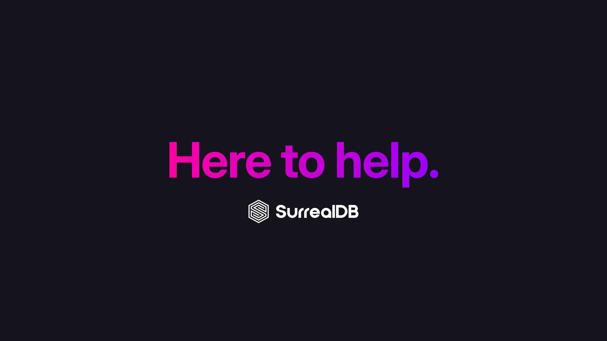

# Our support for FaunaDB users

We wanted to take a moment to acknowledge the difficult news about FaunaDB winding down operations. Building and maintaining a database platform is an enormous undertaking - one that requires not just technical brilliance but also an unwavering commitment to supporting a community of developers and businesses. The FaunaDB team has done an incredible job over the years, and we have immense respect for everything they’ve built.

However, we know that for many of you, this news creates a lot of uncertainty. Your applications, your data and the impact on your business operations. Your users rely on a stable and secure database solution, and the thought of having to migrate can feel overwhelming.

At SurrealDB, we’re here to help. We’ve worked hard to build a database that offers the scalability, performance, and developer-friendly features that FaunaDB users have come to expect. Our team has already developed a streamlined migration path to make the transition as smooth as possible. We’re offering:

- **Migration assistance:** Our engineers are ready to help you assess your current setup and guide you through the migration process step by step.
- **Dedicated support:** We know time is of the essence, and our team is available to ensure that your transition happens without disruption.
- **Surreal Cloud credits:** We would offer impacted users Surreal Cloud credits to help FaunaDB users to migrate their applications to our cloud.
- **Vibrant community:** We have a highly engaged community who actively share insights, collaborate on innovative solutions, support each other in solving challenges, and contribute to the continuous evolution of our platform through discussions, open-source contributions, and real-world use cases.

#### Our commitment We’re committed to ensuring that your applications not only continue running smoothly but also thrive in a platform designed to scale with your needs. If you’re ready to discuss your options or have any questions please contact us.

We welcome the opportunity to work with you.

Tobie Morgan Hitchcock and Jaime Morgan Hitchcock CEO and Co-founder / COO and Co-founder SurrealDB
