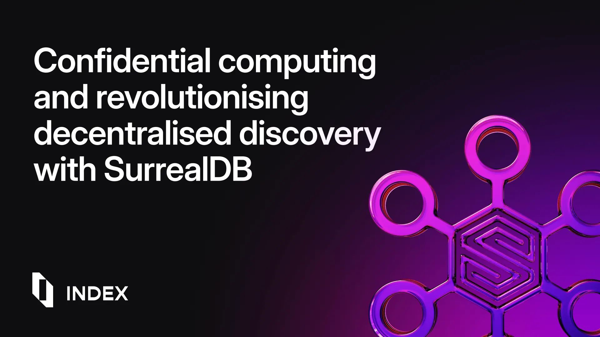

# Revolutionising decentralised discovery with SurrealDB and confidential computing



## About Index Network

Traditional discovery methods are fragmented, limiting personalisation and forcing trade-offs between relevance and privacy. While public data is widely accessible, personal context remains siloed in separate apps, inboxes, and chat histories. Index Network bridges these gaps by allowing autonomous agents to synthesise both public and private data securely, preserving user privacy. Instead of relying on centralised platforms, users can define their own context and delegate discovery to trusted agents - whether for tracking trends, finding collaborators, or making sense of fragmented knowledge. This approach makes discovery more open, personal, and intelligent.

Index Network is a user-centric and distributed discovery protocol platform. A discovery protocol is a set of rules and technologies that enable a platform to connect users with relevant information, ideas, and people. Index Network enables, via decentralised semantic indices, AI agents to securely query private data using Trusted Execution Environments (TEE)-powered compute while maintaining composability with public sources.

## The problem we are solving

We are tackling the challenge of privacy-preserving, user-centric discovery. Our goal is to enable autonomous agents to retrieve and synthesise insights across fragmented data sources without requiring centralised control. Previously, user data could not be securely connected to algorithms while maintaining privacy. Custom-built solutions were necessary for every new context. However, with Web3 eliminating intermediaries, TEE-based decentralised compute enabling public-private data synthesis, and LLMs (Large Language Models) processing human language data, autonomous agents can now dynamically compose information for any context.

**<a real world example>**

## The challenges we faced

1. **Unpredictable data structures**: User data can exist in various formats and schemas, requiring flexible querying - sometimes as a graph, other times relational, and often semantically structured.
1. **Uncertain access patterns**: A decentralised environment needs a secure, verifiable, and distributed authorisation mechanism. Compute nodes must only access data during processing, minimising data leakage risks.
1. **Scalability constraints**: The unpredictable nature of data access forces compute and storage to scale together, leading to inefficient resource allocation and performance bottlenecks. Proximity between compute and storage is crucial for efficiency, but decentralisation introduces network latency challenges.

## Our solution

We explored traditional relational databases with dynamic schema management (such as PostgreSQL with pgvector for embeddings), document-based databases for schemaless design, and graph databases. Specifically, we needed to combine vector, graph, relational and document based databases on a unified platform. Trying different combinations of tools we ran into hurdles:

- Performance hit of module based approaches
- Requiring redundant data transformations when leveraging multiple products
- Indexing headaches when trying to leverage unstructured with structured data.
- Managing multiple binaries with their own version concerns.

This led us to a conclusion that to achieve a platform solution for our decentralised product our data needed to also be stored on a platform without compromise.

We chose SurrealDB because it's reliable and lets us access data in many different ways on a single data-platform without having to replicate data, leverage multiple languages and deal with the complications of managing multiple versions of technologies.

### Why SurrealDB?

Our use of **Rust**, now the standard in decentralised compute networks, led us to **SurrealDB**. Its support for both graph and relational models aligned perfectly with our needs. Additionally, its architecture separates compute and storage, making it naturally decentralised.

```surrealql
LET $person_embedding = [0.15, 0.25, 0.35, 0.45];

SELECT 
    id,
    username,
    count(->follows->person<-follows<-person) AS mutual_connections,
    vector::similarity::cosine(intent_embedding, $person_embedding) AS intent_alignment,
    (mutual_connections * 0.4) + (intent_alignment * 0.6) AS match_score
FROM person
WHERE 
    id != user:current_user
    AND id NOT IN (SELECT out FROM user:current_user->follows)
    AND intent_embedding <|1,4|> $person_embedding
ORDER BY match_score DESC
LIMIT 5;
```

In our setup, we leverage **TEEs** to ensure compute nodes access data only during execution, preventing unauthorised retention. Since **SurrealDB's query layer is decoupled from storage**, we can run verifiable computations within TEEs, maintaining privacy and security without sacrificing performance. Think of it like this: SurrealDB separates the financial advisors (compute) from the vault (storage). This separation allows us to bring the advisors into a secure, private room (TEE) to work on your portfolio (process data) without giving them full access to all your assets in the vault.

### Code snippet: querying data with SurrealDB

```rust
use surrealdb::engine::remote::ws::Client;
use surrealdb::Surreal;

#[tokio::main]
async fn main() -> surrealdb::Result<()> {
    let db = Surreal::new::<Client>("localhost:8000").await?;
    db.use_ns("index_network").use_db("discovery").await?;
    // This query is executed directly against the database.  While it demonstrates
    // how to query SurrealDB, it does *not* utilize TEEs for secure execution.  
    // The data is potentially exposed during transit and within the database itself.
    // This should only be executed in the trusted local environment for processing in the distributed TEE after being encrypted.
    let result: Vec<_> = db.query("SELECT * FROM users WHERE interests CONTAINS 'AI'").await?;
    println!("{:?}", result);

    Ok(())
}

```

### Code snippet: secure query execution in a TEE

```rust
// Code Snippet: Secure Query Execution in a TEE (This shows the *TEE-enabled* flow)
fn execute_secure_query(query: &str) {
    // 1. Fetch User Data (Unencrypted):  The data is retrieved from SurrealDB
    //    *outside* the TEE.  This is a potential vulnerability point if not handled
    //    carefully.  In a real-world scenario, the data might already be encrypted
    //    at rest in the database.
    let data = fetch_user_data();

    // 2. Encrypt Data (Before entering the TEE): The data is encrypted *before*
    //    it's passed into the secure environment. This is crucial for protecting
    //    the data in transit to the TEE.
    let encrypted_data = encrypt_data(data);

    // 3. Run Query in TEE: The encrypted data and the query are sent to the TEE.
    //    The TEE decrypts the data *within* its secure environment, performs the
    //    computation (runs the query), and encrypts the result.
    let result = run_query_in_tee(encrypted_data, query);

    // 4. Decrypt Result (Outside the TEE): The encrypted result is returned from
    //    the TEE and decrypted.
    let decrypted_result = decrypt_data(result);

    // 5. Display Results: The decrypted results are displayed.
    display_results(decrypted_result);
}

fn run_query_in_tee(data: Vec<u8>, query: &str) -> Vec<u8> {
    // Secure execution inside the TEE.  This is the critical part.
    // The `perform_secure_computation` function would use the TEE's APIs
    // to decrypt the data, execute the query, and encrypt the result *all within*
    // the protected environment of the TEE.  This prevents the data and the
    // query from being exposed to the outside world.
    perform_secure_computation(data, query)
}

```

## The benefits

- **Predictable and minimal architecture**: Autonomous agents can retrieve data across graph, relational, key-value, and semantic layers without redundant transformations.
- **Privacy management**: Users can now control data flow without compromising security.
- **Scalability for multi-modality**: A standardised approach to querying different data modalities ensures long-term growth.

We’re excited about the road ahead with SurrealDB and look forward to unlocking new possibilities in decentralised discovery.
