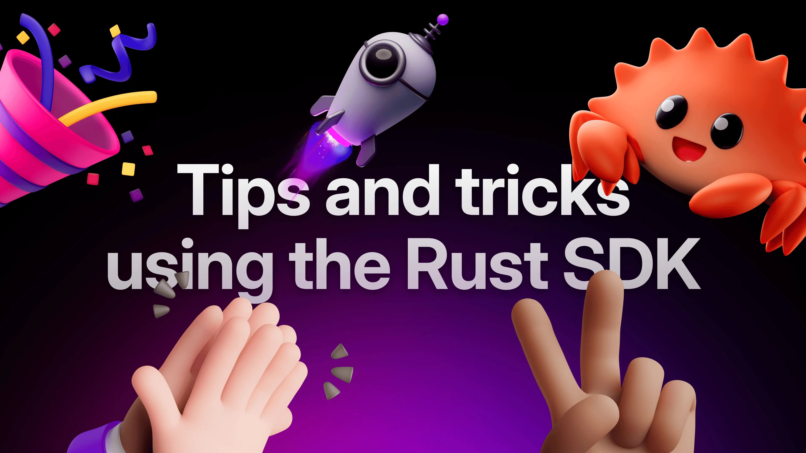

# Tips and tricks on using the Rust SDK



The Rust SDK is designed to be lean, to keep the API surface small. The main type `Surreal<T>` currently only has 24 associated functions. Out of all those functions, only one is defined as `async`. At a glance, this might lead you to believe that the API of the SDK is mostly synchronous. However, this is not the case. In this article we are going to explore some tips and tricks for using the Rust SDK.

## Async builders

The SDK makes extensive use of the [async builder pattern](https://doc.rust-lang.org/std/future/trait.IntoFuture.html#async-builders). Except `Surreal::init`, which is just a constructor, none of the associated functions mentioned earlier does anything unless you `.await` on them. This keeps the API flexible and allows us to add modifier methods without breaking backwards compatibility [like we did for exports in v2.1](https://github.com/surrealdb/surrealdb/pull/5125/files#diff-5783f3149e3b5b16d2cad9c8d84d56f389e83571643efdafa0f457aea7421b76).

This allows you to do things like connecting with unbounded capacity

```rust
let db = connect("ws://localhost:8000").await?;
```

or specify a connection capacity when connecting.

```rust
let db = connect("ws://localhost:8000").with_capacity(1024).await?;
```

## Alternative runtime (`async-std`)

The SDK uses Tokio APIs so if your async runtime is Tokio, you are good to go. If you are using a different runtime, however, you may want to ensure that it is compatible with Tokio. When using `async-std`, try enabling the `tokio1` feature for compatibility with Tokio.

```yaml
async-std = { version = "1", features = ["tokio1"] }
```

## Static and dynamic engines

The Rust SDK is very versatile and allows various ways of accessing your data. It can embed the database entirely or access a SurrealDB server remotely via either a WebSocket connection or an HTTP one. The SDK uses the term "engine" to refer to these clients and KV stores in a general way. These engines can be instantiated statically or dynamically at runtime.

Static engines are typically instantiated using `Surreal::new`

```rust
let db = Surreal::new::<Wss>("cloud-docs-068rp16e0hsnl62vgooa7omjks.aws-euw1.staging.surrealdb.cloud").await?;

```

In this case the scheme, `Ws`, is a proper Rust type. The advantage with this is that typos can be caught at compile-time and if the relevant feature for that engine is not specified, the code won't even compile.

The dynamic engine, `Any`, is a meta engine. It's typically instantiated using the `connect` function

```rust
let db = connect("wss://cloud-docs-068rp16e0hsnl62vgooa7omjks.aws-euw1.staging.surrealdb.cloud").await?;

```

Because the scheme is part of the endpoint, it is not checked at compile time. The advantage of this is that the endpoint can be extracted into an environment variable, allowing you to switch engines at runtime without changing or recompiling your code.

## Interchangeable engines

The Rust SDK is like a meta-SDK of some sort. Currently it supports 9 engines:

- WS
- HTTP
- RocksDB
- SurrealKV
- FoundationDB
- IndexedDB
- TiKV
- Memory
- Any

Besides the obvious one, IndexedDB, some of these engines can run on Wasm as well. All these engines share the same API and work the same way, so you can easily switch from one engine to another. Using the `Any` engine, you can even do it without recompiling your code. The beauty of this is you can easily scale up or down using the same code by simply changing your endpoint without even needing to recompile your code, if you don't want to.

For example you could start with a single node

```cli
SURREALDB_ENDPOINT=rocksdb:/path/to/database ./target/release/my-app
```

Say your app starts getting more traffic, you could spin up an external server pointing to the same database

```cli
surreal start --bind 192.168.0.1:8000 rocksdb:/path/to/database
```

You can then horizontally scale your app and balance the load across your instances while still pointing to the same database

```cli
SURREALDB_ENDPOINT=ws://192.168.0.1:8000 ./target/release/my-app
```

You can take this a step further and switch to a distributed KV store like TiKV or FoundationDB. You can do this with or without an intermediary SurrealDB server while still using the same code and only changing your endpoint.

You probably know this already but the SDK is modular. Only the WebSocket engine is enabled by default, so if you want to use any other engine you have to enable it first. This way, your binary will only contain the features you need. In order to be able to switch between engines as mentioned above, you either need to enable all the features you will need in your `Cargo.toml` or enable them when building.

```javascript
cargo build --features surrealdb/protocol-ws,surrealdb/kv-rocksdb
```

This way you can keep your binaries lean by recompiling your code with the relevant feature when you decide to switch the engine. Either approach is fine. You may want to decide on one or the other on a project by project basis because, really, it depends on your use-case.

## Static and dynamic typing

Normally you would specify your own custom types and deserialise your responses into them

```rust
#[derive(Serialize, Deserialize)]
struct Person {
    id: RecordId,
    name: String,
}

let people: Vec<Person> = db.select("person").range("abel".."john").await?;

```

or this when using query

```rust
let people: Vec<Person> = db.query("SELECT * FROM person:abel..john").await?.take(0)?;

```

This is what we are referring to as static typing here. The great thing about this are the compile-time guarantees that come with it and you get back types that are already deserialised.

But sometimes you may not know what the data looks like ahead of time or you may not care. This is where dynamic typing comes in. To switch to dynamic typing, we simply need to wrap the parameter of the CRUD method with `Resource::from`

```rust
let people = db.select(Resource::from("person")).range("abel".."john").await?;

```

or this when using query

```rust
let people: Value = db.query("SELECT * FROM person:abel..john").await?.take(0)?;

```

## Trait-based method overloading

Unlike some languages, Rust does not have function/method overloading. Normally, you can allow multiple parameters by specifying a trait as your parameter. The SDK takes this a step further and determines the output of an associated function based on its input. Because of this, we are able to reuse our methods without resorting to multiple methods like `delete_one`, `delete_many` etc while retaining the compile-time guarantees. In this case, instead of `delete_one`, if the parameter is a record ID, the compiler knows we are deleting only one record

```rust
let deleted: Option<Foo> = db.delete(("foo", "bar")).await?;

```

This tells the database to delete a record with an ID `bar` from the table `foo`. The compiler knows we are deleting only one record and will only allow you to type hint `Option<T>` as your return type. Not specifying a return type or specifying a `Vec<T>` will result in a compiler error. To delete multiple records, ensure the delete operation is running on either a table

```rust
let deleted: Vec<Foo> = db.delete("foo").await?;

```

or a range of records

```rust
let deleted: Vec<Foo> = db.delete("foo").range("alpha".."baz").await?;

```

This deletes every record whose ID is `alpha` up to but not including `baz`. If you specify `Option<Foo>` instead of `Vec<Foo>` when deleting multiple records, the code won't even compile. This protects you from accidentally deleting multiple records. If you really know you want to delete the multiple records but you don't care about the response, you can use dynamic typing instead.

```rust
db.delete(Resource::from("foo")).range("alpha".."baz").await?;

```

## Waiting for certain events

The SDK allows you to wait for certain events before proceeding. Currently you can wait for a connection to be established or wait for a database to be selected. This is handy if you want to wait for these events concurrently.

```rust
// Initialise the client without establishing a connection
let client = Surreal::<Any>::init();

// Clone the client so we can move it to a different Tokio task
let  db = client.clone();
// Using Tokio spawn to show that these can be done concurrently
tokio::spawn(async move {
    // Establish the connection
    // Once this connection is established, the `Connection` event will fire
    db.connect("ws://localhost:8000").await.unwrap();
    // Sign into the database
    db.signin(Root {
        username: "root",
        password: "root",
    }).await.unwrap();
    // Select the namespace and database
    // Once the database is selected, the `Database` event will fire
    db.use_ns("namespace").use_db("database").await.unwrap();
});

// We won't proceed past this line until the database is selected
client.wait_for(Database).await;
```

As you can see, while the API surface is deceptively small, the Rust SDK has a lot going on under the hood.
