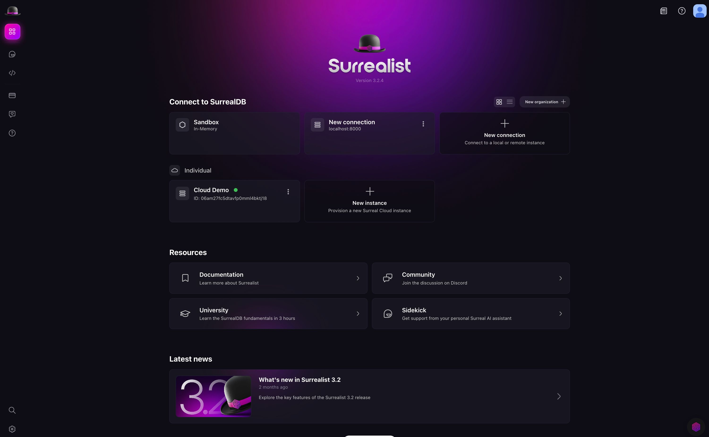
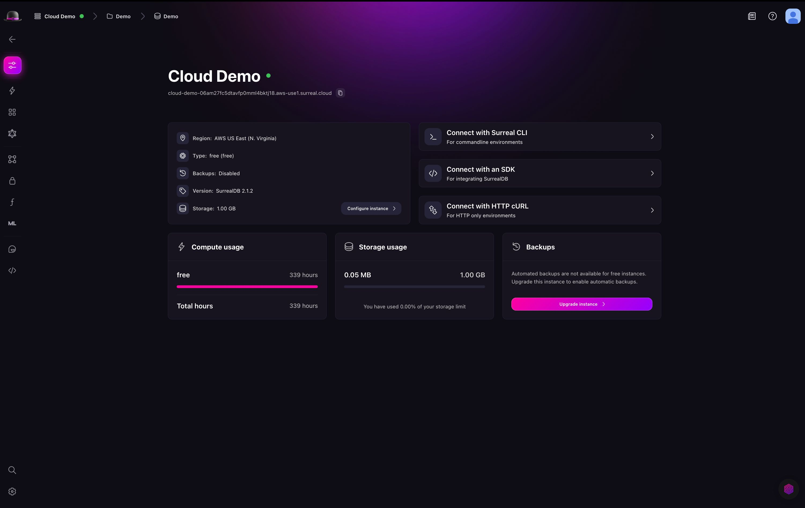
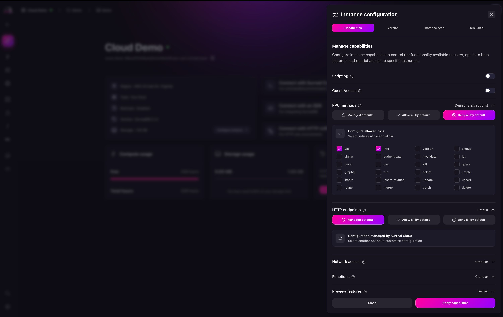
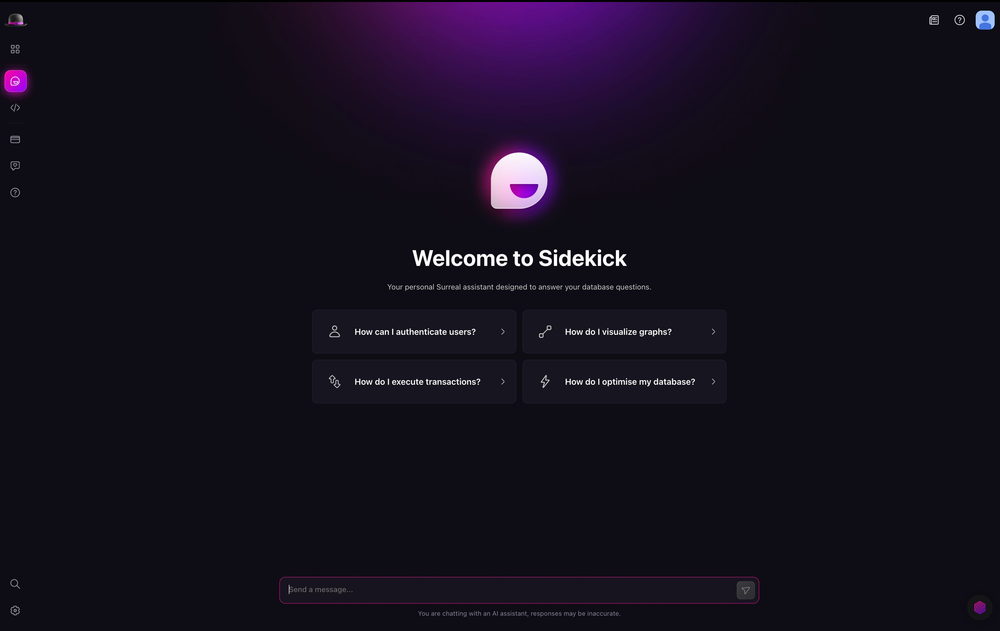

# What's new in Surrealist 3.3

We're excited to announce the release of Surrealist `3.3`. Our rethink on the Surrealist experience has led us to a new overview page, Instance configurator, and a dashboard view with a few more updates for Cloud instance configuration. Let's dive right in and see what's new 🎉.

## Highlights

### New overview page

When we first released Surreal Cloud as part of Surrealist, we focused on providing a way to connect to and manage your Surreal Cloud Instances. The Surreal Cloud panel was a single place to manage your instance settings, capabilities, and other configuration options. Although this was a great start, we knew we could do better.

To ensure that you have a better experience when using Surreal Cloud, we have introduced a new overview page. This page provides a more intuitive and user-friendly experience for navigating between local connections and Surreal Cloud Instances.

### Redesign Cloud dashboard

The Cloud Dashboard view has also been redesigned to provide a more intuitive and user-friendly experience for managing connection methods, instance configuration, compute and storage resources, and more.

### Enabling backups

Also included in the Cloud Dashboard is the ability to enable backups for your Surreal Cloud Instances. This allows you to create a backup of your instance and restore it if needed.

For free Surreal Cloud Instances, automatic backups are not available. For the Start plan, daily automatic backups are enabled by default.

Learn more about [Surreal Cloud pricing](/pricing).

### Capabilities configuration

In the previous release, capabilities were not configurable. This meant that you could not allow configurations like guest access, scripting functions, RPC or HTTP endpoints. To address this, `3.3` introduces a new instance configuration drawer which includes the following:

- Capabilities configuration
- Version upgrade
- Instance type change
- Increase disk size

### Instance pausing

You can now pause and resume your Surreal Cloud Instances. This is useful if you need to stop your instance from running to save costs. Learn more about this in the [Surreal Cloud documentation](/docs/cloud/getting-started/create-an-instance).

### Redesigned Sidekick page

The Sidekick page has been redesigned to provide a more intuitive and user-friendly experience. The page now includes suggestion prompts to help you get started with SurrealQL. We hope you like it!

## Other changes

- Routing has been updated to allow for top level pages, outside of the scope of a connection
- New embedded SurrealQL editor
- Start screen has been replaced with a new overview page
- The Surreal Cloud panel has been removed and integrated into top level pages
- Cloud instances can now be connected to with a single click
- Lazy-prompt namespace / database selection
- Replaced connection groups with connection labels
- Added keyboard multicursor support to the editor
- Added use of locale number format for rows counter
- Added dedicated Surrealist Mini creator page
- Added a new overview page
- Provides a single clear overview of all your connections and cloud instances
- Includes various help resources and latest blog posts
- Provides a quick way to create new connections and cloud instances
- You can search and filter connections and cloud instances
- Improvements to connections
- Improved the connection creation form
- The prompt requesting the selection of a namespace and database has been improved
- The active connection is now specified in the URL
- Overhauled Surreal Cloud integration
- Cloud Instances can now be managed and opened from the new overview page
- Instances can now be connected to without having to add them to Surrealist first
- The Surreal Cloud panel has been removed in favour of new top level pages
- Improved the performance of authentication
- The instance provision page has been redesigned and simplified
- Added a new provisioning page which opens your instance once it is ready
- Added a new Dashboard view visible for all cloud instance connections
- Provides a single clear overview of your instance configuration and usage
- Allows configuring many instance settings directly from the dashboard
- Displays an alert banner when your instance can be updated to a new version
- Connection groups have been replaced with connection labels
- You can tag each connection with any amount of labels
- Labels are displayed on the overview page
- You can filter connections by label
- Added the ability to pause and resume Surreal Cloud instances
- Instances can be paused to save costs when not in use
- All data is preserved when an instance is paused
- Instances can be resumed at any time
- Added the ability to customise Surreal Cloud instance capabilities
- Added the ability to increase maximum disk size for Surreal Cloud instances
- Added the ability to view the backup status of a Surreal Cloud instance
- Added a policy notification on first use
- Added suggested questions to the Sidekick page
- Added a button to the sidebar to return to the overview page
- [Display Explorer view row counts in a localised format](https://github.com/surrealdb/surrealist/pull/700)
- [Enhanced the CSV importing functionality](https://github.com/surrealdb/surrealist/pull/678)
- [Improved the performance of CSV importing](https://github.com/surrealdb/surrealist/pull/726)
- [Added editor shortcuts for multicursor editing](https://github.com/surrealdb/surrealist/pull/697)
- Allow cost estimations to be selected

## Bug fixes

- Fixed an issue with Surrealist crashes on large CSV imports
- Fixed overview glow animation performance on certain systems
- Fixed missing instance name validation
- Fixed issues in light theme
