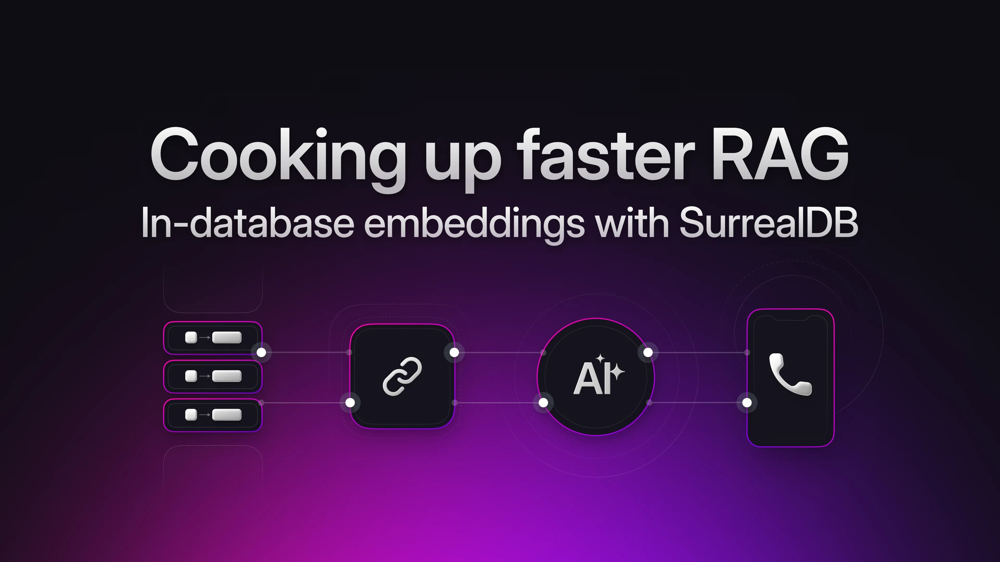

# Cooking up faster RAG using in-database embeddings in SurrealDB



Imagine you're trying to put the perfect recipe together, but every time you search, you have to wait for a slow, external chef (API) to prepare your ingredients (embeddings). Wouldn't it be better if you had all your tools in one kitchen (database)? This is the challenge that many developers face when building Retrieval Augmented Generation (RAG) pipelines. RAG combines the power of large language models (LLMs) with the ability to supplement the LLM’s understanding with information from an external source. This allows LLMs to generate more accurate and contextually relevant responses by drawing on a wider range of data, reducing hallucinations and improving factual accuracy.

## The problem with external APIs

Traditional RAG pipelines often rely on external APIs to generate vector embeddings, which are numerical representations of text that capture its semantic meaning. However, this approach introduces several challenges:

- **Latency**: Every API call introduces network latency, slowing down the

entire process.

- **Cost**: API usage can quickly become expensive.
- **Complexity**: Managing API keys, rate limits, and different service

endpoints adds complexity to the architecture.

- **Data security**: Sending data to external APIs raises concerns about data

privacy and security, as sensitive information might be exposed.

- **Dependencies**: Your entire dataset would need to be re-encoded when

changing vendors.

- **Integration issues**: Integrating with various APIs and ensuring

compatibility can be challenging and time-consuming.

## A quick overview of how RAG works

Before diving into how SurrealDB solves these problems, let's quickly review how RAG works:

1. **User query**: A user poses a question or request.
1. **Information retrieval**: The query is used to search a database for

relevant information.

3. **Contextual augmentation**: The retrieved information is combined with the

original query.

4. **Response generation**: The LLM uses this augmented context to generate a

more informed answer.

## The key to semantic understanding is information retrieval and vector search

Vector search is a crucial component of RAG because it allows for semantic searches based on the meaning of the text, not just keywords. Instead of looking for exact matches, vector search finds the most relevant pieces of information based on the similarity of the embeddings. This is important because queries might not have the same keywords as the stored information, but can still be semantically similar. For example, “pancake” is closer in meaning to “flapjack” than “chocolate cake” despite “cake” being part of “pancake” and “chocolate cake”.

## What are embeddings?

Embeddings are numerical representations of text (or other data types) in a high-dimensional vector space. Words, phrases, sentences, or documents with similar meanings are located closer to each other in the vector space. When you perform a vector search, the search query is also converted into an embedding vector. The database then calculates the distances between this query vector and the embedding vectors of all stored items. The closest vectors in the embedding space correspond to the most semantically similar items. A useful analogy is that of ingredients and flavours. For every ingredient in your pantry, it has a name (the word) and a flavour profile (the embedding). When you taste a lemon you know it’s similar to a lime, vinegar, etc… and when someone asks you what other ingredients can I use instead of lemon it is easy to recall a list of similar taste profiles.

## A bit about embedding flavours

All embedding models are trained on corpuses of data (i.e. the input data of the domain you seek to model). Each algorithm for training an embedding model has different tactics for conceptualising the data and for optimising the model to during the training process. Here is a high level overview of some popular modelling techniques.

- **Word-level embeddings**: These models represent individual words as

fixed-length vectors, capturing semantic relationships. Examples include GloVe, Word2Vec, and FastText.

- **Contextual embeddings**: These models generate word representations that

depend on the surrounding context, capturing nuanced meanings. Examples include ELMo, BERT, and RoBERTa.

- **Sentence embeddings**: These models are designed to create representations

for entire sentences or paragraphs, capturing their overall meaning. Examples include Sentence-BERT, Universal Sentence Encoder, and SimCSE.

## Understanding the data behind embedding models

- **Word-based models:** In word-based models, each word is associated with a

vector, and these vectors capture the meaning of the word in a high dimensional space.

- **The word list:** At the heart of the model is a list of words and vocabulary

that the model has been trained to understand. This is a representation of all the words that the model can translate to a vector. Each word in this list is unique and has a unique vector representation.

- **The vector:** Each word in the vocabulary has a corresponding vector of

numbers. The values in these vectors are learned during the model training process and represent the semantic meaning of the word. Words with similar meanings will have vectors that are close together in this high dimensional space.

## SurrealDB as your all-in-one kitchen for RAG

**SurrealDB** is a multi-model database that can handle different types of data, including graph relationships, vector embeddings, and full-text search. **SurrealDB** also uses **SurrealML**, an engine that stores and executes trained ML models, and allows for integration with external training frameworks. SurrealDB allows you to generate embeddings directly within the database using SurrealQL functions, eliminating the need for external APIs or services. This means that everything is prepared in-house. You no longer have to rely on external "chefs".

- **Eliminate external APIs**: With SurrealDB, you no longer have to rely on

external APIs or services to generate embeddings, so everything is prepared in-house.

- **Reduce latency, complexity, and cost**: This eliminates the delays, costs,

complexity, and security risks of external APIs.

- **Multi-model database**: SurrealDB is a multi-model database, meaning it can

handle different types of data including graph relationships, vector embeddings, and full-text search.

- **Integration of ML models**: SurrealDB, using SurrealML, can store and

execute trained ML models, and allows for integration with external training frameworks.

## Word embeddings as a simple table structure

Word-based embedding models have a simple structure that allows for straightforward storage in a database. In SurrealDB, we can represent this as a simple table with two fields:

- **Word (Record ID)**: The first field holds the word itself, which is a simple

text string and also serves as the record ID. As record IDs are direct pointers to data, using them facilitates fast and easy fetching.

- **Vector (Array of floats)**: The second field stores the vector associated

with that word, represented as an array of floating-point numbers. This array captures the semantic meaning of the word in a high-dimensional space.

This table of word embeddings is like a spice rack. Each word in the vocabulary, such as `basil` or `cayenne`, is like a specific spice. Each vector associated with a word is like a jar of that spice with a unique blend of components. The vector represents the semantic "flavour" of the word. The record ID of each word is like the label on the jar, allowing for easy and quick retrieval of a particular spice (or word vector). So in our analogy of the spice rack: `basil` would be closer to `oregano` than it would be to `cayenne` or `salt`.

## Sentence embeddings and word vectors

Now that we have our words and vectors, we need to extend this to sentences. To create a vector representation of a sentence, you average the vectors of all the words in the sentence. This is like taking the spices in the rack and making a new spice mix that represents the combination of fetched flavours. This new flavour can now be compared with other flavours directly in the same way that a lemonade has a similar taste profile to a key-lime pie or despite not sharing any ingredients. Extending this notion further we can also understand what other concepts are connected. For example, fish and whales _swim_ while cats and dogs _walk_; you _mince_ and _dice_ herbs but _squeeze_ lemons and limes.

Here's how it works:

1. **Sentence tokenisation**: The input sentence is first broken down into its

constituent words. For example, 'Squeeze a lime into the bowl' can be reduced to `['Squeeze', ‘a’, 'lime', ‘into’, ‘the’, ‘bowl’]`.

1. If your model only has a smaller vocabulary than all the words in the

tokens we reduce that to just the words in our vocabulary: `[’squeeze’, ‘lime’]`

2. Similarly we can reduce the sentence ‘Add the juice of a lemon to the

sauce’ to `[’juice’, ‘lemon’]`

2. **Word vector lookup**: For each word, we fetch its corresponding vector from

the simple table in the database that stores the embedding model itself. For example, here is a conceptual word model based on a very small vocabulary in a 2d space:

```surrealql
   Parsley:               [1.1,0.0]
   Cilantro:              [1.5,0.0]
   Lemon:                 [3.0,0.0]
   Lime:                  [4.0,0.0]
   Chop:                  [0.0,1.0]
   Squeeze:               [0.0,3.8]
   Mince:                 [0.0,1.5]
   Juice:                 [0.0,4.0]
```

3. **Averaging word vectors**: We take the vectors and average them to return a

single vector. For example, `[’squeeze’,’lime’]` can be reduced to the average of `[0.0,3.8]` and `[4.0,0.0]` which equals: `[2.0,1.9]`. When looking at our two sentences we see that they are more similar in our vector space than sentences like ‘Mincing cilantro’ or ‘Chopping Parsley’ would be.

## How we do this in SurrealDB

### The embedding table in SurrealDB

The table definition is very simple. As mentioned earlier, we have a word as a string and an embedding as an array of floats.

```surrealql
DEFINE TABLE embedding_model TYPE NORMAL SCHEMAFULL;
DEFINE FIELD word ON embedding_model TYPE string;
DEFINE FIELD embedding ON embedding_model TYPE array<float>;
```

This would be familiar in many flavours of SQL. The more interesting Surreal twist is how we store IDs on insert of each embedding.

```surrealql
CREATE embedding_model:yummy CONTENT {"word":'yummy',embeddding:[0.1,0.2,0.3..0.4]}
```

In traditional SQL queries one would have to use the word field in a WHERE statement. In SurQL you can directly fetch the record with a query like:

```surrealql
SELECT * FROM embedding_model:yummy;
```

The impact of this subtle change is that we avoid table scans entirely.

### Averaging word vectors in SurrealDB as a simple function

To put this all together we can define a function to generate the vectors for an entire sentence. Here is the entire function:

```surrealql
      DEFINE FUNCTION fn::sentence_to_vector($sentence: string) {
        #Pull the first row to determine the size of the vector (they should all be the same)
        LET $vector_size = (SELECT VALUE array::len(embedding) FROM embedding_model LIMIT 1)[0];
        
        #Split the input into individual words
        LET $words = string::lowercase($sentence).split(" ");

        #remove any blank words due to double spaces
        LET $words = array::filter($words, |$word| $word != "");

        #select the vectors from the embedding table that match the words
        LET $vectors = array::map($words, |$word| {
            RETURN (SELECT VALUE embedding FROM type::thing("embedding_model", $word))[0];
        });

        #remove any non-matches
        LET $vectors = array::filter($vectors, |$v| { RETURN $v != NONE; });

        #transpose the vectors to be able to average them
        LET $transposed = array::transpose($vectors);

        #sum up the individual floats in the arrays
        LET $sum_vector = $transposed.map(|$sub_array| math::sum($sub_array));

        #calculate the mean of each vector by dividing by the total number of vectors in each of the floats
        LET $mean_vector = vector::scale($sum_vector, 1.0f / array::len($vectors));

        #if the array size is correct return it, otherwise return array of zeros
        RETURN
            IF array::len($mean_vector) == $vector_size {$mean_vector}
            ELSE {array::repeat(0,$vector_size)}
            ;
    };
```

Let’s break down the individual steps of the function:

Step 1: Split the sentence into tokens

```surrealql
#Split the input into individual words
LET $words = string::lowercase($sentence).split(" ");

#remove any blank words due to double spaces
LET $words = array::filter($words, |$word| $word != "");
```

The notable functions here are:

[string::split](/docs/surrealql/functions/database/string#stringsplit) which splits the sentence into an array of words.

[array::filter](/docs/surrealql/functions/database/array#arrayfilter) which filters out any blank words due to extra whitespace.

Step 2: Retrieve the vectors for each token

```surrealql
#select the vectors from the embedding table that match the words
LET $vectors = array::map($words, |$word| {
    RETURN (SELECT VALUE embedding FROM type::thing("embedding_model",$word))[0];
});

#remove any non-matches
LET $vectors = array::filter($vectors, |$v| { RETURN $v != NONE; });
```

The notable functions here are:

[array::map](/docs/surrealql/functions/database/array#arraymap) which fetches the vectors for each word as the map command will execute arbitrary logic against each element in the array.

[type::thing](/docs/surrealql/functions/database/type#typething) which will translate the word to a record ID in which we avoid the aforementioned table scans.

[array::filter](/docs/surrealql/functions/database/array#arrayfilter) we use a filter again to eliminate any words that are not part of the embedding model’s vocabulary.

Step 3: Transpose and generate the average vector

```surrealql
#transpose the vectors to be able to average them
LET $transposed = array::transpose($vectors);

#sum up the individual floats in the arrays
LET $sum_vector = $transposed.map(|$sub_array| math::sum($sub_array));

#calculate the mean of each vector by dividing by the total number of vectors in each of the floats
LET $mean_vector = vector::scale($sum_vector, 1.0f / array::len($vectors));
```

The notable functions here are:

[array::transpose](/docs/surrealql/functions/database/array#arraytranspose) which transforms the arrays into a format that we can execute the averaging on.

[array::map](/docs/surrealql/functions/database/array#arraymap) we again leverage the map function. This time to perform a sum on the elements of the arrays and return a single array (i.e. vector).

[vector::scale](/docs/surrealql/functions/database/vector#vectorscale) which divides each summed element in the vector by the total number of vectors, achieving the average value in each dimension.

With this function in hand we can now return embeddings for any bit of text:

```surrealql
RETURN fn::sentence_to_vector("A sentence to embed");
```

Or on data ingest have an embedding automatically calculated:

```surrealql
DEFINE FIELD text ON my_table;
DEFINE FIELD text_embedding ON my_table DEFAULT fn::sentence_to_vector(text);
```

Or leverage this in your semantic searches without calling an external API for your input text:

```surrealql
SELECT text, vector::distance::knn() as distance
FROM my_table
WHERE text_embedding <|5,COSINE|> fn::sentence_to_vector($input_text)
ORDER BY distance;
```

### Bringing it back to RAG

With your embedding model installed in the same database as your underlying database, you now have the means to eliminate the points of friction associated with an external embedding call. To update your end-to-end RAG application, replace your embeddings API call with a single query that returns the relevant text for enhancing your prompts.

This lets you go from this:

Set up and when you add new data:

Upload your corpus to a database

For each article/document, generate your vectors and update your data base via api

User asks a question:

Calculate the vector for search from you vector via api

Query your corpus database

Add the relevant corpus data to the prompt and allow your LLM to answer

To this:

Set up and when you add new data:

Upload your corpus to a database

User asks a question:

Query your corpus database

Add the relevant corpus data to the prompt and allow your LLM to answer

## Key takeaways

- SurrealDB allows you to perform all of your required database operations in

one single place.

- You no longer need to rely on external "chefs" (APIs).
- The word embeddings are stored in a simple table, similar to a spice rack.
- Defining your own function like the aforementioned fn::sentence_to_vector is a

convenient way to create a sentence or paragraph embedding from word vectors by averaging, at query time, directly within the database.

By utilising SurrealDB's in-database embedding capabilities, you can build faster, more secure, and cost-effective RAG pipelines. This approach eliminates the complexities associated with external APIs and allows you to focus on building innovative applications that can take advantage of modern AI.
