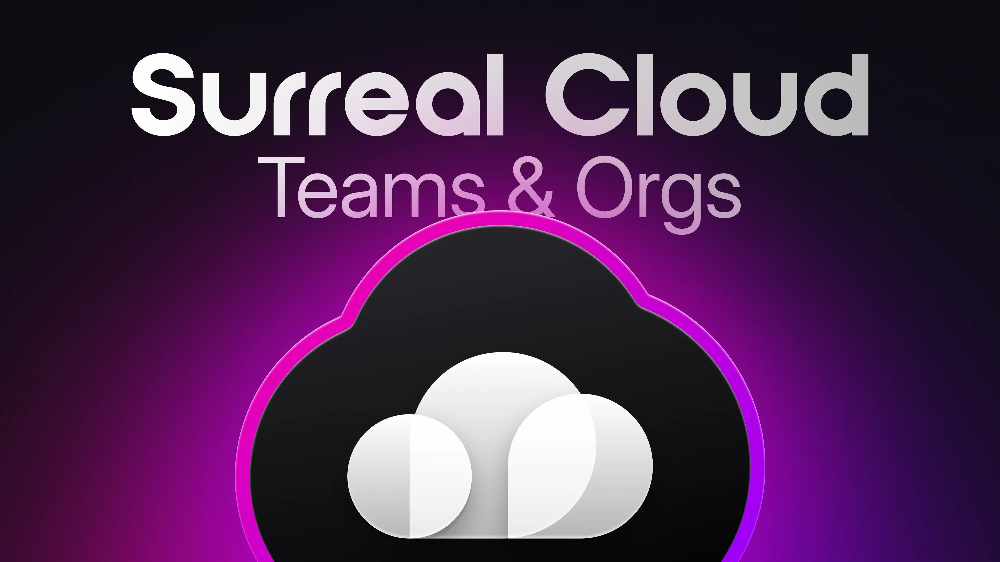
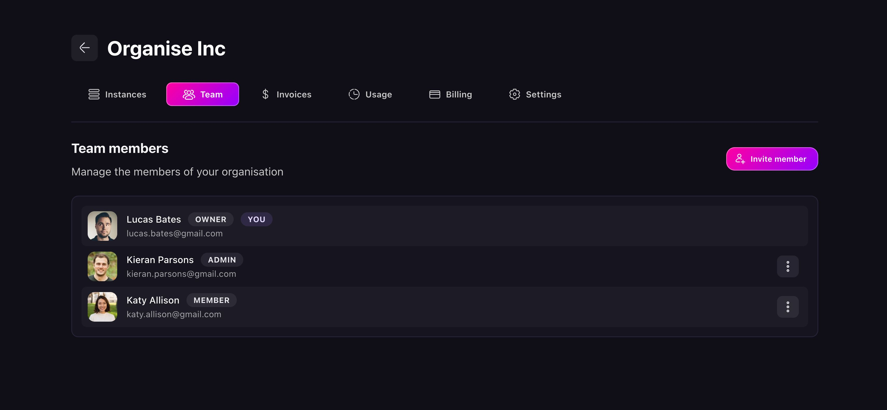
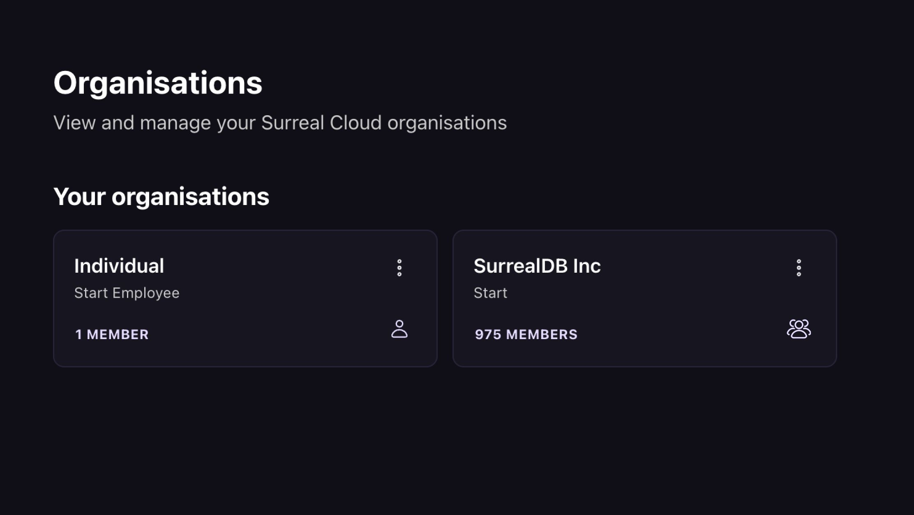

# Introducing Teams and Organisations in Surreal Cloud

We're excited to announce Surreal Cloud's Teams and Organisations - a fully streamlined solution for collaboration and resource management. Whether you want to work seamlessly with others or organise different projects under a single account, Teams and Organisations makes it simple and efficient.

With this new feature, you can invite collaborators to join your organisation with customisable roles and permissions for granular control over who can access and modify your projects. If you need to, you can also [separate your work into different Organisations](/docs/cloud/getting-started/create-an-instance) with their own settings and billing.

## Manage your team with ease

Surreal Cloud makes team management simple and intuitive. Invite team members in seconds. Just enter their email and assign the right role. Need to make changes later? You can update permissions or remove team members at any time, keeping your workspace secure and up to date.

- Collaboration: easily invite colleagues or clients to join your organisation. This way, everyone can access the same resources while you maintain control over who can do what.
- Access Control: assign roles and permissions to team members, ensuring that sensitive data and configurations remain secure. This segmentation is vital for managing larger projects with multiple contributors. Learn more about managing Organisations permissions in the [Surreal Cloud documentation](/docs/cloud).

Whether you're on a team of two or two thousand, Surreal Cloud now scales with your team. With our brand new Teams and Organisations features, you can invite collaborators, manage access, and centralise compliance, all in one intuitive, easy-to-use interface.

## More control. Less complexity.

From fine-grained permissions to unified billing and compliance tools, managing your SurrealDB projects has never been more streamlined. Spend less time wrangling infrastructure and more time building great things, together.

- Billing & Resource Management: each organisation has its own billing setup and resource quotas. This separation is especially useful when managing projects for different clients or business units.
- Scalability: as your projects or teams grow, you can create new Organisations or upgrade specific team Instances without disrupting your existing work, maintaining a clear structure across your collaborative efforts.

In summary, while the individual organisation serves as your starting point on Surreal Cloud, with Teams and Organisations you can scale your operations - whether that's isolating different projects or bringing together multiple collaborators under structured, well-managed environments.

## Ready to get started?

[Teams and Organisations](https://app.surrealdb.com/create/organization) is now available in Surreal Cloud, plus everything else you love about SurrealDB! Build, secure, and ship faster, together.

[Log in to Surreal Cloud](https://app.surrealdb.com/signin) to explore Teams and Organisations and start collaborating today! To help you get started, please accept `$50` of credit from us - just apply the code `CLOUD50` in your [billing settings](/docs/cloud/billing-and-support/billing). Valid until 30th May, 2025.
