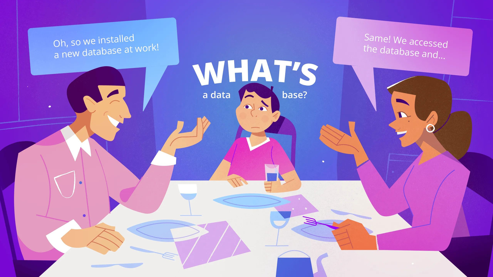
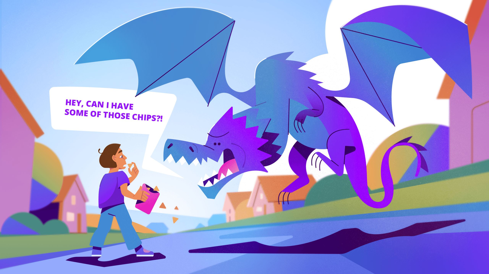
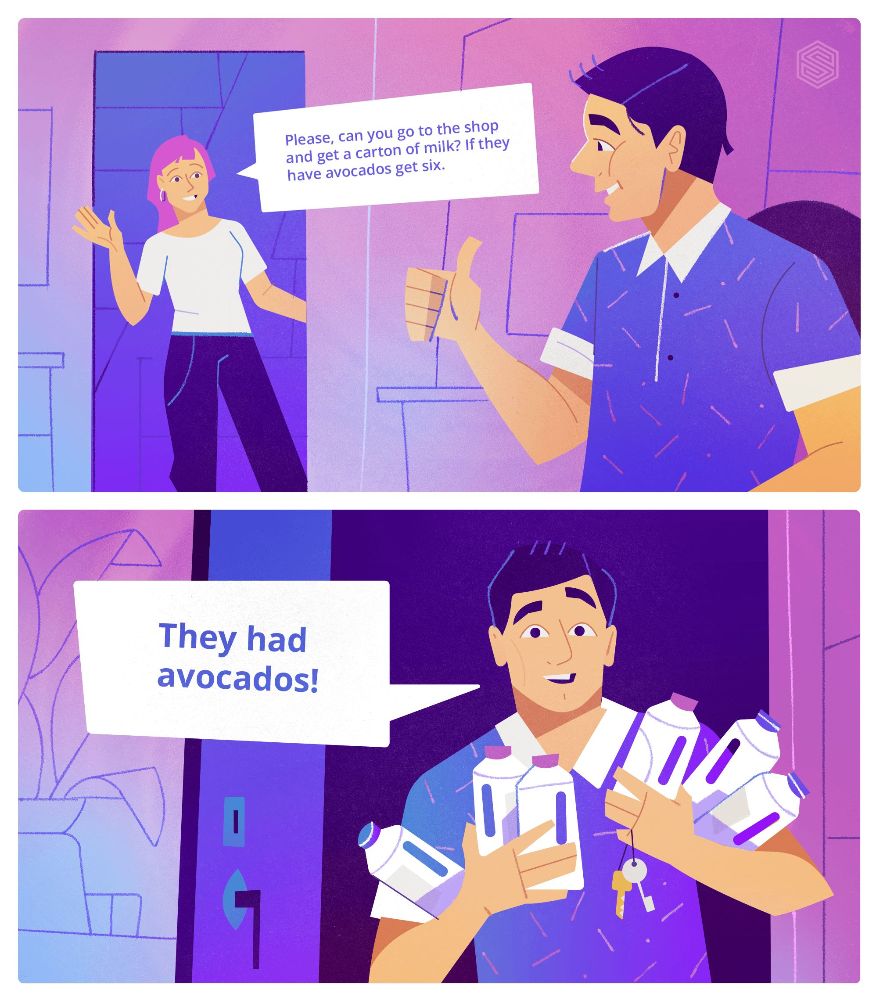
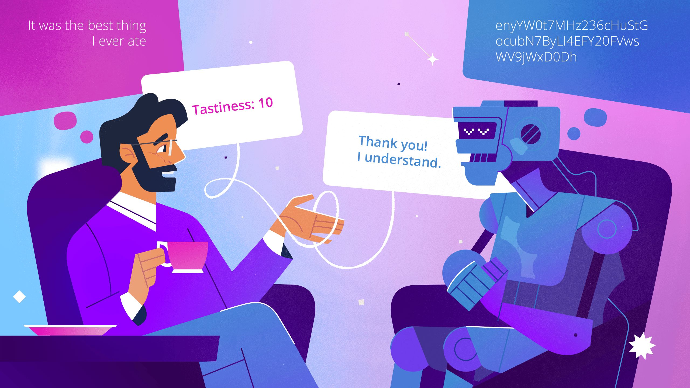

# What's a database anyway?? A blog post for kids



Hello there! This article is only for children to read.

Well, adults can read it too if they want, but it won't have any long words that adults like to use, like "perception" or "idempotent". Just normal words that people use every day. So if you are an adult that likes explanations that don't use difficult words, feel free to read it too!

Anyway, we made this post for you because you might know someone who works with a database. This someone might be your mom or dad, or someone else.

And you might have heard this someone talking about work at dinner, saying things like:

- "We couldn't access the database today because...", or
- "We're looking to install a new database, which..."

And then you probably wondered just what a database is, and how old you have to be to understand what a database is.

The good news is that you can understand what a database is right now! That's because everyone uses databases, even you. Whenever you search for a book at the library, that is thanks to a database that holds the information for every book. And whenever you look through a list of shows on TV to watch, that uses a database too.

In fact, even your own mind has its own database. Because a database is really just something that you use to do two things.

- The first thing is: Keeping information. Lots of information. It's like a box that never gets full.
- The second thing is: Finding the information again when you need it.

And that's what your mind does for you every day!

## The database inside your mind

Whenever you do or see something, your mind decides how important it is. Then it decides how long to remember it. The more important the memory, the longer your mind will keep it.

You certainly remember what you ate for breakfast this morning. But how about what you ate for breakfast 15 days ago? You probably don't remember that anymore, because your mind doesn't think that it was very important. But for important things, like how you first met your best friend, you'll remember for longer - maybe even for the rest of your life.

And whenever your mind makes a new memory, you don't just remember *what* it was - you also remember *how* it was. How big, how good, how bad, how much time, how much fun, and so on.

As time goes on, your mind keeps putting new information into its database and you get smarter and smarter.

Once these memories are made, you can access them whenever you like. Let's try it right now with a simple question:

- What time did you wake up this morning?

Whatever the answer is, you just accessed your mind's database to get it.

## Questions that are easy for people to answer

Here are some other questions to practice the database in your mind. Answering these questions doesn't take much time at all!

- "What's your favourite food?" - The database in your mind might give you the answer "hamburgers".
- "Can you pick a healthy food?" - Sure, you know lots of healthy foods. A good answer might be "carrots".
- "Of the foods you know, which do you think is least healthy?" - This question takes a bit longer, but still not too long. You might answer "milkshakes".

If you think about it, it's pretty amazing that you can answer so fast. If you are ten years old, and eat three meals plus three snacks a day, that means that you've eaten food over twenty thousand times!

Here's the math to prove it. Every year has 365 days. Well, sometimes 366 days (that's why we sometimes have a February 29th), but let's just say 365. You can count them if you don't believe me.

Now if you eat something (including snacks) six times a day, that's 365 * 6 = 2190. Over a full year, your mouth eats something over 2000 times! And over ten years, just add an extra zero and you get over 20,000.

And since you don't eat the same thing every day, you have the memories of hundreds and hundreds of different types of food and drinks. That's a lot of food memories.

And yet, it's easy for your mind to go through all these memories to answer those three questions. The human mind is a really fast database when it comes to questions like this!

## Questions that are hard for people to answer

However, some questions aren't quite as easy to answer. This is because human minds are a lot slower when the question is very exact. If the question is "exactly how many", "exactly how long", and "which is first, which is second, which is third", then you have to think for much longer.

Imagine trying to answer all of these questions in under a second!

- "Which is the most healthy, the second most healthy, and the third most healthy food that you know?"
- "Which is the tenth most tasty food that you know?"
- "How many friends do you have that like milkshakes more than hamburgers?"

Questions like this are hard for humans, but easy for machines.

And that's why people made databases instead of just using their minds all the time!

## So what is a database anyway?

We know that a database is sort of like a box that never gets full. Now imagine that this box is somewhere in your room. It has a small opening that is big enough to slide sheets of paper in. This box is a little bit magical, because if you write it a letter with important information, it will remember it all.

The box doesn't understand English the way you do though, so you can't write it a letter like this.

> March 28 2025.

>

> ‎

>

> Dearest magical box,

>

> ‎

>

> How are you? I had a fun day today. We got to go to Stanley Park and see some geese as we sat on the grass. Then we went to the ice cream shop and sat on the benches outside!

But don't worry, because there is something called a database language that you can use. With a database language, you can give the box a letter that it will understand.

Here's what happens when we take your letter and rewrite it in a database language.

```surrealql
{
    date: d'2025-03-27',
    i_visited: park:stanley_park,
    with: [person:mother, person:father, person:brother],
    i_saw: [goose:one, goose:two, goose:three],
    i_ate: food:ice_cream,
    i_sat_on: ["bench", "grass"],
    the_day_was: "fun"
}
```

But why use a database language anyway? Why can't you just talk to a database like a normal person?

## How languages work

A database language is a language that is made so that both humans and databases can understand it. Machines aren't good at languages like we are, so we have to write in a very exact way when working with them. Otherwise they get very confused.

So what makes humans so good at languages? It's because we understand the *feeling* behind words. Machines can't do that.

Let's think of an example.

## Why humans are good at languages

Imagine that you are sitting on the couch with a friend who is eating a bag of chips. You'd like some too, so you say:

"Hey, can I have some of those chips?"

If you say that, then your friend will give you some chips!

But "Hey, can I have some of those chips?" isn't the only way to get chips, is it? These two would work too!

- "Pass me those chips for a second."
- "Can I try those chips too?"

You could even just say "Mmmmm, that looks tasty" and make a smacking sound with your lips.

If you think about it, it's pretty neat that you don't even have to say "can I have" or even the word "chips" to get some chips.

If you have a dog or a cat then you know this fact really well. All they need to do is make a sad face to get food from you, no words required.

Now let's think about what you *could* have meant, but *didn't* mean, when you said "Hey, can I have some of those chips?"

Well, you wanted "some" chips. But the word "some" can mean lots of things, don't you think? If you open up the dictionary and go to the word "some", you will see this explanation:

> "Some": A certain number, at least two.

So if a bag has 100 chips, then that means that:

- One chip is "a chip" (not "some").
- Two chips might be "some", but usually three and above feels more like "some". For two, you'd usually use a word like "a pair" or "a couple".
- 100 chips is "all the chips" (not "some").

So 1 is not "some", and 2 is not "some", and 100 is not "some". That still leaves a lot of room, doesn't it? "Some" chips could mean anywhere from 3 to 99 chips!

So that's a bit funny, because when you said "some" you certainly didn't want three chips, or 99! You probably wanted about ten, and your friend understood without having to ask. In fact, your friend would give you about ten chips even if you asked for "a chip". It wouldn't be very nice to give you exactly one just because you asked for "a chip".

In a different situation, "some" could mean something else. Imagine that you're walking down the street one day and a gigantic dragon flies down - a dragon that can speak. It opens its mouth and says the same thing you said to your friend:

> **"HEY, CAN I HAVE SOME OF THOSE CHIPS?"**



"Some" doesn't mean ten chips this time, does it? No, you'll give the dragon the whole bag, and any other bags of chips you have, as you run away while it eats them. "Some" in this case actually turned meant "everything"!

And there are lots of other funny things that happen when we talk too. Think about the word "have" in "Hey, can I have some of those chips?" Here, it doesn't exactly mean "have", does it? You didn't actually want to "have" the chips, as in to take them home and keep them and be their new owner. No, what you wanted was to "have" them for a second before you put them in your mouth.

That's the magic of human communication. You don't always have to think so deeply about how you're saying something. People are very good at this. Computers though...not so much!

## Why computers are bad at languages

If you and your friend were computers, it would be very different. You would have to say "Give me ten of your chips" and nothing else, because computers are bad at languages.

And even if you made the smallest mistake, like saying "Give me ten of your chip", your friend wouldn't know what to do! Your friend would just look surprised and say "I don't understand. I have more than one chip, what are you talking about? What do you want me to do?"

Sigh. You will have to change what you said to "Sorry, please give me ten of your CHIPS." And only then would your computer friend understand. That's what talking to computers is like.

The good thing about computers though is that they are very fast. If you ask for ten of your computer friend's chips, you will have them in under a second!

The more you ask a computer to do, the more careful you have to be about how you say it. There is a good joke online that explains this better than I can. It looks like this:



Do you get the joke? It starts with "Please, can you go to the shop". That's nice and clear, even for a computer.

But after this point it's not so easy! What does the "get six" part mean? For a human it's clear. We know that it's silly to get six times more milk if there are avocados. But a computer doesn't know that. It doesn't even know that six cartons is a lot of milk.

And just look at how little we have to change to make the sentence mean "get six cartons of milk"! A small change from "avocados" to "a sale" completely changes the meaning.

- "Please, can you go to the shop and get a carton of milk, if they have AVOCADOS get six"
- "Please, can you go to the shop and get a carton of milk, if they have A SALE get six"

The poor computer is just doing its best, but human languages are so hard to understand! It doesn't know that "if they have AVOCADOS" doesn't mean milk but "if they have A SALE" it *does* mean milk.

Anyway, if the person you know that works with computers ever starts laughing for no reason, it's probably because of this. Sometimes computers give some pretty silly responses to what you ask them to do. Or rather, what you *thought* you asked them to do.

It's actually pretty fun to work with computers because of this. They are like innocent little creatures that do whatever you tell them to do. So you have to take very good care of them and make sure they don't make mistakes.

And when you work with databases and computers every day, you get to know how they work and how to communicate with them.

## Turning human language into computer language

Okay, it's time to actually learn some computer language! You might be surprised at how easy it is to read.

Let's get back to that magic box again. Let's say you ate a hamburger that was the best thing you've ever eaten. There were some vegetables in it, but overall it probably wasn't that healthy. Your mind will remember this, but how can you let the database have the information too?

To help the database remember the same information, you'll need to write a "letter" in a way that it can understand. First, you'll have to decide what exactly you mean by "the best thing you've ever eaten" and "probably wasn't that healthy".

A good way to do this is to use numbers from 1 to 10, with 1 meaning "the least" and 10 meaning "the most". It's just like rating a movie.

In database language, the hamburger information will now look like this.

```surrealql
{
  food_name: 'hamburger',
  healthiness: 5,
  tastiness: 10
};
```

What about a milkshake? It's a little bit less tasty than a hamburger, and less healthy. We can give it the numbers 3 for `healthiness` and `8` for tastiness.

```surrealql
{
  food_name: 'milkshake',
  healthiness: 3,
  tastiness: 8
};
```

The third letter is carrots - very healthy, but not as tasty as the others.

```surrealql
{
  food_name: 'carrots',
  healthiness: 9,
  tastiness: 4
};
```

You then put these three letters into the box and they disappear.

Well, they sort of disappear.

What actually happens is that the box turns your letters into its own language that only it can understand. You could break the box open to look inside...but your letters now look something like this!

```syntax
db/*ns*db!tbfoodZfood)/*ns*db*food*k97bz6oo294iz5t77ztz]
enyYW0t7MHz236cHuStGocubN7ByLl4EFY20FVwsWV9jWxD0Dh
/*ns*db!vs
/*ns*db!tsgۅ?
```

That's the "language" that the database uses to remember things, and there's no way that you can read that. So that's why we use a database language, which is like a bridge between human language and a database's own machine language.

- Human language: `It was the best thing I ever ate`
- Database language: `tastiness: 10`
- Machine language: `enyYW0t7MHz236cHuStGocubN7ByLl4EFY20FVwsWV9jWxD0Dh`



## Thinking like a database

The fun thing about a database language is that it makes you a better thinker too. The more you think about *exactly* what you want to say, the more thinking you do and the smarter you get.

It can even help you be a better person, because learning to see what a person is *trying* to say can help you understand them. And when people understand each other well, they get along better too.

Here's a good example to show you what I mean about being a better thinker.

Let's imagine that you are planning a weekend camping trip for you and some friends. But where to choose? You could always just pick a spot, bring your friends and hope that everyone likes it.

But if you start thinking like a database, you can pick a spot that you *know* they will like.

First you ask them what they like and don't like. You find out that some of your friends...

- ...don't like outhouses (because they smell awful).
- ...get carsick easily.
- ...want to explore and go on long walks.

So, the campsite needs to...

- ...have good clean bathrooms.
- ...be close.
- ...have hiking trails.

Now it's time to start thinking like a database. What exactly do we mean by "good bathrooms" or "be close" or "have hiking trails"? How close is "close"? How many hiking trails is enough?

Let's give each one of them a number to help us decide.

Now the campsite needs to...

- ...have at least three bathrooms. Why three? Because sometimes bathrooms are out of order. If there are at least three, then there's a good chance that you'll always have one that works.
- ...be within 50 kilometres. Why 50 kilometres? Because that's close enough that people won't get carsick.
- ...have at least three hiking trails. Why three? Because sometimes trails are closed. Also, some of your friends will want to try a new trail every day.

Next, we have to give some information to the database. Here are three "letters" to give it, each of which has information for one camping site. If you look at the information, you can see that:

- One camping site is really rough, with 50 trails and no bathrooms.
- The second one is really close, has lots of bathrooms. But only one trail. It's probably feels more like going to a cabin than actual camping in the woods.
- The third one is just right.

```surrealql
-- This is letter 1!
INSERT INTO camping_site {
    name: "Outback Camping",
    address: "10800 Backway Lane",
    distance: 49.7,
    bathrooms: 0,
    outhouses: 3,
    trails: 50
};

-- This is letter 2!
INSERT INTO camping_site {
    name: "Easy Camping",
    address: "150 Rose Street",
    distance: 10.1,
    bathrooms: 20,
    outhouses: 0,
    trails: 1
};

-- This is letter 3!
INSERT INTO camping_site {
    name: "Happy Trails Camping Site",
    address: "55 Woodcreek Road",
    distance: 30.0,
    bathrooms: 3,
    outhouses: 10,
    trails: 5
};
```

All of these letters disappear into the magic box (the database). We could put in many more letters: hundreds, thousands, millions! But I think you get the idea from the three campsites we just saw.

Now the box has some memories, and we would like to ask it a question about it. Here is the question that we want to ask.

> "What is the name and adress for camping sites that have more than two bathrooms, and at least two trails, and less than 50 kilometres away?"

That's pretty clear! But it's not database language yet, so we'll have to change it. Fortunately, database language is pretty close to English.

Here's how we can change our question to database language.

- "What" is called "SELECT",
- "Name and address" is called `name, address`,
- "for camping sites" is called `FROM camping_site`,
- "that have" is called `WHERE`,
- `more than two bathrooms` is called `bathrooms > 2`,
- "and" is the same as in English,
- `more than two trails` is called `trails > 2`,
- `less than 50 kilometres away` is called `distance < 50`

That's pretty close to regular spoken language, isn't it? Here's what the whole thing looks like when you put it together.

```surrealql
SELECT
    name, 
    address
FROM camping_site
WHERE
    bathrooms > 2 AND
    trails > 2 AND
    distance < 50;
```

And just like magic, the database gives us an answer. In the same way that we give it a letter, it can print out a letter to give to us. Here is what it looks like.

```surrealql
[
  {
    address: '55 Woodcreek Road',
    name: 'Happy Trails Camping Site'
  }
]
```

Looks like Happy Trails Camping Site is the place to choose!

The nice thing about database questions is that they will always work, even if you add more camping sites. If you copy this `SELECT` question and save it somewhere, you can use it again and it will always work. And it will get even better if you add more camping sites. If you put one hundred camping sites into the database, then maybe you'll get ten responses from it. And then you can choose the best one from among the ten.

## Well done!

And with that, you now know what a database is! It's not all that mysterious anymore, is it?

It's just a computer mind that knows lots of things, with a special language so that people can ask it questions.

See you later!
