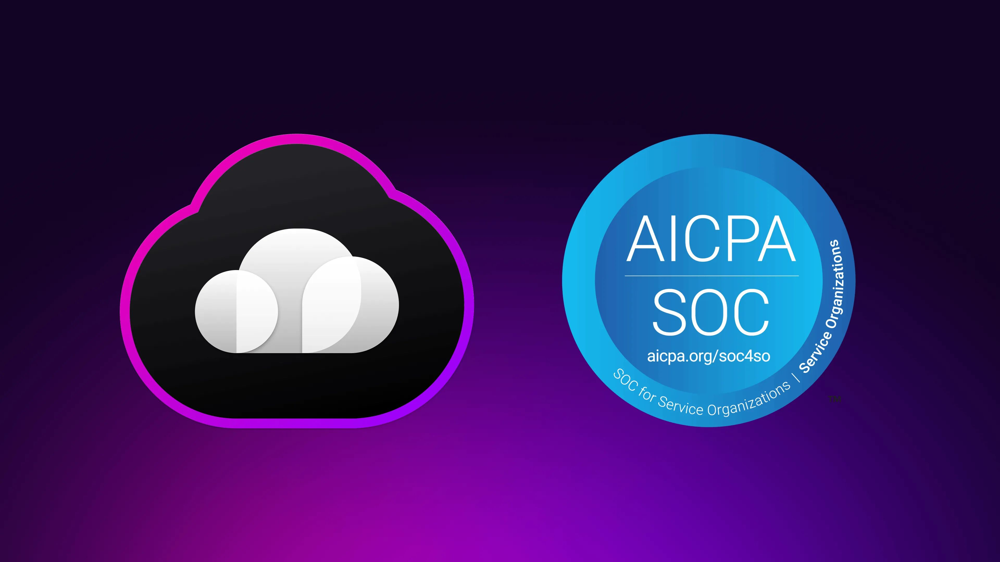

# Surreal Cloud successfully completes SOC2 Type 1 Audit

We are thrilled to announce a significant milestone in our commitment to security: SurrealDB's Surreal Cloud has successfully completed its SOC2 Type 1 Audit!

This independent attestation confirms that our cloud platform's security controls, designed to protect your valuable data, have been rigorously evaluated and meet the stringent standards set by the AICPA for the Security, Availability, and Confidentiality Trust Service Criteria.

Achieving SOC2 Type 1 is a critical step on our journey, laying a verified foundation as we progress towards the comprehensive SOC2 Type 2, which will assess the ongoing operational effectiveness of these controls.

This achievement builds upon our existing ISO27001 certification, demonstrating clear momentum and our growing competence in establishing a multi-layered security assurance framework. At SurrealDB, one of the fastest-growing database companies, our unwavering commitment to security is paramount. As we continue to innovate with Surreal Cloud, the trust you place in us to safeguard your data is our highest priority, and these certifications underscore that dedication to maintaining the highest standards of data protection.

For more information, and our SOC2 Type 1 attestation view our [Trust Centre](https://trust.surrealdb.com/).
