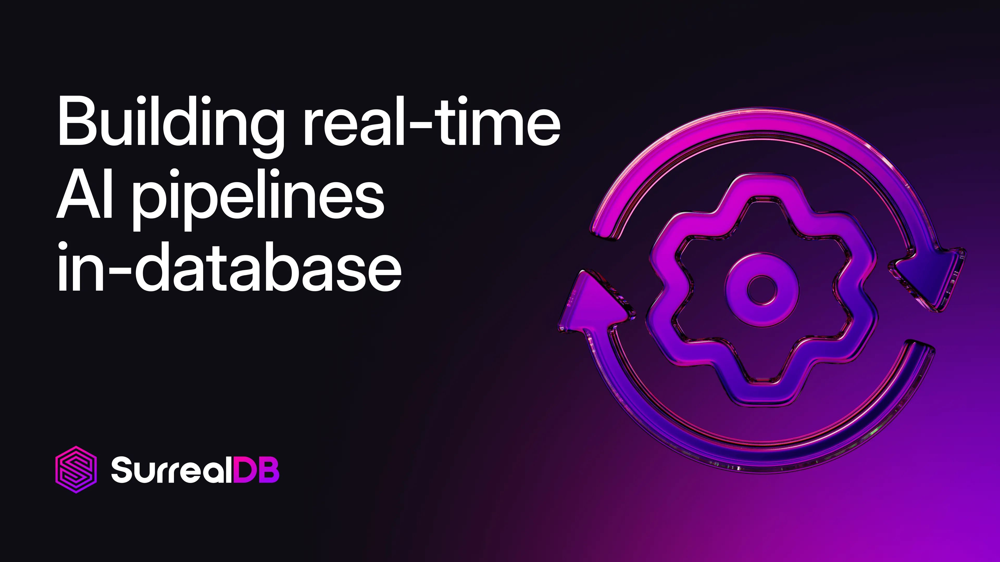

# Building real-time AI pipelines in SurrealDB



This guide details how SurrealDB facilitates the creation of real-time Artificial Intelligence (AI) pipelines by eliminating the traditional Extract, Transform, Load (ETL) process and integrating diverse data models and AI functionalities directly within the database.

## Simplifying data pipelines: goodbye ETL

Traditional data pipelines often rely on complex ETL processes to move and transform data between various systems. SurrealDB simplifies this by allowing the building of real-time AI pipelines directly within the database, effectively saying "Goodbye ETL".

## SurrealDB: a multi-model database for AI

SurrealDB achieves this by being multi-model, making it capable of handling various data structures and functionalities essential for modern AI applications.

For example, it supports:

- **Relational data**
- **Document data**
- **AI data handling**
- **Vector search**
- **Graph data**
- **Key-value pairs**
- **Geospatial data**
- **Time-series data**
- **Full-text search**
- **Machine learning integration**

This comprehensive support makes SurrealDB particularly well-suited for building sophisticated, context-aware AI systems.

## Working with knowledge graphs

Knowledge graphs are a powerful way to represent complex relationships within data, enabling advanced querying and inference. SurrealDB provides robust capabilities for working with knowledge graphs, as demonstrated by the "Surreal Deal Store" example, which models entities like `Person`, `Product`, `Order`, `Cart`, `Wishlist`, and `Review` along with their interconnections.

### Creating graph relations

Relationships between entities can be easily established. To **insert a relation with metadata**, you can use the `RELATE` statement:

```surrealql
RELATE person:bob -> order -> product:fancy
SET details = http::get('https://example.com/api/product/fancy');
```

</br>

To **insert multiple relations** efficiently, the `INSERT RELATION INTO` statement can be used:

```surrealql
INSERT RELATION INTO order [
{
  in: person:bob,
  out: product:fancy
},
{
  in: person:jane,
  out: product:fancy
}
];
```

</br>

### Graph-based recommendations

SurrealDB's graph capabilities are ideal for building recommendation engines. You can traverse relationships to identify relevant items. For example, to find products ordered by a specific person and then find other products ordered by persons who ordered those same products, you can use the following query:

```surrealql
SELECT
    array::distinct(
        -- Which products did they order?
        ->order->product,
        -- Which persons also ordered those products?
        <-order<-person,
        -- And what did they order?
        ->order->product.{id, name}
    ) AS recommended_products
FROM person;
```

</br>

This query can be refined to provide recommendations for a specific person, identified by their record ID:

```surrealql
SELECT
    array::distinct(
        ->order->product,
        <-order<-person,
        ->order->product.{id, name}
    ) AS recommended_products
FROM person:01FVRH055G93BAZDEVNAJ9ZG3D;
```

</br>

For **real-time graph recommendations**, SurrealDB supports `LIVE SELECT` queries, which continuously update results as data changes:

```surrealql
LIVE SELECT
    array::distinct(
        ->order->product,
        <-order<-person,
        ->order->product.{id, name}
    ) AS recommended_products
FROM person:01FVRH055G93BAZDEVNAJ9ZG3D;
```

</br>

### Preparing graph context for AI

To feed relevant contextual information from the graph into an AI model, you can define functions to extract specific details:

```surrealql
DEFINE FUNCTION fn::person_context($record_id: string) {
    LET $context = (
        SELECT id, name, address,
        ->order.* AS order_history,
        ->order->product.* AS product_details
        FROM type::thing($record_id)
    );
    RETURN $context
};
```

</br>

This function retrieves a person's basic details, their order history, and the details of products within those orders, all within the graph context.

## Building a real-time AI pipeline

A typical real-time AI pipeline in SurrealDB involves several key steps:

1. **Create Embeddings**
1. **Semantic Search**
1. **Full-Text Search**
1. **Add Context from the Graph**
1. **Send Prompt Template to LLM**

Let's explore each step in detail.

### 1. Create embeddings

Embeddings are numerical representations of data that capture semantic meaning, crucial for AI tasks like similarity search. You can **define a function to create embeddings** by making an HTTP POST request to an external embedding model API:

```surrealql
DEFINE FUNCTION fn::create_embeddings($input: string) {
    RETURN http::post(
        "https://example.com/api/embeddings",
        {
            "model": "embedding model",
            "input": $input
        }
    )
};
```

</br>

For **real-time embedding generation**, you can use SurrealDB's event system. This allows embeddings to be automatically created or updated whenever new data is added or modified. For example, to create embeddings for product details when a new product is created:

```surrealql
DEFINE EVENT product_details_embeddings ON TABLE product
WHEN $event = "CREATE" THEN {
    UPDATE $after.id
    SET details_embeddings = fn::create_embeddings(
        array::join(details, " ")
    )
};
```

</br>

This event ensures that product details are immediately converted into embeddings upon creation, keeping your vector index up-to-date.

### 2. Vector / semantic search

SurrealDB supports vector indexing and semantic search, allowing you to find items based on their meaning rather than just keywords. To enable semantic search, you first need to **define an index for your embedding fields**:

```surrealql
DEFINE INDEX idx_product_details_embedding ON product
FIELDS details_embedding
MTREE DIMENSION 768 DIST COSINE TYPE F32;
```

</br>

This example creates an MTree index on the `details_embedding` field, specifying a dimension of 768 (common for many embedding models), using cosine distance for similarity, and storing embeddings as 32-bit floating-point numbers.

Once indexed, you can perform a **vector/semantic search** to find similar items. For instance, to find products similar to "casual sweatshirt":

```surrealql
LET $prompt = fn::create_embeddings(
    "casual sweatshirt"
);

SELECT id, name, vector::similarity::cosine(
    details_embedding, $prompt
) AS similarity
FROM product
WHERE details_embedding <|3|> $prompt
ORDER BY similarity DESC;
```

</br>

This query first generates an embedding for the search term, then queries the `product` table to find products with `details_embedding` vectors similar to the prompt, ordered by similarity.

### 3. Full-text search

In addition to semantic search, SurrealDB also provides **full-text search capabilities** for keyword-based retrieval. First, **define a full-text index** on the relevant field:

```surrealql
DEFINE ANALYZER blank_snowball TOKENIZERS blank 
FILTERS lowercase, snowball(english);

DEFINE INDEX product_details ON product FIELDS details
SEARCH ANALYZER blank_snowball BM25;
```

</br>

This example creates a full-text index on the `details` field of the `product` table, using the `blank_snowball` analyzer and the BM25 ranking algorithm.

You can then **perform a full-text search** using the `@@` operator:

```surrealql
SELECT id, name
FROM product
WHERE details @@ "relaxed";
```

</br>

This retrieves products where the `details` field contains the term "relaxed".

### 4. Hybrid search

For a more comprehensive search experience, you can combine semantic and full-text search into a **hybrid search** function. This allows you to leverage the strengths of both approaches.

```surrealql
DEFINE FUNCTION fn::hybrid_search($search_term: string) {
    LET $prompt = fn::create_embeddings($search_term);

    LET $semantic_search = (
		SELECT id, name, vector::similarity::cosine(
		    details_embedding, $prompt
		) AS similarity
		FROM product
		WHERE details_embedding <|3|> $prompt
		ORDER BY similarity DESC;
    );

    LET $full_text_search = (
        SELECT id, name FROM product
        WHERE details @@ $search_term
    );

    RETURN {
        semantic_results: $semantic_search,
        full_text_results: $full_text_search
    }
};
```

</br>

This function takes a search term, generates an embedding, performs both semantic and full-text searches, and returns the results from both methods.

### 5. Send a prompt template to the LLM

The final step in the AI pipeline is to assemble a prompt for a Large Language Model (LLM) and send it for processing.

**Impact of prompt formatting on LLM pçerformance**: [Research suggests that prompt formatting can significantly impact LLM performance.](https://arxiv.org/pdf/2411.10541) Formats like **YAML and JSON tend to yield better performance accuracy** compared to plain text or Markdown.

**Creating a prompt template**: You can define a function to construct a structured prompt template using JSON, incorporating a system persona, instructions, and user context:

```surrealql
DEFINE FUNCTION fn::rec_prompt_template($question: string, $person_context: string, $product_context: string) {
    LET $template = {
        "System": {
            "Persona": "You are a personal shopper for a clothes retailer and are tasked with making recommendations based on the context you have on the shopping behaviour and preferences of a person.",
            "Instructions": [
                "You will be given a question from a person about a potential product they are looking to buy.",
                "You will also be given context about the shopping behaviour and preferences of the person.",
                "You will also be given context about which products are available and popular with similar people.",
                "Based on the context, recommend a few product names that most closely match what the person asked.",
                "Provide your chain of thought first and then respond with your final answer."
            ],
            "Example": "Based on your shopping behaviour and preferences, I think these {PRODUCTS} would suit you.}"
        },
        "User": {
            "Task": $question,
            "Person_context": $person_context,
            "Product_context": $product_context
        }
    };
    RETURN $template
};
```

</br>

This function creates a detailed prompt, including a persona for the LLM, specific instructions, an example, and placeholders for the user's question, person context (from the knowledge graph), and product context (from search results).

**Sending prompt template to the LLM**: Once the prompt template is prepared, you can define another function to send it to an external LLM API via an HTTP POST request:

```surrealql
DEFINE FUNCTION fn::get_recs($template: any) {
    RETURN http::post(
        'https://example.com/api/chat',
        {
            "model": 'reasoning model',
            "input": $template
        }
    )
};
```

</br>

This function allows you to pass the complete, context-rich prompt to your chosen LLM, enabling it to generate intelligent responses and recommendations based on real-time data from your SurrealDB instance.

## The future is more context-aware

By leveraging SurrealDB's multi-model capabilities and in-database AI pipeline features, you can build applications that are more **context-aware** and responsive to real-time data changes, paving the way for more intelligent and dynamic AI solutions.

Interested in getting started with real-time AI pipelines in SurrealDB?

- [Get started](/docs/surrealdb/introduction/start) with SurrealDB now
- [Start building](/cloud#:~:text=Sign%20in-,Start%20for%20free,-View%20pricing) with a free Surreal Cloud instance today
- Dive deeper with [Using SurrealDB as a graph database](/docs/surrealdb/models/graph) and [Graph relations reference guide](/docs/surrealdb/models/graph)
- Build a Graph RAG solution with [Graph RAG: enhancing retrieval-augmented generation with SurrealDB](/blog/enhancing-retrieval-augmented-generation-with-surrealdb)
