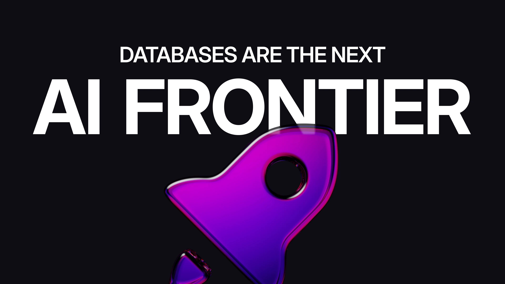

# Databases Are the Next AI Frontier

This blog post was inspired by [Kolawole Samuel Adebayo's Forbes article](https://www.forbes.com/sites/kolawolesamueladebayo/2025/06/18/the-ai-race-is-now-about-databases---not-just-big-models/) on _The AI Race Is Now About Databases - Not Just Big Models._

The article is insightful to highlight that **AI’s bottleneck is no longer compute, it’s about databases: data, storage, and memory.**

The last few weeks made that shift visible in capital letters, with multiple database acquisitions in the AI space. These aren’t just tech M&A headlines. They’re a collective admission: **to scale AI, you first have to rethink how memory (not only data) is managed.**

The frontier has moved down-stack. It’s no longer just about building bigger models or fine-tuning LLMs. It’s about how agents access, reason over, and persist context in real time. In our conversations with enterprises, we’ve noticed that most companies are not ready.

According to recent research done by [Fivetran](https://www.fivetran.com/blog/the-ai-execution-gap-why-nearly-half-of-enterprises-struggle-to-deliver-ai-success), **42% of AI initiatives are delayed, underperforming or outright failing, not because the models are bad, but because the data isn’t there when the models need it.** Fragmented sources. Slow pipelines. No version control. No memory layer.

If AI agents are supposed to simulate cognition, where do their memories live? Traditional databases were designed for building transactional systems, processing batch queries. But agents don’t batch. They observe, decide and act in loops and in real-time. They expect consistency and recall. They want to know what just happened, why, and what changed. That’s not a BI/analytics problem. That’s a memory architecture problem.

**What we’re seeing now, across the industry, is the slow but necessary realisation that databases are not plumbing. They are the foundation of cognition at scale.** Memory isn’t just a buffer. It’s structure. It's real-time. It’s semantically searchable, relationally traversable, and transactionally safe. Without it, reasoning breaks.

The architectural rewrites underway at some of the biggest names in cloud and AI signal this exact shift. **The winners won’t just host data, they’ll model memory.** So here’s a question I think we should all be asking: if agents are the new apps, what’s their operating system? Because that’s where the real battle is moving, and memory is the terrain.

At SurrealDB, **we believe agents deserve a storage and memory engine built for them. One that blends storage (unstructured and structured data) with advanced vector and semantic search, memory, graph reasoning and real-time state capabilities.** Because cognition deserves more than a cache. It needs a foundation.
