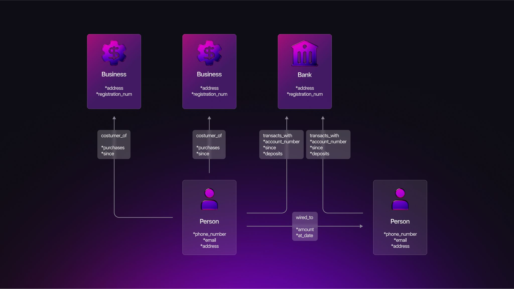
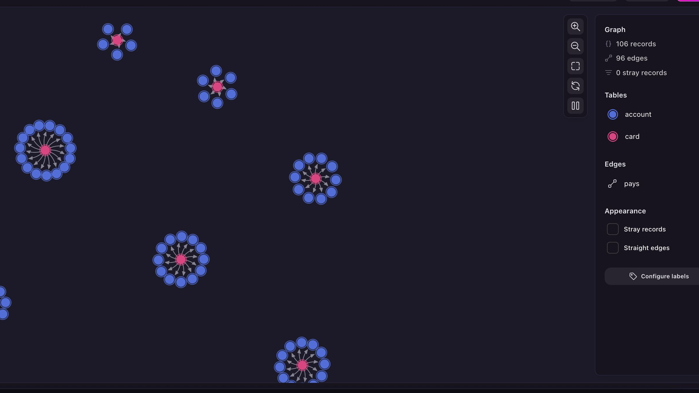
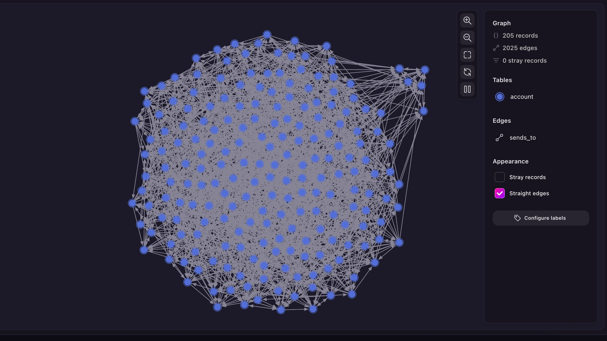
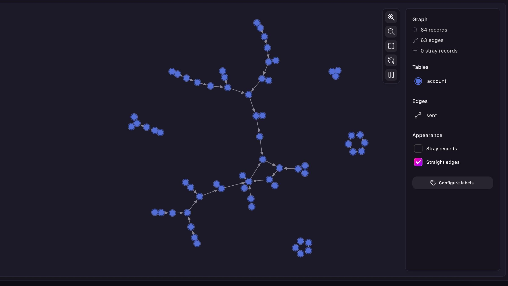
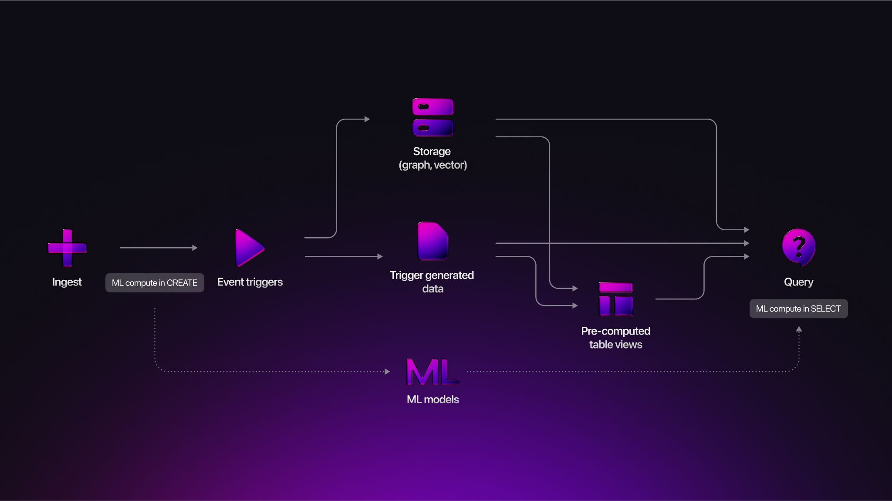

# Fraud detection with SurrealDB


## Understanding the problem of fraud

Financial fraud continues to escalate on both the consumer and business fronts, and the latest numbers are even starker than a few years ago.

Digital attack volume keeps rising: TransUnion's H1 2024 State of Omnichannel Fraud update found that 5.2 % of all global digital transactions were flagged as suspected fraud, up from 4.6 % in 2022. Three quarters of the 800 business leaders surveyed said fraud has either grown or stayed stubbornly high over the past year.

The financial hit is huge: Those same firms estimate that fraud now drains the equivalent of 6.5 % of their annual revenue, about US $359 billion in losses across the sample.

Global losses top half a trillion dollars: Nasdaq's inaugural Global Financial Crime Report calculates that fraud siphoned off more than US $485 billion worldwide in 2023, within a broader US $3.1 trillion pool of illicit funds and money laundering.

In short, fraud remains a fast-growing, multi-billion (and soon trillion)-dollar problem that touches nearly every digital transaction and slices deep into corporate revenue.

Fraud is fundamentally a relationship problem. The same stolen credit card number flits between mule accounts, devices hop across IP addresses, and funds zig‑zag through nested companies in the blink of an eye.

## Understanding fraud as a graph problem

Fraud is fundamentally a graph problem: fraudsters rarely act alone; they connect through shared emails, reused devices, forwarding addresses, or round‑robin money flows. Representing customers, cards, payments, and merchants as **nodes**, and their interactions as **edges**, exposes patterns invisible to flat tables. Using graph nodes and edges makes it much easier to spot deviations from normal behaviour indicating the possibility of fraud.



Some frequent patterns found in financial fraud are:

- **Star patterns** where one card pays hundreds of accounts
- **Tight communities** of accounts that transact mostly among themselves
- **Loops** where money returns to its origin in a short number of hops

## Why SurrealDB for fraud detection?

Fraud detection requires fast responses, deep relationships, and flexible intelligence.

Traditional systems use a variety of siloed services including:

- A graph database for topology and relationship analysis
- One or more databases for features and metadata, and other kinds of data
- A service for ML inference.

These systems require constant maintenance to manage the complex integrations between services, with each new service multiplying the maintenance burden.

SurrealDB collapses that complexity into one unified platform with unlimited possibilities:

- **Multi-model power:** mix graph, document, and vector data in one place to

model users, devices, transactions, metadata, and embeddings side-by-side.

- **Live alerts:** stream risky transactions to dashboards instantly using

[`LIVE SELECT`](/docs/surrealql/statements/live), no external pipelines needed.

- **Defining events:** set actions to happen the moment an

[`EVENT`](/docs/surrealql/statements/define/event) takes place, creating alerts the millisecond a suspicious transfer lands.

- **Inline ML scoring:** Use [`SurrealML`](/docs/surrealml) to run fraud

prediction models directly inside queries, no latency or feature sync issues.

- **Time-travel audits:** investigate historical states with

[`SurrealKV`](/docs/surrealkv) to understand what was known when a decision was made.

While specialised graph platforms excel at deep analytics, many anti‑fraud workloads demand low‑latency scoring and immediate alerts.

SurrealDB's all‑in‑one design removes the need for external stream processors or ML micro‑services, trimming both architecture complexity, latency and costs. Engineers fluent in SQL can adopt SurrealQL quickly, compared to other graph languages with a steeper learning curve.

| Dimension | SurrealDB | Typical Graph DB Stack |
|---|---|---|
| Storage models | Graph + document + vector | Graph + document + vector |
| Real‑time change feed | Built‑in `LIVE SELECT` | Often external (Kafka) |
| In‑database ML | SurrealML (ONNX) | External service |
| End‑to‑end ACID | Yes | Partial |
| Footprint | Lightweight binary to cluster | JVM server |

## Modelling frequent fraud patterns with SurrealQL

A typical anti‑fraud schema might include defined events to automate checks such as maximum transaction amounts for new accounts:

```surrealql
DEFINE FIELD created_at ON account VALUE time::now() READONLY;
DEFINE EVENT cancel_high_volume ON TABLE sends WHEN $event = "CREATE" THEN {
    IF $after.amount > 1000 AND time::now() - $after.in.created_at < 1d {
        THROW "New accounts can only send up to $1000 per transaction";
    }
};
```

As SurrealDB treats edges as first‑class records, we can stay in SurrealQL land while enjoying graph traversal to accomplish other logic such as disallowing more than two transactions within a short period of time.

```surrealql
DEFINE FIELD sent_at ON TABLE sends VALUE time::now() READONLY;

DEFINE EVENT cancel_high_volume ON TABLE sends WHEN $event = "CREATE" THEN {
    LET $sender = $after.in;
    LET $receiver = $after.out;
    -- Disallow more than two transactions within a 5 minute period
    LET $recents = 
        $sender->sends[WHERE out = $receiver]
        .filter(|$tx| time::now() - $tx.sent_at < 5m);
    IF $recents.len() > 2 {
        THROW "Can't send that many times within a short period of time";
    };
};
```

When moving from automatic schema-based security checkpoints to manual searching, the graph visualisation feature in SurrealDB becomes particularly useful for spotting aberrant behaviour. Let's take a look at some of the patterns mentioned above and how easy they are to spot when displayed in a visual manner.

### Star patterns where one card pays hundreds of accounts

The following query creates a number of suspicious cards that send payments out to large numbers of accounts in a short period of time, in comparison with a normal card that does the same over a period of about 100 days. The graph visualisation tool shows only the suspiciously active payments.

(By the way, the `rand::duration()` function used in the query below is available as of SurrealDB 3.0, currently in alpha status).

```surrealql
DEFINE FIELD paid_at ON pays DEFAULT time::now();

-- sketchy cards
FOR $card IN CREATE |card:10| {
    FOR $_ IN 0..rand::int(5, 15) {
        LET $payee = UPSERT ONLY account;
        RELATE $card->pays->$payee SET amount = rand::int(100, 1000);    
    };
};

-- regular card
CREATE card:normal;
FOR $_ IN 0..rand::int(5, 15) {
    LET $payee = UPSERT ONLY account;
    RELATE card:normal->pays->$payee SET amount = rand::int(100, 1000), paid_at = time::now() - rand::duration(1d, 100d);
};

SELECT id, ->pays.filter(|$payment| time::now() - $payment.paid_at < 1d).out FROM card;
```



### Tight communities of accounts that transact mostly among themselves

```surrealql
-- Regular community of 200
CREATE |account:200|;
-- Smaller community that interacts among itself
CREATE |account:5| SET is_sketchy = true;

-- The sketchy community interacts only between itself
-- the regular community has more general interactions
-- and sometimes sends money to the sketchy accounts
FOR $account IN SELECT * FROM account {
    FOR $_ IN 0..10 {
        LET $counterpart = IF $account.is_sketchy {
            rand::enum(SELECT * FROM account WHERE is_sketchy)
        } ELSE {
            rand::enum(SELECT * FROM account)
        };
        RELATE $account->sends_to->$counterpart SET amount = rand::int(100, 1000);
    }
};

SELECT id, ->sends_to->account FROM account;
```



### Loops where money returns to its origin in a short number of hops

```surrealql
CREATE |account:50|;
CREATE |account:1..15| SET is_sketchy = true;

FOR $sketchy IN SELECT * FROM account WHERE is_sketchy {
    LET $counterpart = rand::enum(SELECT * FROM account WHERE is_sketchy AND !<-sent);
    RELATE $sketchy->sent->$counterpart SET amount = rand::int(100, 1000);
};

LET $normal = SELECT * FROM account WHERE !is_sketchy;
FOR $account IN SELECT * FROM account WHERE !is_sketchy {
    LET $counterpart = rand::enum(SELECT * FROM $normal);
    RELATE $account->sent->$counterpart SET amount = rand::int(100, 1000);
};

SELECT id, ->sent->account FROM account;
```



Can you spot the money returning to its origin? It shows up as a circle.

## Detecting frequent fraud patterns with SurrealQL

Pattern‑based detection is the first line of defence. SurrealQL lets us express graph traversals and temporal filters in the same statement, reducing latency and boilerplate.

### Repeated high‑value transactions to a new payee

We want to catch mule accounts that receive several large payments within 24 hours of their first appearance.

```surrealql
DEFINE EVENT check_transaction ON TABLE sent WHEN $event = "CREATE" THEN {
    LET $recipient = $after.out;
    IF time::now() - $recipient.created_at < 1d AND $recipient<-sent.len() > 2 AND math::sum($recipient<-sent.amount) > 40000 {
        CREATE alert SET account = $recipient.id.*, total_sent = math::sum($recipient<-sent.amount);
    }
};

CREATE |account:100| SET created_at = d'2024-01-01';
CREATE |account:1..5| SET created_at = time::now();

RELATE account:1->sent->account:5 SET amount = 10000;
RELATE account:2->sent->account:5 SET amount = 20000;
RELATE account:3->sent->account:5 SET amount = 30000;
RELATE account:4->sent->account:5 SET amount = 20000;

LIVE SELECT * FROM alert;
```

The event `check_transaction` checks for deposits made into accounts less than a day old, creating an `alert` that shows up instantly inside a `LIVE SELECT` whenever the amount transferred is greater than a certain amount and more than three payments have been made.

### Circular money flow (3‑hop loop)

Circular transfers are common in laundering chains. In addition to the graph query shown above, a recursive query can also be used to find transactions that complete within a week.

```surrealql
CREATE account:1, account:2, account:3, account:normal1, account:normal2;

RELATE account:1->sent->account:2 SET amount = 10000, at = time::now();
RELATE account:2->sent->account:3 SET amount = 8000, at = time::now();
RELATE account:3->sent->account:1 SET amount = 7000, at = time::now();
RELATE account:normal1->sent->account:normal2 SET amount = 500, at = time::now();

(SELECT * FROM sent WHERE time::now() - at < 7d).filter(|$transaction| {
    LET $in = $transaction.in.id;
    ($in.{..+shortest=$in}->sent->account).len() > 2
});
```

The arrow chain `->sent->account` is traversed with the `shortest` algorithm to look for paths in which the sender itself is found in a loop that is at least three accounts in length and complete within a week.

## Adding predictive power with SurrealML

Rules catch known patterns; machine‑learning surfaces _unknown_ ones by scoring the likelihood a transaction is fraudulent based on many features. SurrealML embeds ONNX runtime in the database, allowing you to run any ML model in SurrealDB to.

### Online scoring example

Assume you've exported a gradient‑boosted tree to `fraud_gbt.surml`.

```surrealql
IMPORT MODEL FROM file://fraud_gbt.surml AS fraud_gbt<1.0>;

SELECT
    id,
    amount,
    ml::fraud_gbt<1.0>({
        amount,
        hour        : time::hour(created_at),
        country     : country,
        device_deg  : (SELECT count() FROM device<-used_by<-person<-owns WHERE owns.id = in),
        behaviour   : behaviour_vec
    }) AS fraud_prob
FROM transaction
WHERE created_at > time::now() - 5m
  AND fraud_prob > 0.85
LIVE 10;
```

The query imports the model once, then scores every new transaction in near real‑time. Analysts subscribing to this live feed see only high‑risk events (probability > 85%).

## Putting it all together in a real-time pipeline

A fraud detection solution in SurrealDB looks something like this:



1. **Ingest:** ingest financial transaction data into SurrealDB.
1. **Score:** `ml::fraud_gbt` assigns a probability, stored back in the same

row.

1. **Alert:** a `LIVE SELECT` stream pushes high‑risk rows to a web dashboard.
1. **Investigate:** analysts traverse the surrounding graph to confirm or

dismiss.

5. **Feedback:** confirmed fraud updates the `label` field, feeding the next

model retrain.

## Get started with SurrealDB: the smarter database for real-time fraud detection

Sign-up to [Surreal Cloud](/cloud) and get started in minutes with our [Docs](/docs/surrealdb/introduction/start). Join our [Discord community](https://discord.com/invite/surrealdb), check out our [SurrealDB University Fundamentals course](/learn), or [Contact Us](/contact) if you need help!

In our next blog posts, we'll explore how you can seamlessly use SurrealDB as storage (structured and unstructured data) and memory layers to integrate it with LLMs and build Agentic AI solutions.
