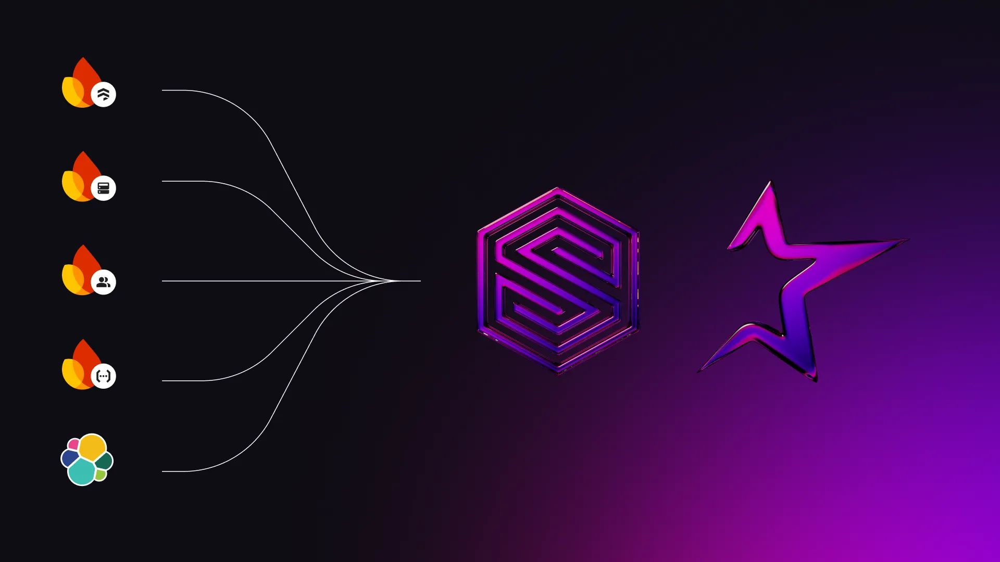

# How Aspire Comps replaced 5 backend tools with SurrealDB and scaled to 700,000 users

[Aspire Comps](https://www.aspirecomps.co.uk/), a UK‑based retail prize competition company, migrated from [Firebase](https://firebase.google.com/) to SurrealDB to streamline operations and resolve performance bottlenecks. By unifying application logic and data within SurrealDB, the team removed multiple supporting services and gained precise access‑control capabilities, creating a foundation for future scalability and machine‑learning‑driven personalisation.

### Background

[Firebase’s real‑time features](https://firebase.google.com/docs/database) were a natural starting point for Aspire Comps. As the user base expanded beyond 700,000 accounts, however, the architecture became increasingly complex. Five separate services were required to meet core business needs:

- Firestore for documents
- Realtime Database for chat and live draws
- Firebase Auth for user management
- Cloud Functions for scheduled and event‑driven tasks
- Elasticsearch for search

With growth came higher latency during cold starts, fragmented access‑control policies, and an intricate dependency chain.

### The 48‑hour migration

To simplify the stack, Aspire Comps adopted SurrealDB. During migration, the team inserted approximately 10,000 records per second into the new database, consolidating all backend functionality into a single ACID‑compliant, multi‑model engine that supports serverless functions.

SurrealDB now underpins the company’s primary e‑commerce site as well as supporting services such as notifications (email, push, SMS), campaigns, prize‑claim management, chat, recommendations, winner management, and charitable initiatives.

### Results

- Instrumented simplicity - the backend toolchain was reduced from five systems to one.
- Performance at scale - SurrealDB handles high concurrency without additional optimisation layers.
- Flexible modelling - schemaless documents and live queries support rapid iteration on new competition formats and customer flows.
- Operational efficiency - search, access control, and event handling are delivered natively, eliminating external infrastructure.
- Future‑ready architecture - the platform is prepared for real‑time machine‑learning workloads, advanced search, and Generative AI integration.

### Modernise your stack

1. Get started for free today - [app.surrealdb.com](https://app.surrealdb.com).
1. [Join the SurrealDB Discord](https://discord.com/invite/surrealdb) - engage with the community and receive support.

If Aspire Comps moved 700,000 users in a night, your next project, whether a side initiative or an enterprise deployment, can achieve similar results.
