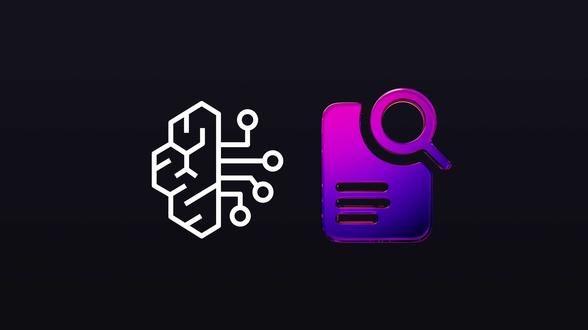
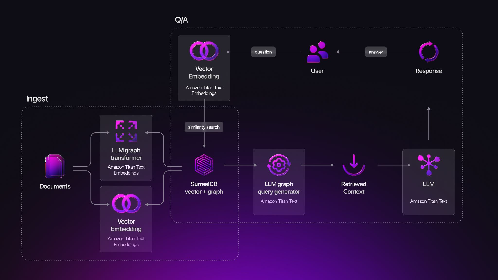

# How to simplify a Graph RAG architecture using Amazon Bedrock and SurrealDB

[Vector similarity search](/blog/find-your-celebrity-soulmate-with-the-magic-of-vector-search) and [Retrieval-Augmented Generation](/blog/cooking-up-faster-rag-using-in-database-embeddings-in-surrealdb) ([RAG](/blog/cooking-up-faster-rag-using-in-database-embeddings-in-surrealdb)) have become table stakes for modern AI products. When an assistant can retrieve relevant facts and ground its responses in concrete knowledge, users get concise, trustworthy answers instead of generic, hallucinated prose. The catch? A typical RAG pipeline forces developers to juggle a *vector store*, a *document store*, a *graph store* (for relationships), plus an *LLM endpoint*, and to keep them all consistent.

[SurrealDB and Amazon Bedrock](/docs/integrations/embeddings/python) put an end to that sprawl. SurrealDB is a single, ACID-compliant engine that stores JSON documents, graph edges and vectors side-by-side, queried through one language (SurrealQL). [Bedrock](https://aws.amazon.com/bedrock/), in turn, gives you fully managed foundation models, [Titan](https://docs.aws.amazon.com/bedrock/latest/userguide/titan-models.html) for embeddings, [Claude](https://claude.ai/) or [Llama](https://www.llama.com/) 3 for generation - behind the familiar `boto3` SDK. Together they form a lean, cost-efficient RAG stack.

## Use-case framing: a contract-review copilot

Picture an in-house legal team that receives hundreds of NDAs, MSAs and addenda every month. Lawyers spend hours searching legacy file-shares for precedent clauses. By indexing each clause as a vector and linking clauses to the contracts, parties and governing laws, we can build a Contract Copilot that answers questions like:

> Show me the five closest indemnification clauses signed with Acme in the last two years, and draft a summary that reconciles them.

SurrealDB holds the contract corpus and its graph of relationships, while Bedrock produces embeddings and drafts the summary. The result is a clear answer with citations - in seconds.

## High-level architecture

Amazon Bedrock plays a part during:

- **Ingestion:**
- Generating document embeddings using **Amazon Titan Text Embeddings**
- Transforming the documents into a knowledge graph using **Amazon Titan Text**
- **Questioning and Answering:**
- Generating embeddings for the user’s question using **Amazon Titan Text Embeddings**
- Generating a SurrealQL graph query using **Amazon Titan Text**
- Summarising the graph query results into a human-readable response using **Amazon Titan Text**

Because SurrealDB’s **vector, graph and document indices live in one place**, no ETL glue is required.

## Industry examples

| Sector | RAG Scenario | Impact |
|---|---|---|
| LegalTech | Contract Copilot, clause-level precedent search | Reduce review hours, standardise language |
| Healthcare | Clinical assistant retrieving patient histories & drug interactions | Faster differential diagnosis; HIPAA compliance via field-level access control |
| Customer Support | FAQ + ticket surfacing with persona-aware answers | Handle long-tail queries without extra staff |
| Finance | Analyst helper that merges market data (time-series) with research notes (documents) and relationship graphs (issuers, sectors) | Better risk models; one store instead of OLTP + OLAP + vector |

By mixing **SurrealDB’s unified data layer** with **Amazon Bedrock’s foundation models**, teams can ship production-grade RAG systems without the overhead of half a dozen specialised services. The stack:

- *Simplifies* **architecture:** one database, one SDK.
- *Accelerates* **delivery:** fewer moving parts, fewer network hops.
- *Scales:* from a developer laptop to a petabyte cluster without schema rewrites.

## Ready to give it a try?

[Get started with Surreal Cloud now](/docs/cloud/getting-started) and check out our [documentation](/docs/integrations/embeddings) for further details on our AWS Bedrock embeddings integration.

Join our [Discord community](https://discord.com/invite/surrealdb) to get help from our vibrant community of thousands of AI engineers, or [Contact Us](/contact) if we can help!
