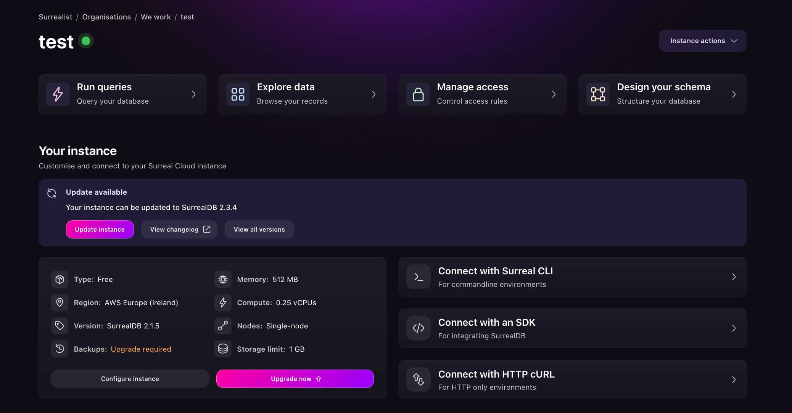
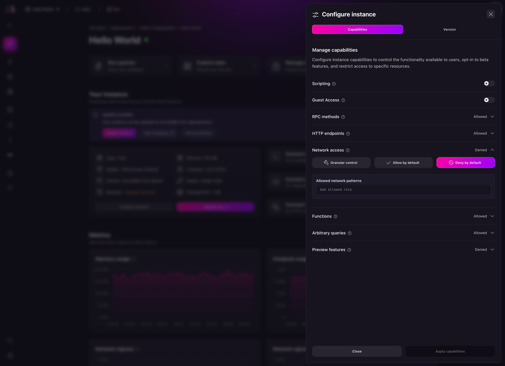

# Introducing network capabilities in Surreal Cloud

When SurrealDB began its mission to make databases easier to use, one of its goals was to give users the power to connect to data from anywhere. Today that connectivity is more critical than ever, but it must also be controlled.

Surreal Cloud’s latest release introduces network capabilities a fine grained controls that determine exactly which network targets your database can reach. In this blog we will walk through network capabilities, explore the motivation behind it, and explain how it improves security for everyone running SurrealDB in the cloud.

## Why do network rules matter ?

SurrealDB is known for its flexible query language SurrealQL and ability to run in various Multi model environments. When running in the cloud, a database often needs to make outbound requests: calling web services, fetching data from remote APIs, or even communicating with internal micro-services.

However, open network access can pose a security risk. An attacker who gains access to a database might try to use it as a springboard for network scanning or data exfiltration. Even well meaning users might accidentally call an unintended service that exposes sensitive information. That’s why, in many environments, Database administrators need to explicitly restrict what their database can connect to.

SurrealDB’s architecture is designed with security in mind, but earlier versions of Surreal Cloud didn’t allow you to customise outbound network rules directly. The system had default capabilities, and while they were sensible for most setups, they lacked the flexibility larger deployments required.

Which is why with this new network capabilities feature, you can now define your own allowlists or denylists, giving you full control over where your database can make requests.

## Introducing network capabilities in Surreal Cloud

In Surrealist the network capabilities are modelled by two options Allowed  and Denied network patterns. The idea is straightforward: you supply a list of patterns in each list. When your SurrealDB instance attempts an outbound connection, the database checks the target hostname or IP address against these patterns.

If the address matches an entry in the Denied list, the request is blocked. If it matches one in the allowed list, it’s allowed. You can specify individual domains, IP ranges, or even wildcard expressions. The rules can be as general or as specific as you like, enabling you to craft policies tailored to your infrastructure.

### Enabling configuration

To enable network capabilities you have to be on the latest version of SurrealDB. This means you have to be on any of the following:

- `>=2.1.8` : Versions greater than `2.1.8` or equal to
- `<2.2.0 || >=2.2.6` : less than `2.2.0` OR greater than or equal to `2.2.6`
- `<2.3.0 || >=2.3.6` : `2.3.0` OR greater than or equal to `2.3.6`

This check ensures that only supported versions display the Network Access option in the configuration interface. If your instance is running an older version of SurrealDB, you’ll need to update to any of these versions to use this feature. You should see a friendly nudge with the upgrade suggestion like the image below.

## How network rules improve security

With network capabilities, administrators can design stricter policies around outbound connections. Suppose your database runs in a secure environment and should only contact internal services.

For example, you might select "Deny by default" to disallow all outgoing network requests, then enter `internal.mycompany.com` in the "Allowed network patterns" field in order to allow requests to the specified domain.

Conversely, if you want to block certain hosts that might leak data, you can populate the deny list with suspicious domains. The system uses pattern matching, so you can block entire IP ranges or domain wildcards.

These rules work alongside other capabilities in Surreal Cloud. For example, you can restrict which functions or HTTP endpoints are accessible. By combining these settings, you create a more resilient environment.

If a rogue query tries to fetch an external resource, SurrealDB checks the deny list before making the request. Administrators gain peace of mind knowing that the database won’t inadvertently call out to unauthorised services.

## Practical scenarios

To appreciate why network capabilities are so valuable, consider a few use cases:

- **Limiting third-party API calls.** Maybe you want your database to interact with a payment provider but block all other external hosts. You can add the provider’s domain to ”allow by default” and leave the deny list unspecified. Any accidental request to unrelated domains will fail, preventing potential leaks.
- **Blocking known risky domains.** If certain hosts are known to deliver malicious content, you can add them to ”deny by default” without restricting other outbound traffic. This is useful in multi-tenant environments or when you integrate user supplied queries.
- **Restricting data egress.** In highly regulated industries, you might want to ensure your database doesn’t send any data outside of your own network. Populate allowed network patterns with your internal IP ranges and set denied network patterns to `0.0.0.0/0 ` as a default to block everything else. SurrealDB will enforce this at the network level, reducing the attack surface.

These scenarios show how the feature aligns with real-world security needs. By specifying exactly where your database can connect, you maintain compliance and reduce the risk of accidental or malicious network activity.

## Seamless integration in Surrealist

One of the strengths of Surreal Cloud is its visual tooling. The same dashboard you use to manage schemas or run queries now provides a straightforward configuration drawer for network capabilities.

When you open the Network Access section, you’ll see fields for allowed and denied patterns. Changes are previewed instantly, and you can apply them with a single click. The UI design is consistent with other capability settings, such as HTTP endpoints and RPC methods, making the learning curve minimal.

Surreal Cloud also calculates “exceptions” if you specify both allow and deny rules. For example, if you allow a wildcard pattern that covers many hosts but deny a few specific ones, Surreal Cloud notes these exceptions so you know exactly what is in effect. This helps prevent misconfiguration, especially in complex environments.

## Conclusion

The addition of network capabilities rounds out an already robust set of configuration options in Surreal Cloud. Administrators gain a simple yet powerful mechanism to lock down outbound communication, while the interface remains intuitive. Try it today! Visit [app.surrealdb.com](http://app.surrealdb.com).
