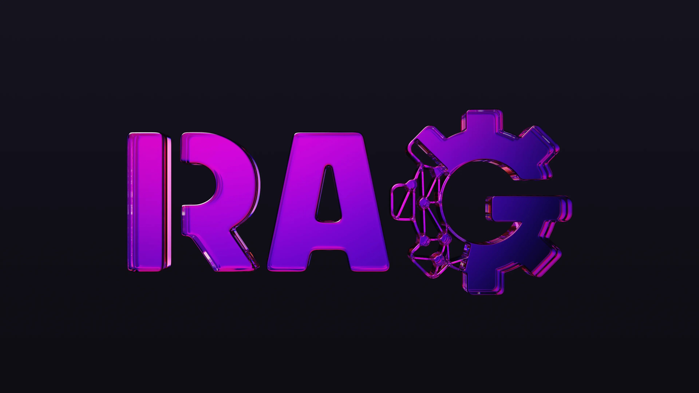

# RAG can be Rigged



*Originally published by [Cyril Scetbon](https://edgebound.hashnode.dev/rag-can-be-rigged) on June 16, 2025*

## Building a smart knowledge agent with SurrealDB and Rig.rs

In my [previous post](https://edgebound.hashnode.dev/surrealdb-the-game-changing-database-youve-been-waiting-for), I explored why SurrealDB is unlike any other database: it blends document, graph, relational, and vector models into one engine - and it's written in Rust.

That flexibility makes it a perfect match for Rig.rs, a toolkit for building LLM-native agents in Rust. Today, I’m going to show exactly how the two fit together by building a basic knowledge agent - one that embeds word definitions and answers questions using that content without having to manage the lookup yourself.

Let me rig this thing. 🔧

### 🧰 Use case: RAG that just works

I’m building a context-aware support agent that:

- Ingests internal documents
- Embeds them into vector space
- Stores everything in SurrealDB
- Finds relevant documents using cosine similarity
- Passes those to an LLM to generate a response

### 🚀 Step 1: Initiate the project

The first thing to do is to create the project and add all the dependencies we gonna need

```cli
cargo new surrealdb-rig
cd surrealdb-rig
cargo add anyhow rig-surrealdb serde surrealdb tokio
cargo add rig-core --features derive
```

I’ll need an OpenAI key in my environment for the program to works

```cli
export OPENAI_API_KEY="USE_YOUR_OWN_KEY_HERE"
```

You can also use a different provider if you prefer. Rig makes it easy and supports many others. Check if your provider is supported at [https://docs.rs/rig-core/latest/rig/index.html#model-providers.](https://docs.rs/rig-core/latest/rig/index.html#model-providers.)

### 📦 Step 2: Ingest & embed

To ingest documents, we need a structure that uses at least the derive macros `Serialise` and `Embed`. The `Serialise` derive macro allows us to serialise data to store in SurrealDB, while the `Embed` derive macro lets us mark the field `description` as the source for embeddings. We can now ingest and embed content using `SurrealStore` from Rig:

```rust
use anyhow::Result;
use rig::{
    Embed,
    client::{CompletionClient, EmbeddingsClient, ProviderClient},
    completion::Prompt,
    embeddings::EmbeddingsBuilder,
    providers::openai,
};
use rig_surrealdb::{Mem, SurrealVectorStore};
use serde::Serialize;
use surrealdb::Surreal;

#[derive(Embed, Serialize, Default)]
struct WordDefinition {
    word: String,
    #[embed]
    definition: String,
}

#[tokio::main]
async fn main() -> Result<()> {
    let surreal = Surreal::new::<Mem>(()).await?;
    surreal.use_ns("ns").use_db("db").await?;
    let client = openai::Client::from_env();
    let model = client.embedding_model(openai::TEXT_EMBEDDING_3_SMALL);

    let vector_store = SurrealVectorStore::with_defaults(model.clone(), surreal.clone());

    let words = vec![
        WordDefinition {
            word: "flurbo".to_string(),
            definition: "A fictional currency from Rick and Morty.".to_string(),
        },
        WordDefinition {
            word: "glarb-glarb".to_string(),
            definition: "A creature from the marshlands of Glibbo.".to_string(),
        },
        WordDefinition {
            word: "wubba-lubba".to_string(),
            definition: "A catchphrase popularized by Rick Sanchez.".to_string(),
        },
        WordDefinition {
            word: "schmeckle".to_string(),
            definition: "A small unit of currency in some fictional universes.".to_string(),
        },
        WordDefinition {
            word: "plumbus".to_string(),
            definition: "A common household device with an unclear purpose.".to_string(),
        },
        WordDefinition {
            word: "zorp".to_string(),
            definition: "A term used to describe an alien greeting.".to_string(),
        },
    ];

    let documents = EmbeddingsBuilder::new(model)
        .documents(words)
        .unwrap()
        .build()
        .await?;

    vector_store.insert_documents(documents).await?;
    ...
}
```

The code above:

- Creates a WordDefinition struct, where embeddings (a vector of integers used to answer questions) are generated from the definition field.
- Embeds the content using OpenAI embedding model text-embedding-3-small which is small and highly efficient
- Stores these embeddings in SurrealDB
- Ensures everything is searchable with metadata

### 🤖 Step 3: Ask the agent

Now, I connect a RAG agent and ask it a few questions:

```rust
    ...
    let linguist_agent = client
        .agent(openai::GPT_4_1_NANO)
        .preamble("You are a linguist. If you don't know don't make up an answer.")
        .dynamic_context(3, vector_store)
        .build();

    let prompts = vec![
        "What is a zorp?",
        "What's the word that corresponds to a small unit of currency?",
        "What is a gloubi-boulga?",
    ];

    for prompt in prompts {
        let response = linguist_agent.prompt(prompt).await?;
        println!("{}", response);
    }

    Ok(())
```

The code above:

- Creates an LLM agent using GPT-4.1 Nano, known as the fastest and most cost-effective GPT-4.1 model.
- Uses the agent to find the meaning of a word it recognises.
- Uses the agent to find a word based on a known definition.
- Asks about an unknown word to ensure it doesn't make up an answer.

### 🤖 Full example

You can test the entire example by cloning the repository cscetbon/surrealdb-rig and running the program.

```cli
git clone https://github.com/cscetbon/surrealdb-rig
cd surrealdb-rig
cargo r
...
A zorp is a term used to describe an alien greeting.
The word that corresponds to a small unit of currency in some fictional universes is "schmeckle."
A gloubi-boulga is a fictional dish from the animated series "Fraggle Rock," created by Jim Henson. It is known as a colorful, messy, and somewhat unappetizing mixture of various ingredients assembled by the character Gunge. The term is used humorously to describe a confusing or disorderly mixture, but it is not a real word or culinary item outside of that context.
```

### 🕵️ Under the hood: how Rig stores data in SurrealDB

Internally, when documents are stored in SurrealDB, Rig uses a query similar to the following for each item:

```surrealql
CREATE ONLY documents CONTENT { 
  document: '{"word":"schmeckle", "definition":"A small unit of currency ..."}',
  embedded_text: 'A small unit of currency ...',
  embedding: [...]
}
```

See [https://github.com/0xPlaygrounds/rig/blob/rig-surrealdb-v0.1.6/rig-surrealdb/src/lib.rs#L125-L132.](https://github.com/0xPlaygrounds/rig/blob/rig-surrealdb-v0.1.6/rig-surrealdb/src/lib.rs#L125-L132.)

Then, when a prompt is sent to the linguist agent using dynamic_context(3, vector_store), Rig executes the following query:

```surrealql
SELECT id, document, embedded_text, vector::similarity::cosine($vec, embedding) AS distance
FROM documents ORDER BY distance DESC
LIMIT 3
```

See [https://github.com/0xPlaygrounds/rig/blob/rig-surrealdb-v0.1.6/rig-surrealdb/src/lib.rs#L154-L163](https://github.com/0xPlaygrounds/rig/blob/rig-surrealdb-v0.1.6/rig-surrealdb/src/lib.rs#L154-L163) and [https://github.com/0xPlaygrounds/rig/blob/rig-surrealdb-v0.1.6/rig-surrealdb/src/lib.rs#L110-L112](https://github.com/0xPlaygrounds/rig/blob/rig-surrealdb-v0.1.6/rig-surrealdb/src/lib.rs#L110-L112)

### 🧠 Why Rig + SurrealDB rocks

- 🦀 Rust-native: first-class support, no wrappers
- 🧩 Unified data model: vector + graph + document in one queryable store
- ⚡ Fast + flexible: embedded or remote use, even in WebAssembly
- 🤝 LLM-friendly: Rig agents work out of the box with SurrealDB as a vector store

### 👉 TL;DR

Stop gluing tools together. Rig your RAG workflow with Rust + SurrealDB.

_This post was inspired by [Joshmo_dev's article](https://x.com/joshmo_dev) on building RAG using Rig, SurrealDB, and DeepSeek on Cloudflare Workers._
