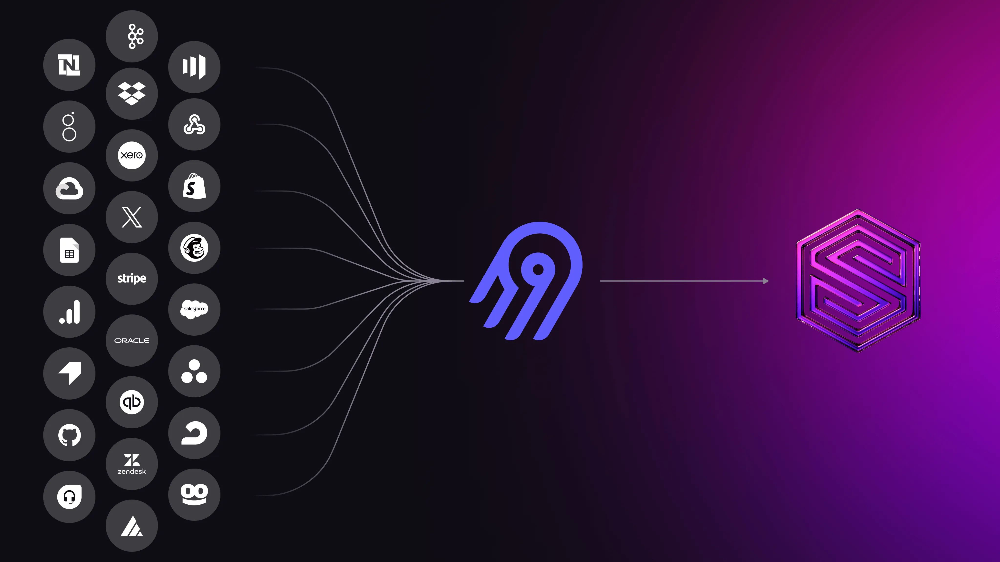
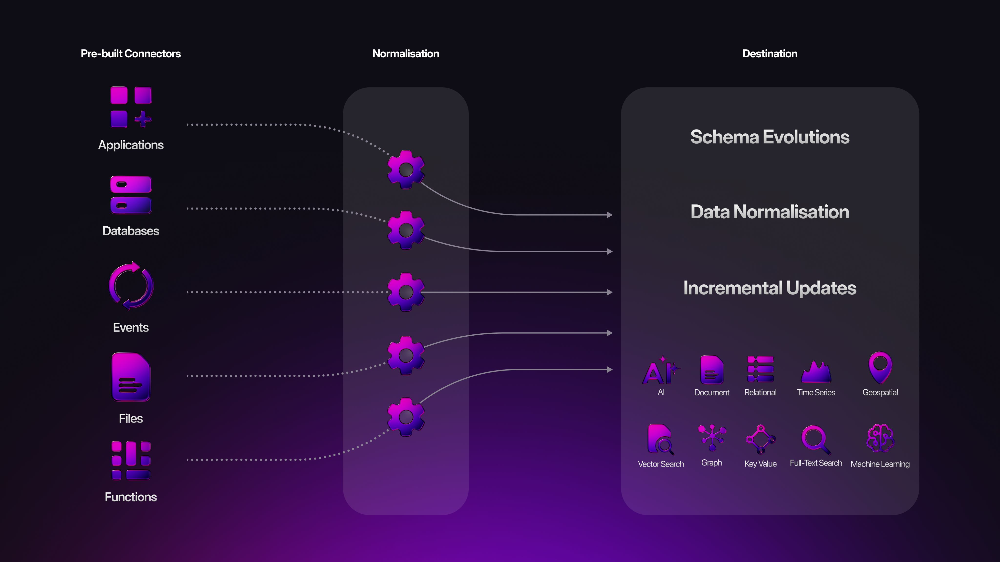

# Seamless data ingestion with the Airbyte connector

At SurrealDB, we believe developers should have full control over their data pipelines - from ingestion, to transformation, to real-time application logic.

Today, we’re excited to announce official support for Airbyte, the leading open-source data integration platform.

With the new Airbyte connector for SurrealDB, developers can now build fully customisable, self-hosted data pipelines that move data from hundreds of sources directly into SurrealDB. Whether it’s operational databases, Software-as-a-Service tools, event streams, or cloud storage systems - Airbyte makes it easy to connect, extract, and load data exactly how and where you need it.

This integration is perfect for engineering teams that value flexibility and transparency. With Airbyte, you can inspect, version, and extend your connectors. You can run them locally or deploy them in the cloud. And, with SurrealDB’s native support for dynamic schemas and real-time queries, your ingested data becomes immediately available for transactional use, analytics, or even AI inference.

Together, SurrealDB and Airbyte offer a fully programmable data stack - open, composable, and built for modern applications.

The SurrealDB connector is now available on the Airbyte platform. Please refer to our [Airbyte integration guide](/docs/integrations/data-management/airbyte) that will help you configure SurrealDB as a destination in [Airbyte](https://airbyte.com/) using the [official connector](https://github.com/surrealdb/airbyte-connector).

We can’t wait to see how you use it to power your pipelines.
