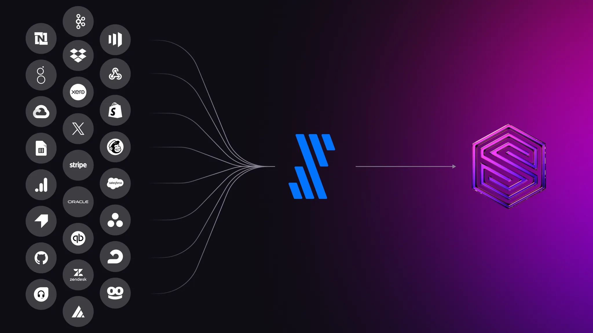
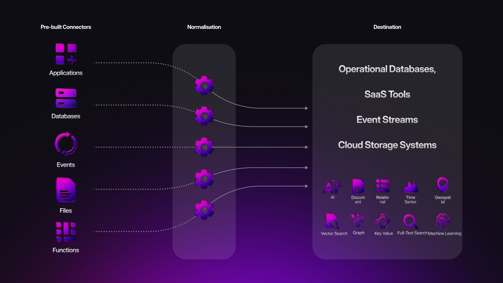

# Seamless data ingestion with the Fivetran connector

SurrealDB is built to support the most demanding real-time applications, and now we’re making it even easier to get your data into the platform - with no code required.

Today, we’re excited to announce official support for Fivetran, the industry leader in automated, fully-managed data pipelines.

With the new Fivetran connector for SurrealDB, businesses can integrate with hundreds of data sources - from Software-as-a-Service platforms and CRMs to transactional databases and warehouses - and sync that data directly into SurrealDB with zero manual overhead.

Fivetran handles schema evolution, data normalisation, and incremental updates automatically. That means less time building and maintaining ETL scripts - and more time building with live, trusted data inside SurrealDB.

For teams that prioritise reliability, scalability, and ease of use, this integration makes SurrealDB an even more powerful foundation for real-time decision-making, application backends, and AI-powered systems.

The SurrealDB destination connector is now available in private preview, you can therefore try it out by going to the [Fivetran documentation](https://fivetran.com/docs/destinations/surrealdb/setup-guide) or [our documentation](/docs/integrations/data-management/fivetran).

As it's in private preview, we'd really appreciate your feedback on the experience of using Fivetran with SurrealDB.
