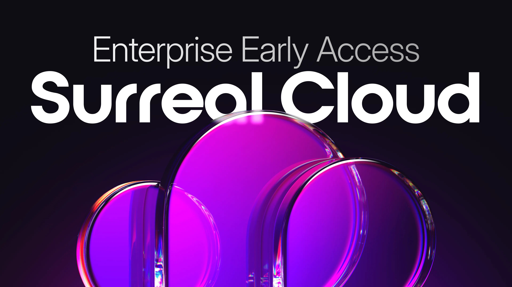

# Surreal Cloud Enterprise

Surreal Cloud redefines the database experience for developers, offering a superior way to build applications through the power and flexibility of our multi-model database, without the pain of managing infrastructure.

## Power your mission-critical applications with Surreal Cloud Enterprise

We are excited to present Surreal Cloud Enterprise, purpose-built for the demands of modern, mission-critical enterprise applications. Whether you're running high-throughput transactional workloads or building secure AI Agents to power your business, Surreal Cloud Enterprise delivers unmatched resilience, security, and performance at scale.

## Enterprise-grade features:

- **Dedicated fault-tolerant clusters** ensure maximum uptime for business-critical systems.
- **Performance at scale** to handle the most demanding workloads.
- **Unlimited scalability** thanks to our separation of storage and compute. Scale write and read compute nodes horizontally without sharding.
- **Enterprise compliance** including ISO 27001, SOC 2, and advanced native security functionalities.

## Coming soon:

- **Enterprise SSO integration**, full **audit and access logs**, and **custom log retention policies** help meet stringent governance requirements.
- **Bring your own encryption keys** to maintain complete control over data security and compliance.
- **AWS PrivateLink support** provides secure, private networking across your infrastructure.

With Surreal Cloud - Enterprise, get full-stack flexibility and operational confidence to build and scale next-generation applications and AI systems, without compromise.

[Sign up](https://surrealdb.typeform.com/to/NkN2vJ7B) **to our Early Access Programme to learn more.**
