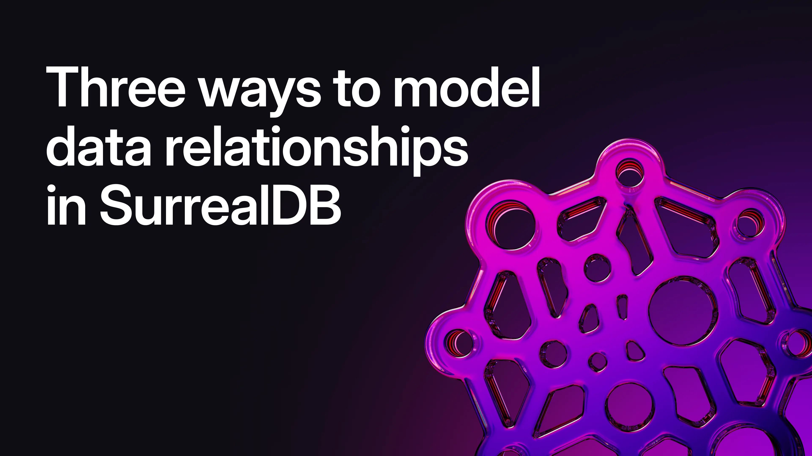

# Three ways to model data relationships in SurrealDB

In a recent SurrealDB Stream, we cracked open a foundational part of SurrealDB’s power: relationship modelling. From traditional record-to-record links to bidirectional references and Graph Edge metadata, we explored the many ways you can model connected data - clearly, scalably, and with performance in mind.

Here’s what we covered, broken out by relationship type.

## Lightweight relationships with Record Links

One of SurrealDB’s most powerful features is its ability to connect records without the need for JOINs or intermediate tables. At the heart of this is the **Record Link**: a direct pointer from one record to another using the built-in `table:id` syntax.

```surrealql
CREATE person:jaime SET friends = [person:tobie, person:simon];
SELECT friends.name FROM person:jaime;
```

This isn’t a foreign key - it’s better. Since Record IDs are first-class citizens in SurrealQL, SurrealDB can fetch remote data directly from disk without scanning tables. And when a record includes another as a field, the engine can automatically fetch nested records, even several layers deep:

```surrealql
SELECT friends.friends.friends.name FROM person:tobie;
```

However, keep in mind that these links are static: if a linked record is deleted or modified, the parent record won’t update automatically. For true referential integrity, consider using Graph Edges or Record References.

## Bidirectional awareness with Record References (experimental)

Available since **SurrealDB 2.2.0**, Record References allow you to automatically track reverse relationships between records - no JOINs or custom queries needed. But keep in mind: references are still an experimental feature, disabled by default.

```cli
surreal start --allow-experimental record_references
```

Once enabled, you can define forward and reverse fields like this:

```surrealql
DEFINE FIELD comics ON person TYPE option<array<record<comic_book>>> REFERENCE;
DEFINE FIELD owners ON comic_book TYPE references<person, comics>;
```

Now when a person adds a comic to their `comics` list, that comic’s `owners` field automatically reflects the relationship.

Want to dynamically inspect references at query time? Use `.refs()`:

```surrealql
comic_book:one.refs('person', 'comics');
```

You can even control what happens when referenced records are deleted using `ON DELETE` clauses:

- `IGNORE` *(default)* - do nothing
- `UNSET` - remove deleted references
- `CASCADE` - delete dependent records
- `REJECT` - block deletion
- `THEN { ... }` - run custom logic

> Record References combine flexibility with schema-driven control - ideal when you need reverse visibility without building manual joins.

## Model rich, flexible relationships with Graph Edges

A Graph Edge in SurrealDB is a full-fledged record - stored in its own table - that connects two records and can hold metadata describing their relationship.

```surrealql
RELATE person:alex->follows->person:tobie
  SET followed_at = "2024-04-01", strength = "high";
```

Unlike Record Links, Graph Edges:

- Can connect any number of record types
- Support forward, backward, and recursive traversal via SurrealQL’s arrow syntax
- Store metadata on the relationship itself (e.g., timestamp, weight, notes)

Graph Edges are especially useful when:

- You need to visualise schemas. Surrealist’s Designer view picks up `TYPE RELATION`.
- You want to track context, e.g., a user’s mood or device at time of interaction.
- You want bidirectional equality like `friends_with` using `<->`.
- You need declarative schema rules via `DEFINE TABLE likes TYPE RELATION IN person OUT blog_post`.

> Use Graph Edges when your relationships need stories: metadata, directionality, and multi-hop traversal - all native to SurrealQL.

## TL;DR: three relationship types, one powerful model

- Use **Record Links** for simple, direct, ultra-performant jumps between records.
- Use **Record References** for bidirectional visibility, powered by your schema *(but keep in mind they’re experimental)*.
- Use **Graph Edges** when your relationship is complex, metadata-heavy, or needs visual tooling or equality semantics.

> Model your data the way you think: directly, flexibly, and with full graph awareness.

## Want to explore further?

Check out the [SurrealDB Fundamentals course](/learn/fundamentals) to learn more about data modelling.

🎥 Watch the full stream: [SurrealDB Stream #29: Simplify Graph Edges with Record References](https://youtube.com/live/XDOfdi-Hip8?feature=share).
