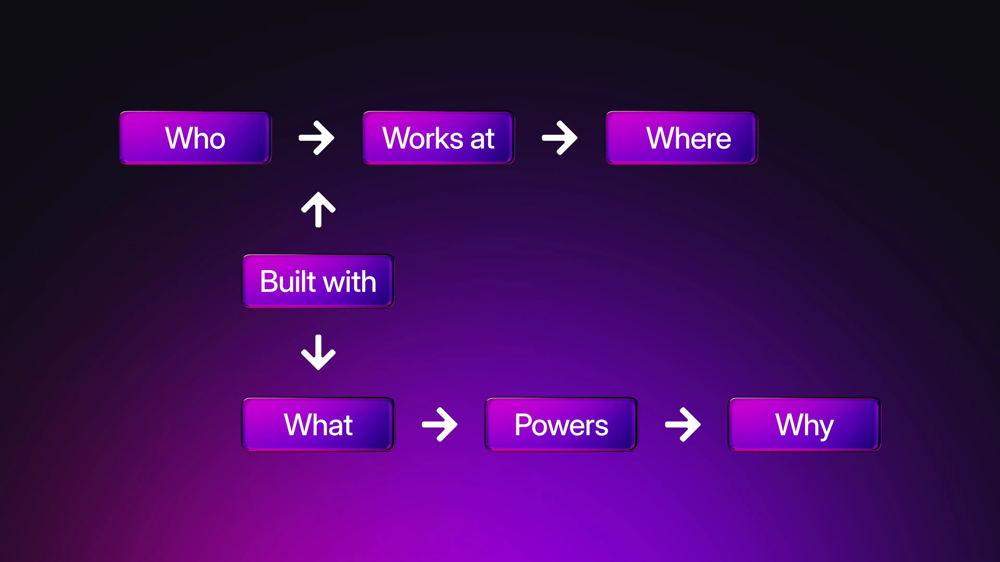
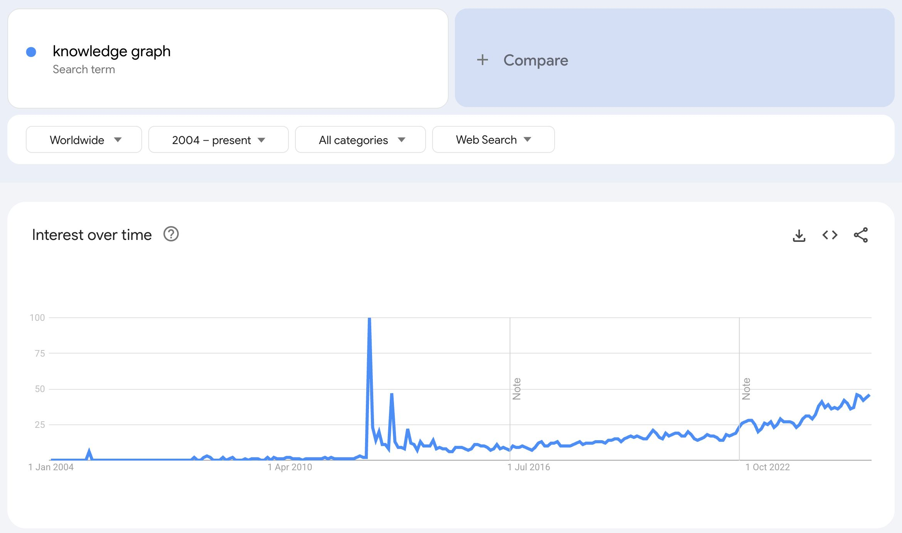
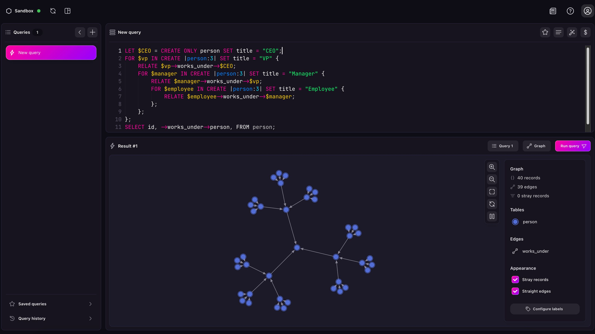

# What are knowledge graphs and why is everyone talking about them?

## How a decades-old idea became the connective tissue for today’s AI era

Picture a customer-service AI agent that politely answers questions until a user asks something just outside its training data. Suddenly the bot stumbles, hallucinating facts or looping back to *“I’m sorry, I don’t understand.”* What’s missing is context, i.e. a structured memory of how the world is stitched together that the model can query, reason over and update as reality changes.

That structured memory is exactly what a knowledge graph (KG) provides, and in 2025 every CTO evaluating an AI or data platform seems to have “knowledge graph” on the whiteboard. Blame (or thank) large-language models (LLMs): they’re great at generating fluent text from patterns, but they still need a source of truth to ground their answers, disambiguate entities and keep long-running agents consistent. KGs deliver that truth layer.

## What *is* a knowledge graph, exactly?

The concept of knowledge graphs traces back to early efforts in symbolic AI and semantic networks in the 1970s and 1980s, where researchers sought to represent knowledge in structured, machine-interpretable formats. But it wasn’t until 2012, when Google launched its own ["Knowledge Graph"](https://blog.google/products/search/introducing-knowledge-graph-things-not/) to enhance search results with real-world context, that the term entered the mainstream. Since then, knowledge graphs have evolved from niche academic tools into foundational infrastructure for search, recommendation, enterprise AI, and generative systems, powering everything from digital assistants to fraud detection and personalised medicine.

*Searches for “knowledge graphs” searches over time. Notice the spikes in 2012 (Google’s blog) and November 2022 (ChatGPT release).*

At its core, a knowledge graph is a network of things (nodes) connected by relationships (edges), each described with attributes (properties). Think of:

- **Nodes (Entities):**
- `Person: Alice`
- `Company: Acme Corp`
- `Product: iPhone 15 { color: white }`
- **Edges (Relationships):**
- `Alice → works_at → Acme Corp`
- `Acme Corp → manufactures → iPhone 15`
- `Alice → purchased { date: 2025/06/19 } → iPhone 15` (edges can have properties too)

In practice, a KG is stored in a graph-capable database and often described by an ontology - a formal vocabulary of node and edge types (e.g., Person, Company, employed_by). Some graphs enforce a strict schema, others stay schema-light and infer patterns on the fly. Either way, the structure encodes semantics that machines can query and reason about: *“Show me every VP of Engineering who previously worked at a company founded by any MIT graduate.”*

*This is what a simple knowledge graph looks like in SurrealDB*

## Why decision-makers care: business benefits

Modern AI capabilities aren't just technical milestones, they're strategic assets. For business leaders, understanding how these features translate into competitive advantage is key. From improving search accuracy to unifying fragmented data systems, knowledge graphs can reshape decision-making, efficiency, and trust across the enterprise:

- **Semantic search & retrieval:** query by meaning, not just keywords (“smartphones under $800 with *MagSafe*-like charging”).
- **Disambiguation:** distinguish “Apple Inc.” (the company) from “apple” (the fruit) automatically.
- **Reasoning & inference:** let AI derive new facts (“If Alice owns 51 % of Acme, and Acme owns 60 % of Beta Ltd., then Alice indirectly controls Beta.”).
- **360° integration:** bridge CRM, ERP, IoT streams and documents into one logically connected layer.
- **Data lineage & governance:** follow an insight back to raw events (“This forecast used sensor readings from device #4711 sampled at firmware v2.3”).

The result: more accurate models, faster feature development and fewer sleepless nights tracing compliance issues.

## Popular use-cases you’ll actually bump into

Knowledge graphs aren’t just academic, they’re quietly powering real-world applications across industries. From smarter AI copilots to fraud detection and supply chain intelligence, they help organisations connect the dots at scale. Below are some of the most impactful and increasingly common ways knowledge graphs show up in everyday systems and products.

- **Enterprise AI copilots:** ground LLM prompts in an enterprise KG so answers are secure, de-duplicated and fully auditable.
- **Recommendation & personalisation:** traverse a user-product-behaviour graph to surface serendipitous but relevant suggestions.
- **Fraud & risk analytics:** spot suspicious loops (money flow) or rapidly walk ownership hierarchies.
- **Digital twins / industrial IoT:** model factories, assets and sensor streams as a living graph, enabling real-time root-cause analysis.
- **Supply-chain visibility:** cross-link suppliers, shipments and carbon metrics to predict bottlenecks or ESG impact.
- **Drug discovery & bio-informatics:** connect genes, proteins, compounds and trials for algorithmic hypothesis generation.

## Why now? The LLM & vector-search factor

Three converging trends pushed knowledge graphs from “academic nice-to-have” to board-level priority. The first is the emergence of LLMs in general such as ChatGPT. While groundbreaking, enterprises soon lost patience with hallucinations and demanded grounding in structured reality. Meanwhile, cheap vector search allowed storing dense embeddings alongside graph edges to blend semantic similarity (vectors) with symbolic reasoning (edges) in a single query. Finally, customers and regulators in particular wanted to know *why* a model produced a verdict, and not just what the verdict was. A graph path from input to output is easier to audit than a black-box embedding index.

Together, these forces turned KGs into the de facto context reservoir for AI agents.

## Challenges & limitations

Knowledge graphs are great, but there’s no such thing as a free lunch. The mapping of concepts and ontologies requires expertise and cross-team alignment, while a multitude of tooling and query languages can be a burden for engineers. Running one more specialist database (next to relational and document stores) means additional monitoring, security and replication pipelines, while highly connected workloads can thrash RAM or blow up query planners without the right indexes.

Decision-makers therefore look for platforms that *embed* graph capability rather than bolt yet another silo onto the stack.

## The SurrealDB perspective: a unified, production-ready approach

When your team decides to invest in a knowledge graph, the next question is where to store it. Traditional options include dedicated RDF stores or property-graph engines like Neo4j. While powerful, they often live beside separate document DBs, relational OLTP stores and the new vector index you just spun up for RAG. That fragmentation revives the very complexity graphs were meant to solve.

SurrealDB takes a different tack: one ACID-compliant engine that natively supports graph edges, JSON documents, relational tables, time-series rows, key-value pairs **and** high-dimensional vectors. It lets a single query blend SQL joins, graph traversals and k-nearest-neighbour search, without shipping data across micro-services.

Key advantages for KG workloads are:

- **Multi-model flexibility:** store your ontology, unstructured notes and embeddings side-by-side, then hop across them in one round-trip.
- **SurrealQL:** a familiar SQL-like language extended with `→` edge hops (or record references) and vector predicates, so teams don’t have to learn a brand-new DSL.
- **Horizontal scalability & separation of storage/compute:** the same lightweight binary runs on the edge or scales to petabyte clusters with independent compute pools, letting you start small and grow without re-platforming.
- **Live selects, events and change-feeds:** push changes to subscribers in the moment, ideal for agents whose “memory” must stay millisecond-fresh.
- **True ACID across all data shapes:** update graph edges and vector fields atomically, eliminating the eventual-consistency bugs that plague polyglot stacks.
- **Operational efficiency:** achieve lower cost and less latency versus stitching multiple specialist stores together.

### How SurrealDB stacks up vs. legacy graph databases

| Dimension | Traditional graph databases | SurrealDB |
|---|---|---|
| Data models | Graph | Graph + document, vector, relational, KV, time-series |
| Query language | Cypher/Gremlin/SPARQL | SurrealQL (SQL-style with graph & vector syntax) |
| Joins & analytics | Often pushed to separate OLAP store | In-query mixed joins, aggregations & vector KNN |
| Scale path | Cluster, sharding, separate indexing services | Storage/compute split; edge-to-petabyte with the same binary |
| Real-time streams | Add-on (often via Kafka) | Native `LIVE SELECT` streams |
| Edge deployment | Heavy binaries, server-only | Lightweight binary with WASM/embedded option for mobile & IoT |

## Wrapping up

Knowledge graphs have moved from academic research to board-room priority because they give AI systems the structured understanding that pure language models lack. For decision-makers, the opportunity is clear: better search, cleaner data lineage, richer personalisation and transparent reasoning. The hurdle is deploying a graph without resorting to a labyrinth of niche databases.

**SurrealDB offers a pragmatic path:** a single, multi-model engine where your graph lives alongside documents, vectors and real-time events; where a familiar SQL-style query touches them all; and where horizontal scale, live selects and enterprise security are built-in, not bolted on. If your next AI initiative needs a knowledge graph that is both principled and production-ready, you now know where to look.

## Ready to see how SurrealDB can ground your AI in a living, queryable knowledge graph?

- [Get started with SurrealDB now](/docs/surrealdb/introduction/start)
- [Start building](/cloud#:~:text=Sign%20in-,Start%20for%20free,-View%20pricing) with a free Surreal Cloud instance today
- Dive deeper with [Using SurrealDB as a Graph Database](/docs/surrealdb/models/graph) and [Graph relations reference guide](/docs/surrealdb/models/graph)
- Build a Graph RAG solution with [Graph RAG: Enhancing Retrieval-Augmented Generation with SurrealDB](/blog/enhancing-retrieval-augmented-generation-with-surrealdb)
