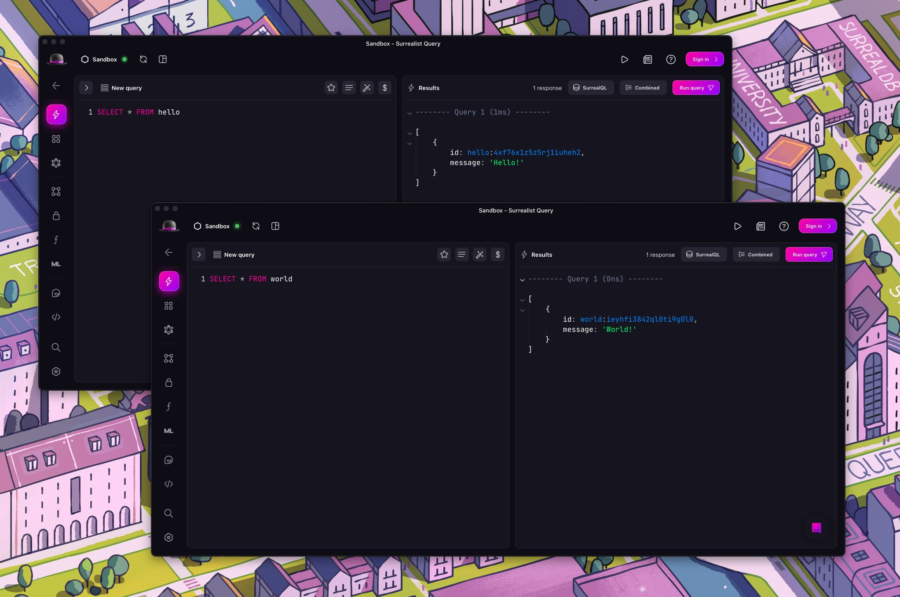
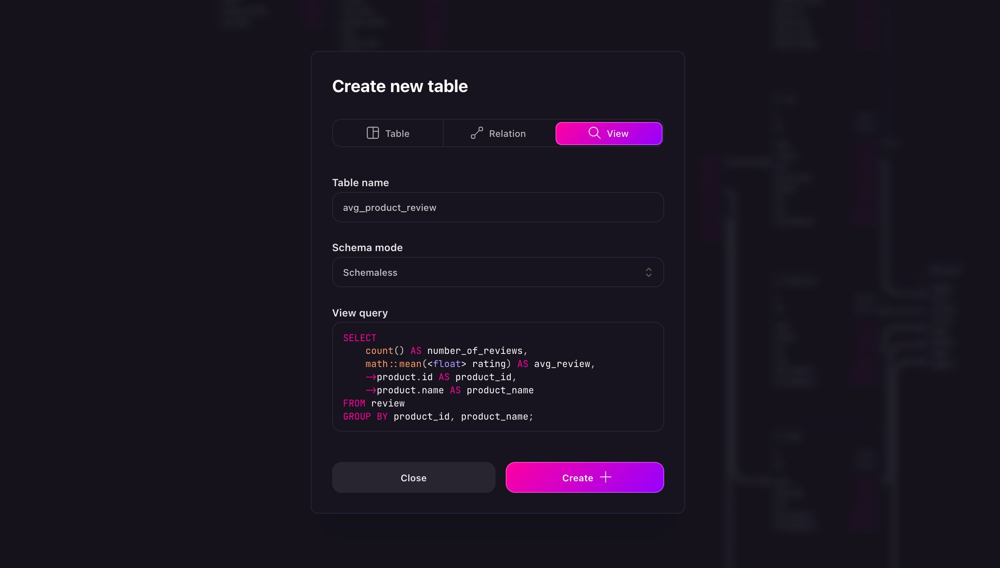
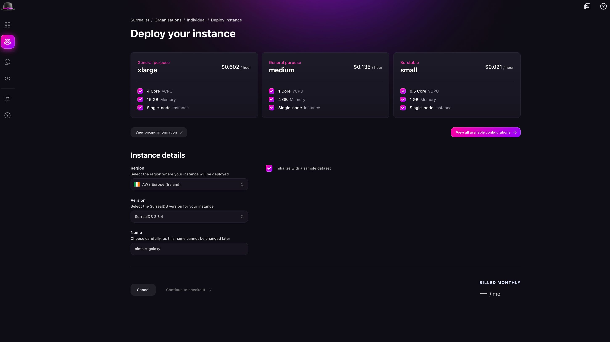
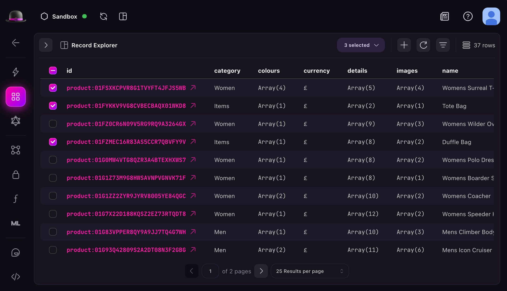

# What's new in Surrealist 3.4

We're excited to announce the release of Surrealist `3.4`. This version introduces exciting and highly requested features such as [multi-window support for desktop users](https://github.com/surrealdb/surrealist/pull/822), improved support for computed table views, a redesigned Cloud deployment workflow, and various other enhancements. Let's dive into what's new 🎉.

> [!WARNING]
> Web app notice: Surrealist has a new home at [app.surrealdb.com](https://app.surrealdb.com)! If you're currently using surrealist.app, please export your configurations and settings from there by going to [surrealist.app](https://surrealist.app) and clicking the export config option, then import them at our new domain to ensure a smooth transition.

## Highlights

### Multi-window support

One of the most requested features for Surrealist Desktop has finally arrived - multi-window support! You can now open multiple independent windows, each connecting to different SurrealDB instances. This feature dramatically improves workflow when working with multiple databases or comparing data across instances.

Windows can be opened through several methods:

- The `File > New Window` menu bar item
- MacOS Dock action
- "Open a new window" command
- Keyboard shortcut: `Ctrl+Shift+N` (Windows/Linux) or `Cmd+Shift+N` (Mac)

### Computed table views support

We've significantly enhanced support for computed table views in this release. Views can now be created directly in both the Explorer and Designer views, with view tables having a distinct appearance in the Designer view to help distinguish them from regular tables. To maintain data integrity, manual record creation in view tables has been disabled.

### Redesigned Cloud deployment

The Surreal Cloud instance deployment process has been completely redesigned to be more intuitive and user-friendly. Notable improvements include:

- Automatic generation and suggestion of instance names
- Option to initialise instances with sample datasets and queries
- Streamlined and stabilized instance creation experience
- Easier deployment within preferred organisations
- Configurable network target capabilities

### Multi-record selection

The Explorer view now supports selecting multiple records at once, enabling bulk actions such as:

- Deleting multiple records
- Copying multiple records
- Exporting selected records

## Full changelog

- Add multi-window support for Surrealist Desktop
- Each window runs independently, enabling connections to different SurrealDB instances
- Introduced a menu bar for quick access to common commands and actions
- Windows can now be opened using several methods:
- The "File > New Window" menu bar item
- MacOS Dock action
- "Open a new window" command
- Keyboard shortcut: `Ctrl+Shift+N` (Windows/Linux) or `Cmd+Shift+N` (Mac)
- Improved support for computed table views
- Views can now be created in the Explorer and Designer view
- View tables will have a unique appearance in the Designer view
- You will no longer be able to create records manually in a view table
- Redesigned the Surreal Cloud instance deployment workflow
- The deployment process is now more streamlined and user-friendly
- Surrealist will now automatically generate and suggest instance names
- Added the option to initialise the instance with a sample dataset and queries
- Improved and stabilized the instance creation experience
- Added the ability to select multiple records in the Explorer view
- You can now select multiple records and perform bulk actions on them
- Bulk actions include deleting, copying, and exporting selected records
- Updated the overal appearance of Surrealist
- Improved the visual consistency across different pages
- Added breadcrumbs to help navigate between pages
- Updated icons and colors to provide a more modern look
- Improved the overview page appearance
- You can now more easily deploy instances in your preferred organisation
- Moved the web app to [https://app.surrealdb.com/](https://app.surrealdb.com/)
- Network target capabilities can now be configured for Surreal Cloud instances
- Improved the behaviour of the namespace and database selection dropdowns
- Fixed instances where the explorer view pagination would go out of bounds
- Fixed the overview page not appearing when internet access is unavailable

We hope you enjoy these new features and improvements! As always, we appreciate your feedback and suggestions for future releases. [Join the SurrealDB Discord](https://discord.com/invite/surrealdb) - engage with the community and receive support.

Get started for free today - [app.surrealdb.com](https://app.surrealdb.com)
