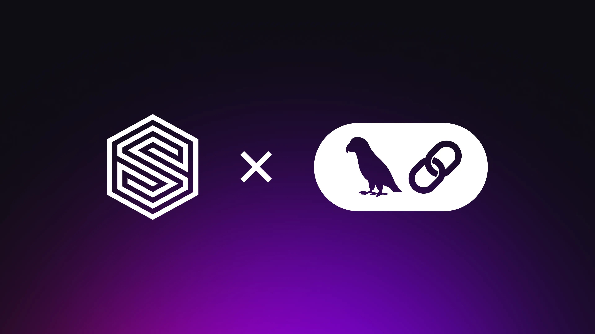

# Announcing our official LangChain integration



We’re thrilled to announce that SurrealDB now has an official integration with LangChain, one of the most popular frameworks for building powerful LLM-driven applications. This partnership brings together the strengths of SurrealDB’s multi-model flexibility and real-time capabilities with LangChain’s powerful orchestration layer, enabling developers to build smarter, faster, and more context-aware AI applications.

**The integration includes the following LangChain components:**

- Vector Store (`SurrealDBVectorStore`)
- Graph Store (`SurrealDBGraph`, currently experimental)
- Graph QA Chain (`SurrealDBGraphQAChain`, currently experimental)

```python
# DB connection
conn = Surreal(url)
conn.signin({"username": user, "password": password})
conn.use(ns, db)

# Vector Store
vector_store = SurrealDBVectorStore(
    OllamaEmbeddings(model="llama3.2"),
    conn
)

# Graph Store
graph_store = SurrealDBGraph(conn)
```

### Get Started

You can start using the integration today via the SurrealDB docs, the LangChain docs, or our GitHub repository. We’ve also published example notebooks and sample apps to help you get up and running quickly:

- Check out the official [SurrealDB Docs](/docs/integrations/frameworks/langchain) or [LangChain Docs](https://python.langchain.com/docs/integrations/vectorstores/surrealdb/)
- GitHub: [langchain-surrealdb](https://github.com/surrealdb/langchain-surrealdb)
- Pypi: [langchain-surrealdb](https://pypi.org/project/langchain-surrealdb/)
- Tutorial: [Make a GenAI chatbot using GraphRAG with SurrealDB + LangChain](/blog/make-a-genai-chatbot-using-graphrag-with-surrealdb-langchain)

### Join the Conversation

We’re excited to see what you build with LangChain and SurrealDB. If you have questions or want to showcase your project, [join our community on Discord](https://discord.com/invite/surrealdb) or [tag us on X](https://x.com/SurrealDB).
