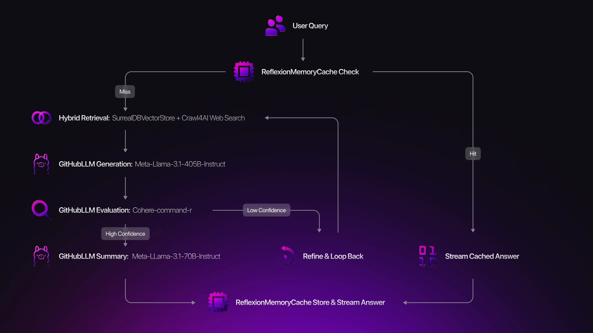

# Beyond basic RAG: Building a multi-cycle reasoning engine on SurrealDB


*While this implementation uses Python, the architectural patterns and SurrealDB integration strategies apply to any language with SurrealDB SDK support.*

## Introduction

Standard **Retrieval-Augmented Generation** (RAG) models are powerful but operate on single shot principle: *Retrieve* then *Generate.* This approach often fails when faced with complex multi-faceted queries, providing incomplete answers that lack depth. The core limitation is the absence of a feedback loop.

This article introduces the **[`Reflexion`](https://github.com/cloaky233/multi-cycle-rag)** RAG Engine, a production-ready system that overcomes these limitations through a multi-cycle, self-correcting architecture powered by **SurrealDB**. It employs a Multi-LLM strategy for *Generation*, *Evaluation*, and *Synthesis* to iteratively refine answers, ensuring higher accuracy and comprehensiveness. **SurrealDB** serves as a unified data store that houses both vector embeddings and document metadata.

</br>

## The architectural core: a unified vector and document store with SurrealDB

Traditional RAG architectures are often fragile combinations of multiple technologies: A vector database (e.g. Pinecone, ChromaDB), a separate document store for metadata (e.g. MongoDB, Postgres), and a caching layer (e.g. Redis). This fragmentation introduces complexity in data synchronisation and security.

Our engine leverages **SurrealDB** to consolidate these functions into a single, ACID-compliant database. This unified approach provides specific advantages :

- **Simplified architecture**: Documents, their metadata and their 3072-dimensional vector embeddings coexist in the same table. This eliminates data duplication and synchronisation issues.
- **Transactional integrity**: Ingesting a document and its vector is an atomic operation, guaranteeing consistency.
- **High performance search :** SurrealDB’s native HNSW indexing on vector fields enables millisecond-latency similarity searches, even at scale.

The **3072-dimensional vectors** from OpenAI `text-embedding-3-large` model from Azure provide superior semantic understanding compared to standard 1536-dimensional embeddings. SurrealDB’s **HNSW (Hierarchical Navigable Small World)** indexing enables millisecond-level similarity search across millions of vectors.

### The schema in detail

We define a single index `hnsw_embedding` with a *dimension of 3072* to match OpenAI’s text-embedding-3-large model. The use of `Cosine` distance is standard for normalised embeddings. The *EFC* `Entry point Candidate` and *M* `Max connections` parameters are tuned to provide a high recall and query speed, making it suitable for production environments.

```surrealql
-- Define a schema-full table named 'documents'
DEFINE TABLE documents SCHEMAFULL;

-- Define a 'content' field of type string
DEFINE FIELD content ON documents TYPE string;

-- Define a 'metadata' field of flexible type object
-- This allows for storing schemaless data
DEFINE FIELD metadata ON documents TYPE object FLEXIBLE;

-- Define an 'embedding' field of type array of floats
-- This is typically used for storing vector embeddings
DEFINE FIELD embedding ON documents TYPE array<float>;

-- Create an HNSW index on the 'embedding' field
-- This index is used for efficient vector similarity searches
DEFINE INDEX hnsw_embedding ON documents
    FIELDS embedding
    HNSW
    DIMENSION 3072  -- The number of dimensions in the embedding vectors
    DIST COSINE     -- Use cosine distance for measuring similarity
    TYPE F32        -- Use 32-bit floating point numbers
    EFC 500         -- Entry point candidate size for search performance
    M 16;           -- Maximum number of connections per node in the graph
```

</br>

## Deep dive: multi-LLM reflexion engine

The core architecture is based on a loop that mimics critical thinking. For each query a series of steps occur, which are guided by specialised LLMs to ensure a detailed and accurate response.

1. **Generate**: The ***Generation LLM*** produces an initial answer based on retrieved context.
1. **Evaluate**: The ***Evaluation LLM*** assesses this answer, generates a confidence score and identifies knowledge gaps or uncertainties.
1. **Decide**: Based on the evaluation the system makes a decision using the **`ReflexionDecision`** enum:

- **`COMPLETE`**: If confidence is above the threshold (e.g., 0.90), the loop terminates.
- **`REFINE_QUERY`**: If specific gaps are found, a new, more targeted query is generated to fill them.
- **`CONTINUE`**: If the answer is incomplete but on the right track, the loop proceeds.
- **`INSUFFICIENT_DATA`**: If the knowledge base cannot answer, the loop terminates gracefully.

1. **Synthesise**: When the loop completes through multiple cycles, the ***Summary LLM*** synthesises the final response from earlier generated partial answers.

### Multi-LLM orchestration strategy

The system strategically assigns different models to specialised tasks:

```python
# From src/rag/reflexion_engine.py
class ReflexionRAGEngine:
    """Advanced RAG engine with dynamic reflexion loop architecture and web search integration"""

    def __init__(
        ....
    ):
        # Initialise different LLMs for different purposes
        self.generation_llm = generation_llm or GitHubLLM(
            model_override=settings.llm_model,
            temperature_override=settings.llm_temperature,
            max_tokens_override=settings.llm_max_tokens,
        )

        self.evaluation_llm = evaluation_llm or GitHubLLM(
            model_override=settings.evaluation_model,
            ...
        )

        self.summary_llm = summary_llm or GitHubLLM(
            model_override=settings.summary_model,
            ...
        )
```

</br>

### Reflexion cycle

The reflexion cycle can be seen in the following diagram.



It works as follows:

1. **Cache check:** Looks for a cached answer to the question and streams it if found.
1. **Reflexion loop:** For a set number of cycles, it:

- Decides whether to use web search in addition to database retrieval.
- Retrieves relevant documents and/or web results.
- Prepares a prompt and streams the LLM’s partial answer as it is generated.
- If the answer is truncated, attempts to continue it.
- Evaluates the answer’s quality and confidence.
- Decides whether to stop, continue, or generate a follow-up query for the next cycle.

1. **Finalisation:** If no confident answer is found after all cycles, synthesises a final answer from all cycles.
1. **Streaming:** Streams the final comprehensive answer with metadata.
1. **Error handling:** If any step fails, falls back to a simpler RAG approach and streams that answer.

**Features:**

- Streams answers in real time.
- Integrates both database and web search.
- Self-evaluates and iteratively improves answers.
- Handles prompt/answer truncation and errors robustly.
- Caches results for future queries.

</br>

## Prompt engineering: YAML-based prompt management

Maintaining, updating and tuning prompts as per requirements is a must. To maintain flexibility, and enable rapid iteration, all prompts are managed in versioned YAML files located in `./prompts` directory. This separates prompt engineering from the application code allowing easier updates.

```yaml
---
metadata:
  name: "initial_generation"
  version: "1.0.0"
  ...

config:
	...

variables:
  - name: "query"
    type: "string"
    required: true
    description: "User's question"
  - name: "context"
    ...
  - name: "cycle_number"
    ...

prompt_template: |
  You are an expert AI assistant providing detailed, accurate answers with proper source citations.
	...
  Question: {{query}}
	
  Available Documents:
  {{context}}
  
	...

  RESPONSE STRUCTURE:
  ...

  IMPORTANT GUIDELINES:
	...

  Answer:
```

```cli
# A snippet from prompts/evaluation/response_evaluation.yaml
RESPONSE FORMAT (JSON):
{
    "confidence_score": 0.35,
    "decision": "continue|refine_query|complete|insufficient_data",
    "reasoning": "Detailed explanation of the assessment",
    ...
}
```

</br>

### The Prompt Manager

The Prompt Manager is responsible for extracting prompts from the *YAML* prompt files and add the variables like ***user query**,* ***queries**, **previous answers*** and ***confidence*** scores at their dedicated places.

```python
from dataclasses import dataclass
from pathlib import Path
from typing import Any, Dict, List, Optional

# --- Data Structures ---

@dataclass
class PromptMetadata:
    name: str
    version: str
    # ... other metadata fields

@dataclass
class PromptConfig:
    temperature: Optional[float] = None
    # ... other config fields

@dataclass
class PromptVariable:
    name: str
    type: str
    # ... other variable fields

@dataclass
class PromptTemplate:
    """A complete, renderable prompt object."""
    metadata: PromptMetadata
    config: PromptConfig
    variables: List[PromptVariable]
    prompt_template: str

    def render(self, **kwargs) -> str:
        """Renders the prompt template with the given variables."""
        ...

# --- Core Manager ---

class PromptManager:
    """Manages loading, caching, and rendering of YAML-based prompt templates."""

    def __init__(self, prompts_dir: Optional[str] = "prompts"):
        """Initialises the manager and loads all prompts from disk."""
        self._prompt_cache: Dict[str, PromptTemplate] = {}
        # ... implementation for loading all prompts on startup ...

    def get_prompt(self, name: str) -> Optional[PromptTemplate]:
        """Retrieves a parsed prompt template from the cache by its name."""
        ...

    def render_prompt(self, name: str, **kwargs) -> str:
        """Finds a prompt by name and renders it with provided variables."""
        ...

    def list_prompts(self) -> List[str]:
        """Returns a list of all loaded prompt names."""
        ...

    def reload_prompts(self):
        """Clears the cache and reloads all prompts from the directory."""
        ...

# --- Global Singleton Instance ---
# Provides a single, shared instance of the prompt manager across the application.
prompt_manager = PromptManager()

```

</br>

## Hybrid retrieval: combining local documents and live web search

A simple RAG system is limited by the freshness of its data. The Reflexion Engine implements a hybrid retrieval strategy to enhance its knowledge base with real-time information from the web.

The ***SurrealDBVectorStore*** implements a `similarity_search_combined` method. Instead of a single vector search, it executes two parallel queries against the documents and web_search tables, each with a separate `LIMIT` (`k_docs` & `k_web`). The results are merged post vector search and re-ranked by their similarity score. This ensures that most relevant information, whether from a local PDF or a recent news article, is available to generation model.

Web Search is configurable via the `WEB_SEARCH_MODE` setting, which can be *off, initial only,* or *every_cycle.* For complex queries, running web search in every reflexion cycle allows the engine to dynamically seek external information, filling current knowledge gaps identified during the evaluation phase.

### Hybrid search: documents + web results

The engine’s hybrid search combines local documents with real-time web results:

```python
async def similarity_search_combined(self, query: str, k_docs: int = 3, k_web: int = 2) -> List[Document]:
    """
    Perform a combined similarity search over local documents and web search results.
    - Embeds the query.
    - Retrieves top-k similar documents and web results (with limits).
    - Combines results, enforcing a max token budget.
    - Sorts all results by similarity score (descending).
    - Returns a list of Document objects.
    """
    ....

    try:
        query_embedding = await self.embedding_function.embed_text(query)

        # Query local documents and web search tables
        docs_query = f"""
            SELECT id, content, metadata, vector::similarity::cosine(embedding, {query_embedding}) AS score
            FROM documents
            WHERE embedding <|300,COSINE|> {query_embedding}
            ORDER BY score DESC
            LIMIT {k_docs};
            """

        # Search web results with limit
        web_query = f"""
            SELECT id, content, metadata, vector::similarity::cosine(embedding, {query_embedding}) AS score
            FROM web_search
            WHERE embedding <|300,COSINE|> {query_embedding}
            ORDER BY score DESC
            LIMIT {k_web};
            """

        ...

        # Add document results first
        for result in docs_results or []:
            ...

        # Add web results if token budget allows
        for result in web_results or []:
            ...

        # Sort by similarity score
        all_documents.sort(key=lambda x: x.metadata.get("similarity_score", 0), reverse=True)
        ...

    except Exception as e:
        logger.error(f"Combined similarity search error: {e}")
        return []
```

</br>

This demonstrates SurrealDB’s ability to handle complex, multi-table vector operations efficiently.

</br>

## Getting started: a practical implementation guide

This section provides a step by step guide to get the Reflexion RAG Engine running.

### Prerequisites

- Python 3.13+
- **`uv`** package manager (recommended). If installed, skip the `Install UV Package Manager` step.
- A SurrealDB instance (local or cloud). Refer to the [official SurrealDB installation guide](/docs/surrealdb/installation).
- A GitHub Personal Access Token with **`repo`** and **`read:org`** scopes.
- (Optional) Google Custom Search API Key and CSE ID for web search.

### Install UV package manager

UV is a lightning-fast Python package manager written in Rust that significantly outperforms traditional pip:

```cli
# Linux/macOS
curl -LsSf https://astral.sh/uv/install.sh | sh

# Windows (PowerShell as Administrator)
powershell -ExecutionPolicy ByPass -c "irm https://astral.sh/uv/install.ps1 | iex"

# Alternative: via Homebrew
brew install uv

# Verify installation
uv --version
```

</br>

### Installation

```cli
*# 1. Clone the repository*
git clone https://github.com/cloaky233/multi-cycle-rag.git
cd multi-cycle-rag

*# 2. Create virtual environment and install dependencies*
uv venv && source .venv/bin/activate *# macOS/Linux# .venv\Scripts\activate # Windows*
uv sync

*# 3. Configure your environment*
cp .env.example .env
*# Edit the .env file with your credentials for SurrealDB, GitHub, etc.*
```

</br>

`uv sync`: This single command installs all production dependencies including SurrealDB Python SDK, Azure AI Inference, Crawl4AI for web scraping, and all LLM related libraries.

### Environment configuration

```cli
# Create environment file
# .env.example is included in the repository!
cp .env.example .env
```

</br>

### Get GitHub models access token (Github.com/models)

1. Visit [GitHub Personal Access Tokens](https://github.com/settings/tokens)
1. Click **“Generate new token (classic)”**
1. Select these scopes:

- `repo` (Full control of private repositories)
- `read:org` (Read org and team membership)

4. Copy the token and add it to your `.env` file

### Define document and web search tables (run as a query or run in Surrealist)

The engine uses two specialised tables, each optimised for different data types while sharing the same vector search capabilities:

```surrealql
-- Define a schema-full table named 'documents'
DEFINE TABLE documents SCHEMAFULL;

-- Define a 'content' field of type string
DEFINE FIELD content ON documents TYPE string;

-- Define a 'metadata' field of flexible type object
-- This allows for storing schemaless data
DEFINE FIELD metadata ON documents TYPE object FLEXIBLE;

-- Define an 'embedding' field of type array of floats
-- This is typically used for storing vector embeddings
DEFINE FIELD embedding ON documents TYPE array<float>;

-- Create an HNSW index on the 'embedding' field
-- This index is used for efficient vector similarity searches
DEFINE INDEX hnsw_embedding ON documents
    FIELDS embedding
    HNSW
    DIMENSION 3072  -- The number of dimensions in the embedding vectors
    DIST COSINE     -- Use cosine distance for measuring similarity
    TYPE F32        -- Use 32-bit floating point numbers
    EFC 500         -- Entry point candidate size for search performance
    M 16;           -- Maximum number of connections per node in the graph
```

```surrealql
-- Define a schema-full table named 'web_search'
DEFINE TABLE web_search SCHEMAFULL;

-- Define a 'content' field of type string
-- This field will store the textual content of the web search results
DEFINE FIELD content ON web_search TYPE string;

-- Define a 'metadata' field of flexible type object
-- This allows for storing additional information in a schemaless manner
DEFINE FIELD metadata ON web_search TYPE object FLEXIBLE;

-- Define an 'embedding' field of type array of floats
-- This field is used for storing vector embeddings of the content
DEFINE FIELD embedding ON web_search TYPE array<float>;

-- Create an HNSW index on the 'embedding' field
-- This index is used for efficient vector similarity searches
DEFINE INDEX hnsw_embedding ON web_search
    FIELDS embedding
    HNSW
    DIMENSION 3072  -- The number of dimensions in the embedding vectors
    DIST COSINE     -- Use cosine distance for measuring similarity
    TYPE F32        -- Use 32-bit floating point numbers
    EFC 500         -- Entry point candidate size for search performance
    M 16;           -- Maximum number of connections per node in the graph
```

</br>

### Custom SurrealQL functions for RAG operations

The system includes specialised SurrealQL functions that demonstrate SurrealDB’s programmability:

```surrealql
-- A function to count number of user documents stored
DEFINE FUNCTION OVERWRITE fn::countdocs() -> int {
	count(SELECT * FROM documents);
} PERMISSIONS FULL;
```

```surrealql
-- A function to count number of web documents stored
DEFINE FUNCTION OVERWRITE fn::count_web() -> int {
	count(SELECT * FROM web_search);
} PERMISSIONS FULL;
```

```surrealql
-- A function to delete user Documents with confirmation
DEFINE FUNCTION OVERWRITE fn::deldocs($confirm: string) -> string {
LET $word = 'CONFIRM';
RETURN IF $confirm == $word
{ DELETE documents; 'DELETED' }
ELSE
{ 'NOT DELETED' }
} PERMISSIONS FULL;
```

```surrealql
-- A function to delete web search Documents with confirmation
DEFINE FUNCTION OVERWRITE fn::delweb($confirm: string) -> string {
LET $word = 'CONFIRM';
RETURN IF $confirm == $word
{ DELETE web_search; 'DELETED' }
ELSE
{ 'NOT DELETED' }
} PERMISSIONS FULL;
```

```surrealql
-- Define a function to perform similarity search on user documents
DEFINE FUNCTION OVERWRITE fn::similarity_search($query_embedding: array<float>, $k: int) -> any {
    
    -- Set a default limit for the number of results if $k is not provided
    LET $limit = $k ?? 5;
    
    -- Perform a similarity search using cosine similarity
    RETURN (
        SELECT id, content, metadata, vector::similarity::cosine(embedding, $query_embedding) AS score
        FROM documents
        WHERE embedding <|300, COSINE|> $query_embedding  -- Use KNN operator with cosine distance
        ORDER BY score DESC  -- Order results by similarity score in descending order
        LIMIT $limit  -- Limit the number of results to the specified limit
    );
} PERMISSIONS FULL;  -- Grant full permissions for this function
```

```surrealql
-- Define a function to perform similarity search on web search results
DEFINE FUNCTION OVERWRITE fn::similarity_search_web($query_embedding: array<float>, $k: int) -> any {
    
    -- Set a default limit for the number of results if $k is not provided
    LET $limit = $k ?? 5;
    
    -- Perform a similarity search using cosine similarity
    RETURN (
        SELECT id, content, metadata, vector::similarity::cosine(embedding, $query_embedding) AS score
        FROM web_search
        WHERE embedding <|300, COSINE|> $query_embedding  -- Use KNN operator with cosine distance
        ORDER BY score DESC  -- Order results by similarity score in descending order
        LIMIT $limit  -- Limit the number of results to the specified limit
    );
} PERMISSIONS FULL;  -- Grant full permissions for this function
```

</br>

These functions showcase SurrealDB’s ability to handle complex vector operations with custom logic directly in the database layer, reducing network overhead and improving performance and security.

### Set up Google custom search

**1. Obtain a Google custom search API key**

The API key authenticates your project's requests to Google's services.

- **Go to the Google Cloud Console**: Navigate to the [Google Cloud Console](https://console.cloud.google.com/) and create a new project if you don't have one already.
- **Enable the API**: In your project's dashboard, go to the "APIs & Services" section. Find and enable the **Custom Search API**.
- **Create credentials**: Go to the "Credentials" tab within "APIs & Services". Click "Create Credentials" and select "API key".
- **Copy and secure the key**: A new API key will be generated. Copy this key and store it securely. It is recommended to restrict the key's usage to only the "Custom Search API" for security purposes.

**2. Create a programmable search engine and get the CSE ID**

The CSE ID (also called the Search Engine ID or `cx`) tells Google *what* to search (e.g., the entire web or specific sites you define).

- **Go to the Programmable Search Engine Page**: Visit the [Google Programmable Search Engine](https://cse.google.com/cse/create/new) website and sign in with your Google account.
- **Create a new search engine**: Click "Add" or "New search engine" to start the setup process.
- **Configure your engine**:
- Give your search engine a name.
- Under "Sites to search," you can specify particular websites or enable the option to "Search the entire web."
- Click "Create" when you are done.
- **Find your search engine ID (CSE ID)**: After creating the engine, go to the "Setup" or "Overview" section of its control panel. Your **Search engine ID** will be displayed there. Copy this ID.

**3. Update your project configuration**

Finally, take the two values you have obtained and place them in your project's `.env` file:

```syntax
# .env file
...
GOOGLE_API_KEY=your_google_api_key_here
GOOGLE_CSE_ID=your_google_cse_id_here
...
```

</br>

### Setup Crawl4AI for web search

For web search, you must have the google api key and cse id, for

```cli
# Install Crawl4AI with browser dependencies
uv run crawl4ai-setup

# Verify installation
uv run crawl4ai-doctor

# Manual browser setup if needed
python -m playwright install chromium
```

</br>

### Initial run and document ingestion

```cli
*# 1. Place your documents (.pdf, .md, .docx, .txt) into the /docs directory.
# 2. Ingest the documents into SurrealDB.*
uv run rag.py ingest

*# 3. Start the interactive chat interface.*
uv run rag.py chat
```

</br>

## Showcase: a complex query in action

To prepare the CLI to accept a complex query, first we’ll need to give it some documents to ingest.

\[ *The CLI provides streamlined document ingestion with progress tracking and comprehensive file format support* \]

### Ingest documents from directory

```cli
# Ingest all supported documents from a directory
uv run rag.py ingest --docs_path=./docs

# Expected output:# 📚 Loading documents from ./docs
# 🔄 Processing 15 documents...
# ⚡ Generating embeddings...
# 💾 Storing in SurrealDB...
# ✅ Successfully ingested 15 documents (127 chunks)
```

</br>

The ingestion pipeline handles multiple formats: PDF `.pdf`, Text `.txt`, Markdown `.md` , and Word `.docx`

These formats are handled by the system's **`DocumentLoader`**, which is configured to recognise and parse these specific file extensions when you ingest documents from a directory.

## Interactive chat and CLI usage

The system provides a rich command-line interface for all operations:

### Start interactive chat session

```cli
# Launch interactive chat with reflexion engine
uv run rag.py chat
```

</br>

### Document management commands

```cli
# View current configuration and status
uv run rag.py config
# Sample output: RAG Engine Configuration
========================
LLM Model: meta/Meta-Llama-3.1-405B-Instruct
Evaluation Model: cohere/Cohere-command-r
SurrealDB URL: wss://your-instance.surreal.cloud
Documents in store: 127
Web results in store: 45
Memory cache: Enabled (hit rate: 73%)

# Delete all documents (requires confirmation)
uv run rag.py delete

# Ingest new documents with progress tracking4
uv run rag.py ingest --docs_path=./new_docs
```

</br>

## Sample output: reflexion in action

Here we see some real output from the reflexion engine processing a complex query about SurrealDB’s vector capabilities.

```syntax
Query: compare SurrealDB's vector search with traditional vector databases

🔄 Cycle 1 - initial generation
📚 Retrieved: 3 documents (similarity: 0.85-0.91)
💭 SurrealDB offers several advantages over traditional vector databases:

1. **Unified data model**: unlike Pinecone or Weaviate, SurrealDB combines document
   storage, graph relationships, and vector search in one system [Source: architecture.md]

2. **Native SQL integration**: SurrealQL enables complex queries that join vector
   similarity with traditional filters [Source: surrealdb_guide.md]...

🔍 Self-evaluation - confidence: 0.78 (Below threshold: 0.85)
❓ Gap identified: missing performance benchmarks and indexing details

🔄 Cycle 2 - reflexion query: "SurrealDB HNSW indexing performance benchmarks"
📚 Retrieved: 5 documents (including web search)
💭 Enhanced response with performance data:

**Performance characteristics**:
- HNSW indexing provides ~10x faster queries than brute force [Source: benchmarks.md]
- Memory usage: ~4 bytes per dimension per vector for F32 type
- EFC parameter (500) balances accuracy vs speed...

🔍 Self-evaluation - confidence: 0.89
✅ Confidence threshold exceeded!

📊 Final metrics:
- Total cycles: 2
- Processing time: 6.8s
- Documents used: 8
- Final confidence: 0.89
- Cache hits: 3/8
```

</br>

## Conclusion

The Reflexion RAG Engine demonstrates SurrealDB’s power as a unified platform for modern AI applications. By combining vector search, document storage, and real-time web integration in a single database, it eliminates architectural complexity while delivering superior performance.

Ready to build your own self-correcting AI system? Clone the repository, follow this setup guide, and start experimenting with SurrealDB’s vector capabilities. The future of AI is reflexive, multimodal, and built on unified data platforms.

**Any questions about implementing reflexion loops with SurrealDB? Join the [SurrealDB Discord](https://discord.gg/surrealdb), star the [project repository](https://github.com/cloaky233/rag_new), or share your own SurrealDB vector search experiments with the community!**
