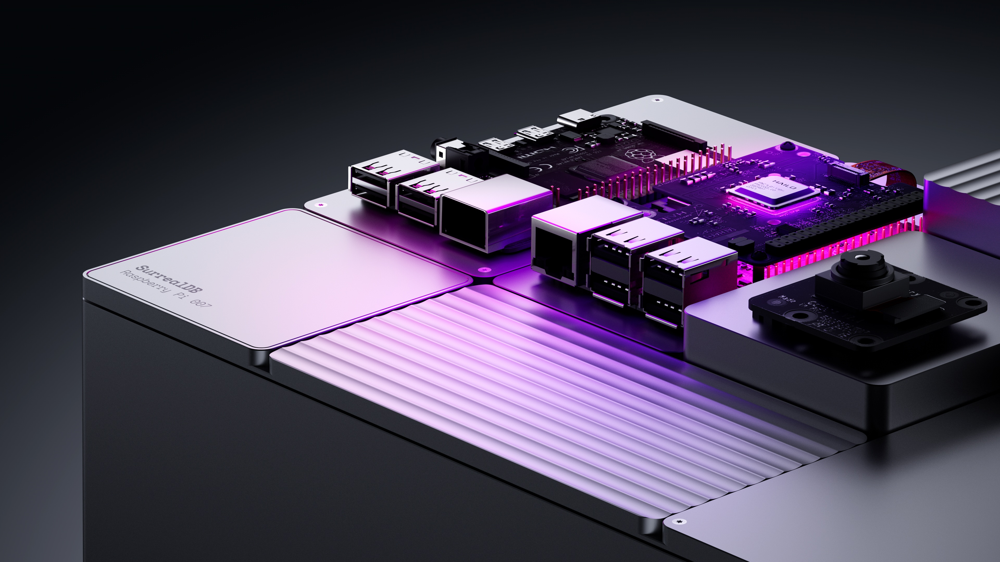
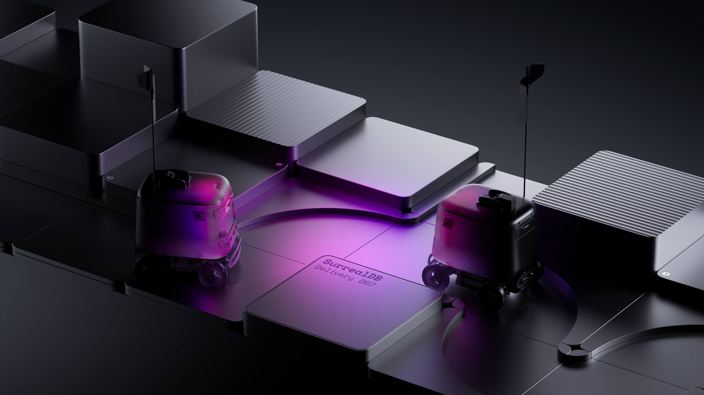

# Does the edge need a new database?

It’s been easy to miss just how quickly the centre of gravity in AI has started to drift away from the cloud. Scroll through any recent handset launch and you’ll see phrases like “Gemini Nano on-device” or “runs local LLMs” wedged between megapixel counts and battery stats. Google’s latest Pixel 9 line, Samsung’s S24 family and even the mid-range Galaxy S24 FE can now execute a trimmed-down Gemini model entirely on the handset, with no round-trip to Mountain View required. Yesterday I borrowed a colleague’s Z Flip 7 and watched it transcribe and translate a Spanish conversation on the tiny cover screen using Gemini Live - five years ago that would have taken a server farm; today it happens in your pocket.

This shift is happening everywhere you look. Hobbyists are coaxing full LLaMA derivatives to life on Raspberry Pi 5 boards with nothing more than a fan and a prayer, proving that eight-watt CPU cores can now host chat models that once needed racks of GPUs. Apple’s silicon team quietly tripled neural-engine throughput between the M1 and this year’s M4, making an iPad Pro faster at token generation than some cloud VMs you were renting last Christmas. Qualcomm’s Hexagon NPU now drives forty-plus trillion operations per second while sipping battery, which is why every Android flagship ad suddenly touts “on-device AI” rather than “5G-ready”.

As exciting as the model work is, there’s an elephant in the room: data. Models may have slimmed down, but the storage layer beneath them still looks suspiciously like 2005. The embedded databases that ship with phones, kiosks, cars and even bedside or implantable medical devices were designed to hold contacts and settings, not embeddings, dialogue history or multi-modal world models. If you’ve ever tried to graft vector search onto SQLite or keep LevelDB in sync across a mesh of edge devices you’ll know the feeling - duct-tape engineering at best, architectural debt at worst.

### From cloud calls to local memory

The historic “request - response” pattern placed inference in the cloud for good reasons: horsepower, model secrecy, compliance nerve-wracking. Yet privacy regulations, bandwidth ceilings and plain economics are now reversing the arrow. With quantisation tricks like QLoRA and runtimes such as ggml and llama.cpp, developers can deliver sub-second answers locally. What changes when the answer lives on the device? Everything.

Suddenly an application isn’t just caching a few settings; it is curating a living memory: user preferences, spatial context, even transient sensor feeds that inform the next token. Picture a home-automation agent that remembers the temperature you prefer on rainy Tuesdays, or an industrial robot that adapts pick-and-place routines as parts vary through the shift. These behaviours require rapid, bidirectional read-write loops between model and store - latencies measured in microseconds, not the 100 ms you might tolerate over REST.

### Why yesterday’s embedded stores feel like floppy disks

Classic embedded engines did their job magnificently when all they had to do was persist rows and occasionally survive a power cut. But an AI-native edge workload, powering VR headsets, kiosks and autonomous drones, throws six new curveballs at them.

First comes schema drift: a conversational agent can invent new keys or relationships on the fly, so the store must negotiate structure rather than enforce it rigidly. Second is the rise of vectors: storing a 4 096-dimensional float array is the easy part - indexing and querying it efficiently on constrained silicon is the kicker. Third, context windows slide forward every few seconds, so writes and reads happen in a tight loop; any locking or table-alter rebuilds will manifest as user-visible lag.

Concurrency is fourth on the list. A mobile IDE that co-pilots code - or a VR headset juggling sensor streams, spatial meshes and voice commands - needs to handle text embeddings, file trees and chat context all at once; single-writer models like traditional LMDB start to squeal. Fifth, modern privacy mores mean every edge device is a potential breach vector, so row-level security and encryption at rest are no longer optional tick-boxes. And finally, hybrid deployment is the norm: your app should keep working underground or at 35 000 ft and then merge neatly when the network returns. Most bolt-on replication engines assume everything is either always-on or always-offline; reality sits in-between.

### What tomorrow’s edge database has to nail

If we scrape away the hype, an edge-ready database has a simple mandate: become the model’s memory. That means letting data shift shape without ceremony: handling graphs, docs, time-series and vectors in the same breath; scaling from a smartwatch to a cluster when an idea takes off; and doing all of that within the energy budget of mobile hardware.

The first ingredient is a genuinely multi-model core - no sidecars, no glue code. When embeddings, relational facts and graph edges co-exist in a single logical store, a retrieval-augmented query can jump from “user bought A and B” to “vector-nearest neighbours of product C” in one round-trip. The second must-have is native ANN indexing that respects memory hierarchies; BLAS calls are cheap on an M4 NPU but murderous on a Cortex-A53 unless they’re tightly fused.

Third, the database has to speak the language of AI frameworks. Developers want to feed LangChain or Ollama a simple connection string, not orchestrate Kafka, Redis and half a dozen ETL scripts. Fourth, security needs to be woven into the protocol: row-level ACLs, zero-trust tokens, end-to-end TLS, even when the node is a kiosk bolted to the floor in a public space. Fifth, replication should look more like Git than a monolithic log - branches, merges, conflict resolution that respects semantic meaning rather than blindly choosing “last writer wins.” Projects like Striim’s streaming RAG pipelines demonstrate the appetite for millisecond-fresh embeddings; a modern store must treat such flows as first-class rather than exotic.

### A quick detour into how we’re tackling it at SurrealDB

At SurrealDB we stumbled into this problem because customers kept welding vector stores, graph databases and document engines together just to power a single agent. So we asked: what if the database collapsed that stack? The result is a system that lets an agent think, learn and act in one place. The core understands graph, relational, document, time-series and vector data with the same query language. It can run embedded inside an Arm64 binary for a drone or expand into a petabyte-scale cluster in the cloud without code changes. Developers can stream embeddings straight into tables, run cosine similarity alongside SQL filters, and secure the lot with row-based policies and end-to-end encryption. The upshot is that the model’s “long-term memory” no longer lives in half a dozen services; it sits in one engine that speaks SurrealQL.

I’m not here to pitch you, but it’s worth noting the pattern we see among teams who succeed at the edge: they pick a store that treats vectors as citizens, lets schemas evolve with the agent, and bakes in security so they don’t discover compliance holes after the pilot. Whether you end up on SurrealDB or roll your own, tick those boxes early - you’ll thank yourself when version three of your agent suddenly needs to remember image embeddings or conversation sentiment.

### Where this is all heading

Edge AI is about to get weird in the best possible way. Qualcomm is lining up consumer chipsets with always-on sensor fusion that pours event streams straight into local memory. Apple continues to blur the line between neural-engine and GPU, which means complex diffusion and audio models will follow language to the device. Meanwhile, open-weights culture ensures a steady supply of distilled models that fit inside a video-doorbell.

When every gadget can run inference, the database stops being a background utility and becomes the arbitration layer between competing goals. Imagine a home where the vacuum, thermostat and security camera each run their own model yet share a common memory of the household routine. The database mediates: the vacuum learns you hate noise during meetings; the thermostat knows a closed door means “do not disturb”; the security cam flags the same anomaly that woke the dog. None of this conversation leaves the four walls unless you allow it.

In that world, storage morphs into what we’ve started calling Agentic Memory. It is stateful, vector-aware, privacy-respecting and context-rich. It is as close to the silicon as the model itself, sometimes compiled into the same binary. And it syncs opportunistically rather than constantly, because bandwidth, energy and sovereignty demands differ from street to street.

### Closing thoughts

A decade ago the question was whether the cloud would kill the edge. The irony is that cloud economics and latency have now conspired to push cognition back outwards. Models have done their part by shedding parameters and learning to run on NPUs the size of thumbnails. The onus is now on data infrastructure to match that agility.

So, does the edge need a new database? My take is that it needs a new kind of database - one that looks less like a ledger and more like a living, breathing notebook for autonomous software. It must juggle relational joins and vector maths, accept that schemas are suggestions, and secure every byte as though the device could be stolen tomorrow.

We’re building SurrealDB because we believe that convergence is inevitable. But even if you never spin up a Surreal cluster, the principles remain: put memory next to the model, let it speak vectors, and design for a world where offline is the default, not the exception. Do that, and you’ll find that edge intelligence stops feeling like a demo and starts behaving like the future - quietly, responsively, and everywhere at once.
