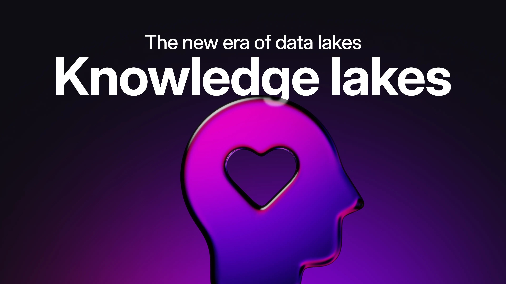
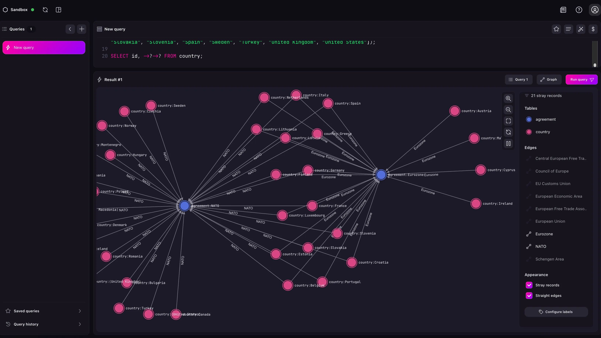
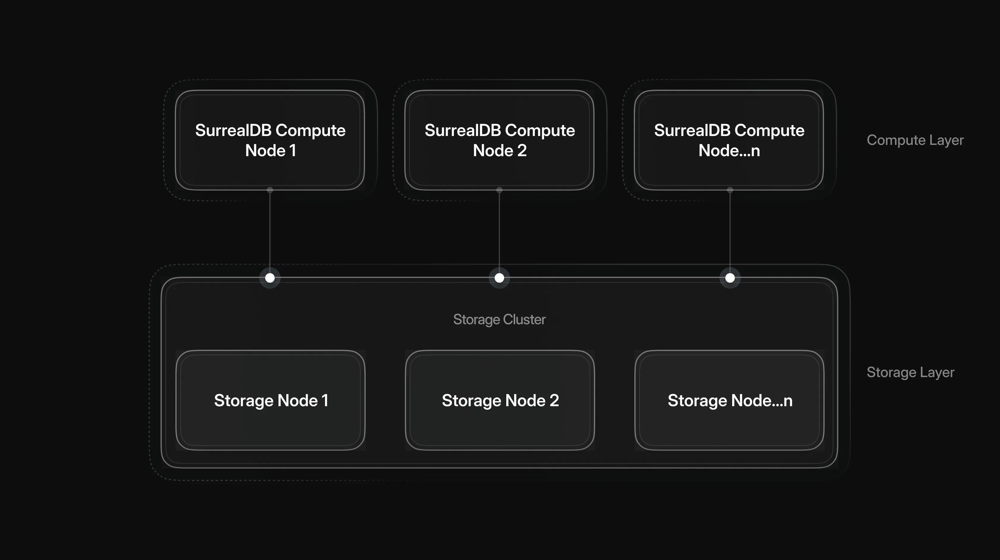
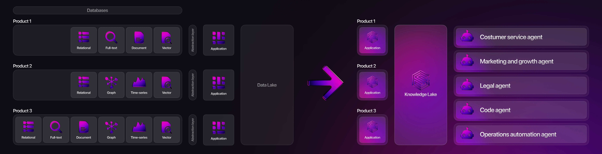

# The new era of data lakes: knowledge lakes



## The Evolution of the Data Lake: From Storage to Knowledge

Enterprise data infrastructure has been on a continuous journey, from rigid, structured data warehouses, to the flexible, unstructured world of data lakes. The latter were designed to store massive volumes of raw data, offering greater scale and flexibility than traditional warehouses. But while they solved many storage challenges, they often fall short when it comes to turning data into immediate, actionable intelligence.

Thanks to the advent of Generative AI and the opportunities that knowledge graphs present to superpower these systems, many organisations have been introduced to the magic of graph data modelling and knowledge graphs for the first time.

Today, a new paradigm is emerging: data lakes enhanced with knowledge graphs i.e.: knowledge lakes.

## What are knowledge graphs?

Rather than simply collecting information and making it available in a raw format, enterprises need rich, queryable networks of their data assets. Knowledge graphs add relationships, context, and meaning, transforming raw data into navigable knowledge that drives smarter, faster decisions.

Knowledge graphs make querying data remarkably intuitive and efficient. Unlike traditional databases that rely on rigid tables and complex joins, knowledge graphs use a flexible structure of entities and relationships. This means you can easily express complex queries like “Find all researchers who collaborated with someone who worked on Project X” in a natural and direct way, allowing you to traverse connections effortlessly, even across multiple hops.

```surrealql
SELECT 
  ->worked_with->person->worked_on->project[WHERE name = "Project X"] 
FROM person;
```

Because the schema is dynamic and relationships are first-class citizens, knowledge graphs are especially powerful for exploring interconnected data.

Knowledge graphs are widely used across industries due to their ability to model complex relationships. In search and semantic search, they help deliver more accurate, context-aware results by understanding the meaning behind queries. In recommendation systems, they enable smarter suggestions by mapping user behaviour and item relationships. Enterprises use them to unify siloed data, creating comprehensive views of customers or operations. In AI and chatbots, knowledge graphs improve response accuracy by grounding answers in structured data. They are also valuable in fraud detection, tracing suspicious connections across entities. In healthcare, they connect patients, treatments, and research for better insights. Finally, in supply chains, they map relationships among suppliers, products, and logistics to enhance efficiency and decision-making.

## Knowledge graphs in the age of AI

In the context of Generative AI, knowledge graphs allow you to inject additional context to AI systems, allowing LLMs to understand complex relationships in data and thus increasing the accuracy of systems. You can find an example in [Graph RAG: Enhancing Retrieval-Augmented Generation with SurrealDB](/blog/enhancing-retrieval-augmented-generation-with-surrealdb).

Knowledge graphs have been around for quite some time, and are currently finding popular use in Generative AI. Recently, their value has expanded significantly when used to complement data lakes. This evolution isn't just about data modelling, it demands a fundamental rethinking of storage and compute architectures. See “[What are knowledge graphs and why is everyone talking about them?](/blog/what-are-knowledge-graphs-and-why-is-everyone-talking-about-them)” for more information.



*Knowledge graph visualisation in Surrealist*

## The power of storage and compute separation

Platforms powering data lakes have increasingly adopted separation of storage and compute, allowing each to scale independently. Storage grows elastically without compute bottlenecks, while compute resources can be spun up or down dynamically to meet specific workload demands, allowing these systems to meet the scalability needs of enterprise organisations.

This has been the norm with data lake platforms like Snowflake and Databricks, but it’s only recently been adopted by the wider database world. Traditional graph database solutions don’t have these capabilities, greatly limiting the scale in which these solutions can be deployed.



This architecture enables another powerful functionality: compute-compute separation, allowing different teams within the same organisation to run independent compute tasks on a single shared storage layer. This is a game-changer for large enterprises, allowing teams such as marketing, finance, product, and analytics to work in parallel without duplicating data, competing for cluster resources, or introducing governance risks. The result is more efficient systems, greater agility, better governance, and faster innovation.

## SurrealDB is powering the new era of data lakes: knowledge lakes



*The evolution of enterprise data architecture for AI*

At SurrealDB, we are proud to support this next wave of data evolution. Our architecture is purpose-built for knowledge-graph enhanced data lakes, combining the powers of graph relationships with the varied data needs of today’s data-intensive applications: relational, document, time-series, geospatial, vector and full-text search.

Our separation of storage and compute enables data lake levels of scale, and the flexibility for multiple enterprise teams to scale compute independently against shared data. SurrealDB also allows you to update data dynamically and in real time, ensuring your knowledge lake has the latest data available to power your AI agents, transactional applications and real-time analytics systems.

Finally, the power of SurrealQL brings together the flexibility of a SQL-like query language with the expressiveness of graph traversal enabling complex relational, document, and graph queries in a single unified syntax. It allows teams to model and query their data with unprecedented simplicity and speed, without needing multiple systems or languages.

This transition from unstructured data in data lakes to knowledge graphs with a rich understanding of context will enable the next generation of enterprise generative AI transformation. For organisations looking to transform their data infrastructure and enable knowledge-intensive applications, SurrealDB provides the platform to make it possible.

## Ready to start your journey?

[Sign up to Surreal Cloud](https://app.surrealdb.com/signin/deploy) to get started.
