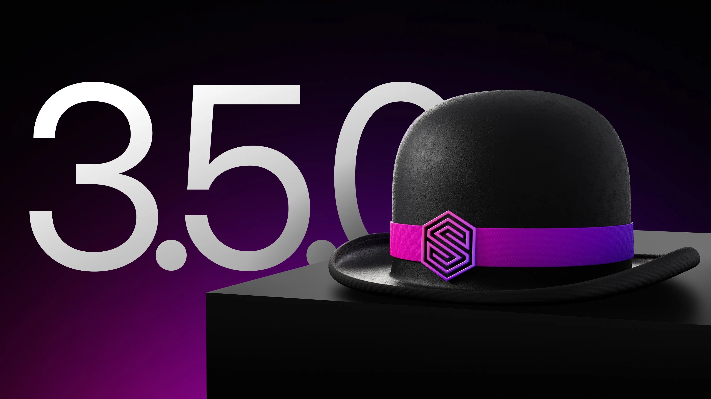
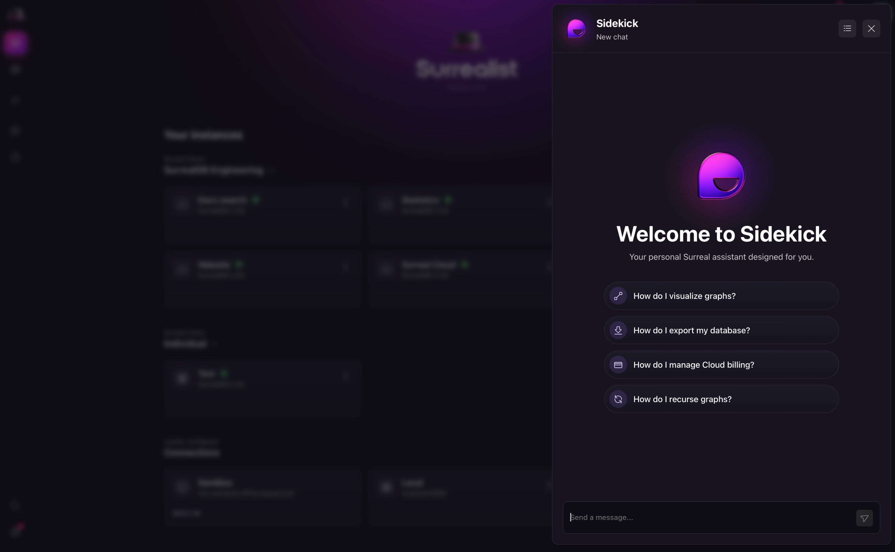
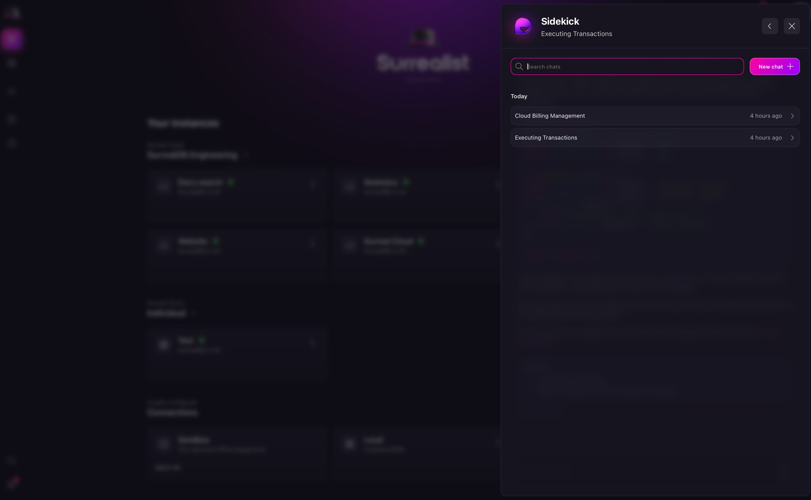
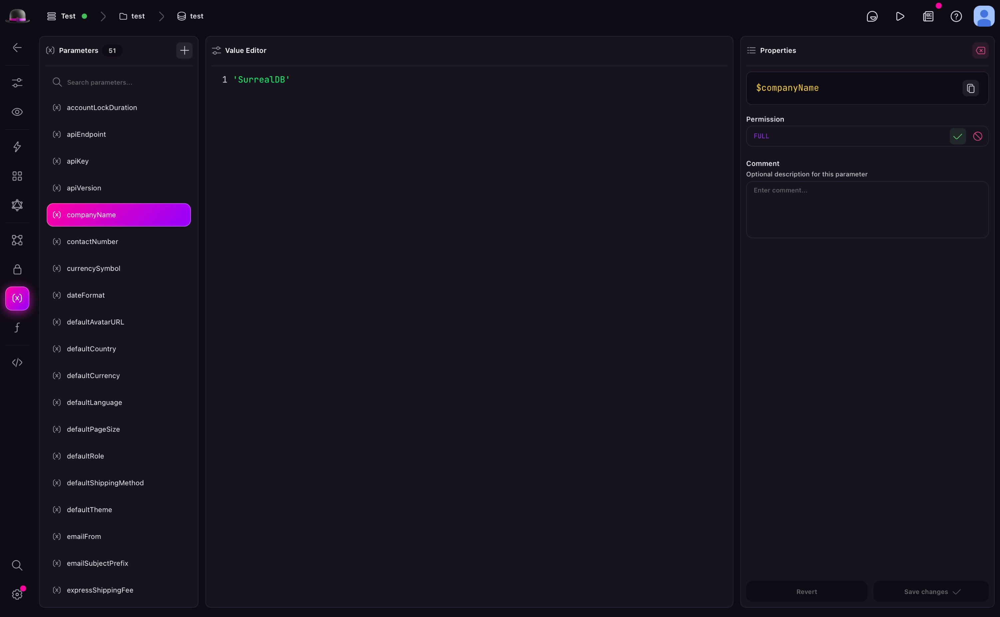
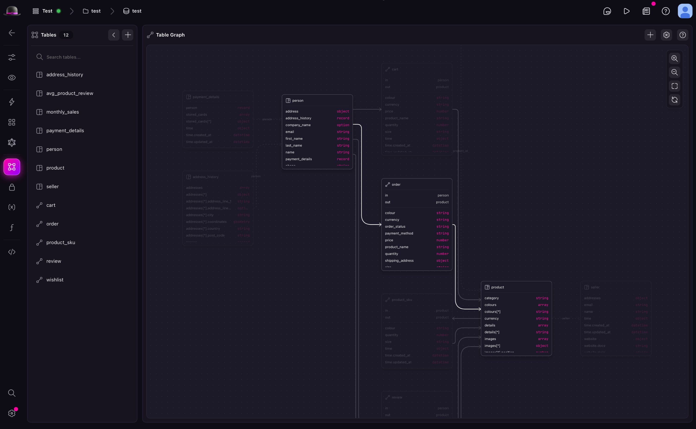
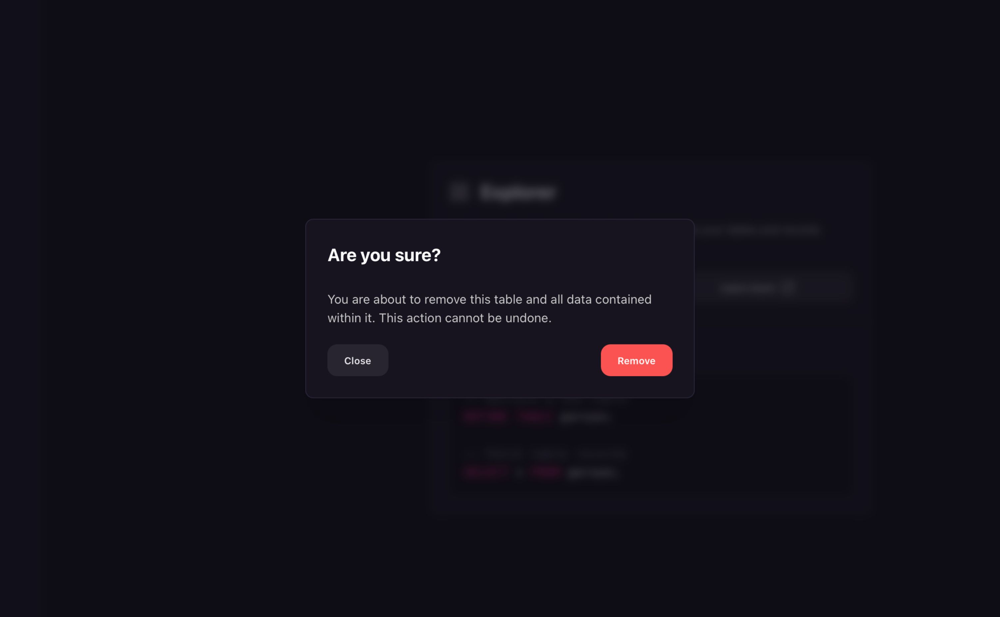

# What's new in Surrealist 3.5

We're excited to announce the release of Surrealist `3.5`. This version introduces exciting new features such as a fully redesigned Surreal Sidekick experience, a new Parameters view, a revamped functions view, and various other enhancements. Let's dive into what's new 🎉.

## Highlights

### Sidekick has moved

The Sidekick experience has been fully redesigned from the ground up! To make Sidekick even easier to use, we've moved Sidekick to a dedicated drawer which can be accessed globally from the toolbar. This new design provides a more unified experience, ensuring that you can access Sidekick anywhere in Surrealist with just one click.

### Sidekick chat history

One of the most highly requested features for Surreal Sidekick is now here - chat history! Whether you want to refresh your memory on what you've discussed or continue right where you left off, the new chat history functionality makes developing with SurrealDB even easier and more efficient. All Sidekick interactions are automatically saved to your Surreal Cloud account and persist between sessions, allowing you to quickly find past conversations even on the go.

### New Parameters view

Prior to this release, working with parameters proved to be quite challenging since there was no easy way to view and manage all of your parameters. However with the new Parameters view, you can now see and manage all of your parameters visually in one intuitive and easy to locate place.

### Designer view hover dimming

This release also implements hover dimming to the Designer view which automatically dims non-related tables on hover. This change improves the experience when working with complex database schemas by reducing visual clutter and highlighting only the relevant relationships. Options for what is shown on hover can be changed globally in Preferences under Designer View or per-table in the graph settings menu, allowing you to customise the dimming behaviour to suit your current project or your working style.

### Quality of life improvements

This release contains loads of quality of life improvements to make your experience using Surrealist even better! These include:

- Indexed column indicators in the Explorer view to help you quickly identify which columns are indexed
- Improved global confirmation menus that are easier to use or skip
- A unified Models and Functions view to make all of your functions available in one place
- The ability to upgrade compute nodes for distributed instances

## Full changelog

- Redesigned Surreal Sidekick
- Sidekick is now located in a dedicated drawer accessible from the toolbar
- You can view, restore, and search previous conversations
- Added a new command to ask a question to Sidekick
- Added a new Parameters view
- Allows you to view and edit global database parameters
- Added hover focus dimming to the Designer view
- Automatically highlight related tables
- Added a graph setting and preference to control the hover focus behaviour
- Added a new preference to enable pressing enter to apply confirmations
- Added the ability to upgrade compute nodes for distributed instances
- Added an indicator to the explorer view columns to show which columns are indexed
- Added the ability to shift-click to skip confirmations
- Merged the Models view into the Functions view
- Improved the import failure error reports
- Fixed keybindings triggering incorrectly on certain keyboard layouts

We hope you enjoy these new features and improvements! As always, we appreciate your feedback and suggestions for future releases. [Join the SurrealDB Discord](https://discord.com/invite/surrealdb) - engage with the community and receive support.

Get started for free today - [app.surrealdb.com](https://app.surrealdb.com)
